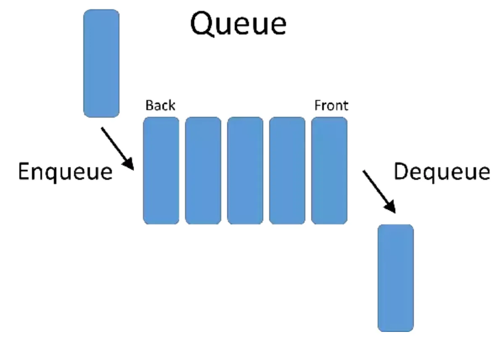

# 좀 더 알아보기

## 스택 (`stack`) - `LIFO(리포)`

- 한쪽 끝이 막혀 있는 통과 같은 저장공간
- **'나중에 저장한 데이터를 가장 먼저 빼내는 데이터 관리방식 (후입선출)'**
- `PUSH` : 저장 명령어
- `POP` : 저장된 데이터를 꺼내는 명령어
  

## 큐 (`queue`) - `FIFO(피포)`

- 양쪽이 뚫려 있는 통과 같은 저장공간
- **'가장 먼저 저장된 데이터부터 빼내는 데이터 관리방식(선입선출)'**
  

[사진 출처](https://medium.com/@songjaeyoung92)
