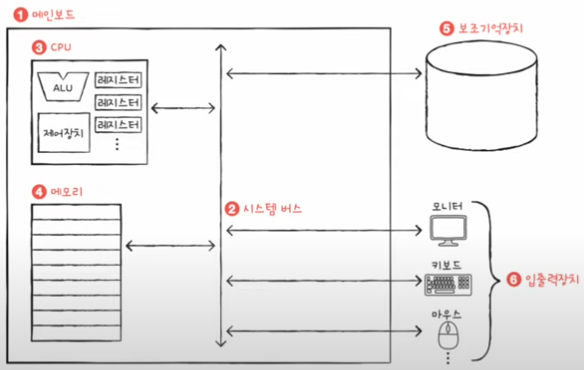
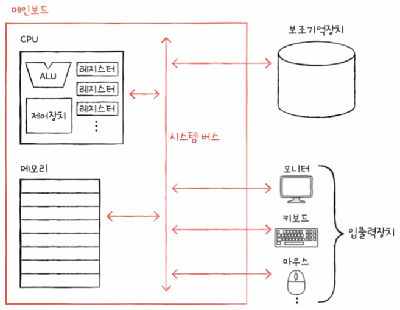
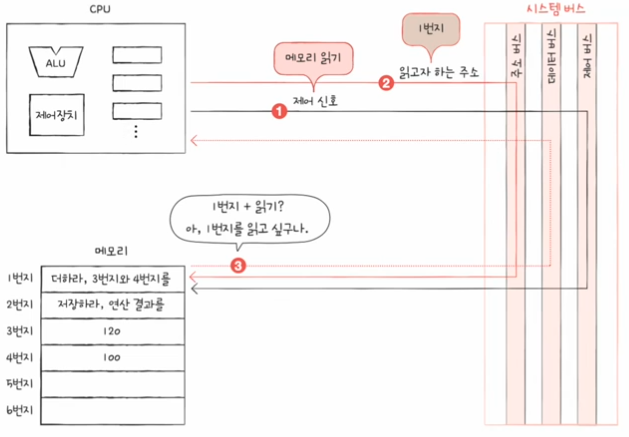
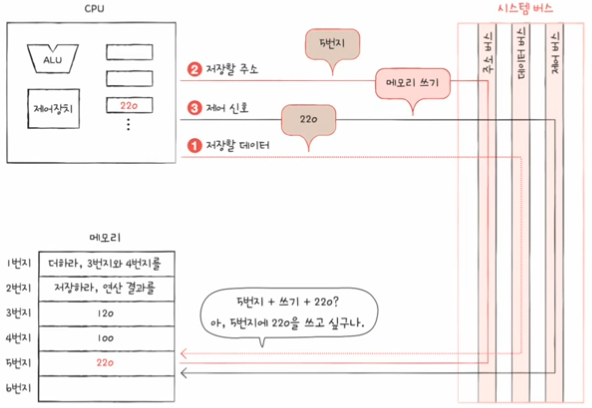

# 컴퓨터 구조 이해하기

## 01. 컴퓨터 구조를 알아야 하는 이유

### 문제 해결

- 컴퓨터 구조를 이해하게된다면 **문제 해결능력**이 향상된다.
- 컴퓨터를 **미지의 대상에서 분석의 대상으로** 바라보아야한다.

### 성능, 용량, 비용

- 어떤 CPU를 사용할지, 어떤 메모리를 사용할지 등을 **직접 판단하고 현명하게 선택**할 줄 알아야한다.
- 프로그래밍 언어의 문법만으로는 해결하기 어렵고 컴퓨터 구조가 결국에는 성능, 용량, 비용과 직결되기 때문에</br>
  즉, 컴퓨터구조를 이해하면 입력과 출력에만 집중하는 개발을 넘어 **성능, 용량, 비용까지 고려하며 개발하는 개발자**가 될 수 있다.

## 02. 컴퓨터 구조의 큰 그림

컴퓨터 구조 지식은 크게 두 가지로 나눈다.

1. 컴퓨터가 이해하는 정보
2. 컴퓨터의 4가지 핵심 부품
   </br>

그럼 이제 정보와 부품에 대해 알아보자.

### 컴퓨터가 이해하는 정보

- 컴퓨터는 0과 1로 표현된 정보만을 이해한다.
- 0과 1로 표현되는 정보에는 크게 두가지 종류가 있는데, 바로 **데이터와 명령어**이다.

#### 데이터란?

👉🏻 숫자, 문자, 이미지, 동영상과 같은 정적인 정보</br>
👉🏻 컴퓨터와 주고받는 정보나 컴퓨터에 저장된 정보를 편하게 데이터라 통칭하기도 한다.

#### 명령어란?

> 컴퓨터를 한마디로 정의한다면❓</br>
> 컴퓨터는 **명령어를 처리하는 기계**라고 보면된다.

Why❓</br>
명령어는 실질적으로 데이터를 움직이고 컴퓨터를 작동시키는 정보이다.

```
- 데이터 : 1과 2
- 명령어 : 더하라, 1과 2를
- 데이터 : 안녕하세요
- 명령어 : 화면에 출력하라, 안녕하세요를
```

💡 즉, **명령어는 컴퓨터를 작동시키는 정보이고, 데이터는 명령어를 위해 존재하는 일종의 재료**이다.

</br>

### 컴퓨터의 4가지 핵심 부품



#### 1. 주기억장치 (메모리 : main memory)

> 💡 주기억장치의 종류</br>
> 주기억장치에는 크게 RAM과 ROM 두가지가 있다.</br>
> 메모리라는 용어는 보통 RAM을 치칭한다.

- **현재 실행되는 프로그램의 명령어와 데이터를 저장하는 부품**이다.
  - 프로세스 : 현재 실행되고있는 프로그램

1. 프로그램이 실행되기 위해서는 메모리에 저장되어 있어야한다.
2. 메모리는 실행되는 프로그램의 명령어와 데이터를 저장한다.
3. 메모리에 저장된 값의 위치는 주소로 알 수 있다.

#### 2. 중앙처리장치 (CPU : Central Processing Unit)

- 컴퓨터의 두뇌이다.
- `CPU`는 메모리에 저장된 **명령어를 읽어 들이고, 해석하고, 실행하는 부품**이다.
- 그렇기 때문에 내부는 굉장히 정교하고 복잡한지만, 크게 3가지로 나뉜다.

##### 산술논리연산장치(ALU: Arithmetic Logic Unit)

- 계산기 역할
- 컴퓨터 내부에서 수행되는 대부분의 계산은 `ALU`가 한다.

##### 제어장치(CU: Control Unit)

- 제어 신호를 내보내고, 명령어를 해석하는 장치
  - 제어신호 : 컴퓨터 부품들을 관리하고 작동시키기 위한 전기 신호
  - `CPU`가 메모리에 저장된 값을 읽고 싶을 땐 메모리를 향해 **메모리 읽기**라는 신호를 보낸다.
  - `CPU`가 메모리에 어떤 값을 저장하고 싶을 땐 메모리를 향해 **메모리 쓰기**라는 제어 신호를 보낸다.

##### 레지스터(register)

- `CPU` 내부의 작은 임시 저장장치
- 프로그램을 실행하는데 필요한 값들을 임시로 저장한다.
- `CPU`안에는 여러 개의 레지스터가 존재하고 각기 다른 이름과 역할을 가지고 있다.

#### 3. 보조기억장치 (secondary storage)

> ❌ 메모리의 단점 (약점)
>
> - 보조기억장치에 비해 가격이 비싸고 저장 용량이 적다.
> - 전원이 꺼지면 저장되 내용을 잃어버린다.
> - 이유는 ? 실행 중인 프로그램들은 메모리에 저장되는데, 메모리는 전원이 꺼지면 저장된 내용이 날아가기 깨문이다.

💡 **메모리를 실행할 정보를 저장하고 전원이 꺼저도 보관될 프로그램을 저장**하는 부품이 보조기억장치이다.

#### 4. 입출력장치 (input/output device)

- 컴퓨터 외부에 연결되어 컴퓨터 내부와 정보를 교환할 수 있는 부품을 말한다.
- 모니터, 키보드, 마우스 등...

> 보조기억장치와 입출력장치의 차이점이 무엇이죠❓<br/>
> 딱 잘라 구분되는 개념은 아니고, 주변장치 (peripheral device)라 통칭하기도 한다.<br/>
> 하지만, <strong>다른 점은 보조기억장치는 메모리를 보조하는 특별한 입출력장치다❗️</strong> 라고 생각하면 된다.

#### 그 외, 메인보드와 시스템 버스



##### 메인보드

- 지금까지의 설명한 컴퓨터의 핵심 부품들은 모두 **메인보드라는 판**에 연결된다.
- **마더보드**라고 부르기도 한다.

##### 시스템 버스

- 메인보드에 연결된 부품들은 서로 정보를 주고받을 수 있는데, 이는 메인보드 내부의 **버스**라는 통로가 있기 때문이다.
- 컴퓨터 내부에는 다양한 종류의 통로, 즉 버스가 있다.
- 하지만, 여러버스 가운데 컴퓨터의 네 가지 핵심 부품을 연결하는 가장 중요한 버스는 **시스템 버스**이다.<br/>
  <br/>
- 버스의 종류에는 주소 버스, 데이터 버스, 제어 버스가 있다.
- 주소 버스 : 주소를 주고 받는 통로
- 데이터 버스 : 명령어와 데이터를 주고 받는 통로
- 제어 버스 : 제어 신호를 주고 받는 통료

  - `TIP` : 제어장치는 제어버스를 주고 받는다.<br/>
    <br/>

- **메모리 읽기 신호를 내보낼 때**
  

1. 제어버스로 '메모리 읽기' 제어신호를 보낸다.
2. 주소 버스로 읽고자 하는 주소를 내보낸다.
3. 메모리는 데이터 버스로 `CPU`가 요청한 주소에 있는 내용을 내보낸다.

- **메모리 쓰기 신호를 내보낼 때**
  

1. 데이터 버스를 통해 메모리를 저장할 값을,
2. 주소 버스를 통해 저장할 주소를,
3. 제어 버스를 통해 '메모리 쓰기' 제어 신호를 내보낸다.
