# 데이터

## 01. 0과 1로 숫자를 표현하는 방법

### 정보단위

- 비트(bit) : 0과 1을 표현하는 작은 정보 단위

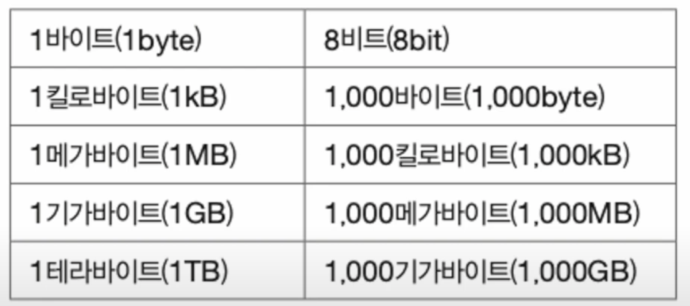

💡 바이트를 제외한 kB, MB, GB, 그 이상의 단위들은 모두 전 단위를 1,000개 묶어 표현한 단위라는 점에 유의하자 !

> **여기서 잠깐 ❗️**<br/>
> 중요한 정보 단위 중 **워드**라는 단위가 있다. <br/>
> 워드란 ❓<br/>`CPU`가 한 번에 처리할 수 있는 데이터 크기를 의미한다.<br/>
> 예를 들어)<br/> `CPU`가 한번에 16비트를 처리할 수 있다면 1위드는 16비트가 되고, 한번에 32비트를 처리할 수 있다면 1워드는 32비트가 된다. <br/>

- 하프 워드 (`half word`) : 워드의 절반 크기
- 풀 워드 (`full word`) : 워드 크기
- 더블 워드 (`double word`) : 워드의 두 배 크기

### 이진법 (`binary`)

- 수학적으로 0과 1로 수를 표현하는 방법
- 숫자가 1을 넘어가는 시점에 자리올림
- 우리가 일상적으로 사용하는 진법은 숫자가 9를 넘어갈 때 자림올림하는 진법은 십진법(`decimal`)이다.

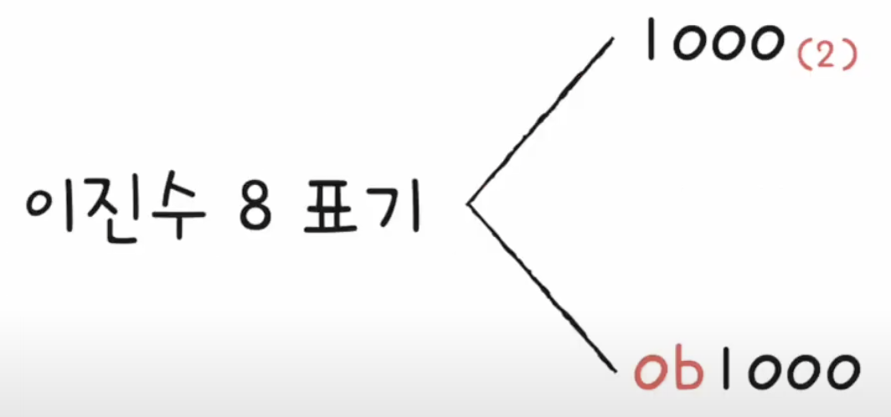

- 숫자 10을 십진수로 읽으면 10, 이진수로 읽으면 2
- 이러한 혼동을 예방하기 위해 수학적으로 표기할 때는 이진수 뒤에 붙히고 주로 코드상에서는 앞에 표기하는 방법을 사용한다.

#### 이진법의 음수 표현

- 가장 대표적인 방법은 2의 보수를 구해 이 값을 음수로 간주하는 방법이다.
- 2의 보수란 ❓ **모든 0과 1을 뒤집고, 거기에 1을 더한 값**
  - 1의 보수는 모든 0과 1을 뒤집은 수
- 2의 보수를 2번 구하면 자기자신이 된다.
- 실제 이진수만 봐서 음수, 양수 구분이 어렵기 때문에 이때는 **플래그**를 사용한다.
  - 플래그 : 부가정보

ex) 이진법 11의 음수는?
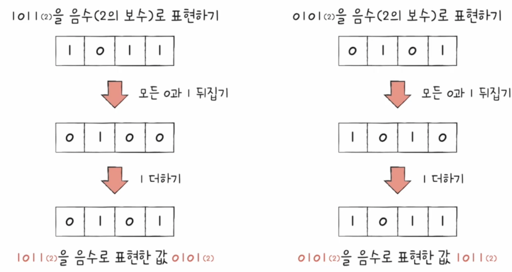

- 이진법 11의 음수 : 01

### 십육진법

> 굳이, 왜 십육진법 ❓<br/>
> 이진법은 0과 1만으로 모든 숫자를 표현하다 보니 숫자의 길이가 너무 길어진다는 단점이 있기 때문이다.<br/>
> 이진법과 십육진법의 변환이 쉽기 때문에 많이 사용된다.

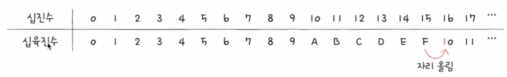

- **수가 15를 넘어가는 시점에 자리 올림을 하는 숫자 표현 방식**이다.

#### 십육진수 A~F를 쉽게 이해하는 방법

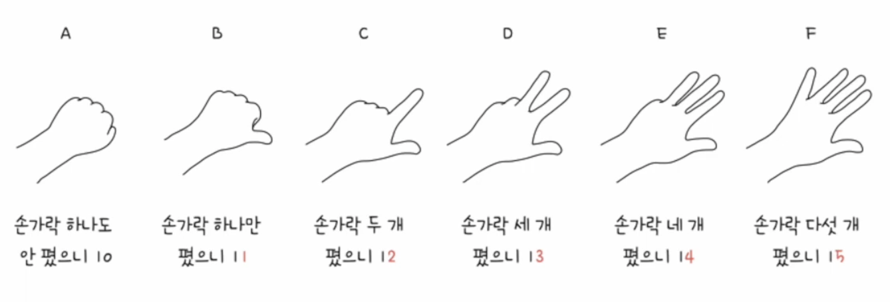

#### 십육진수 표기 방법


#### 이진수를 십육진수로 변환하는 방법

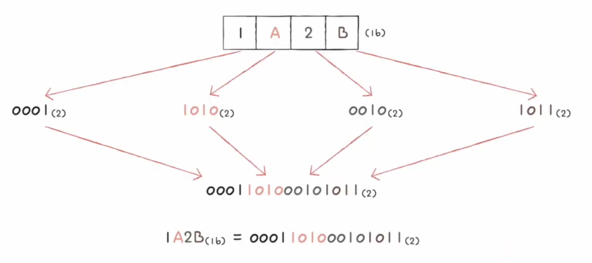

- 십육진수를 이루는 숫자 하나를 이진수로 표현하려면 **4비트**가 필요하다.
  - 2의 4승은 16

1. 가장 간단한 방법은 십육진수 하나를 이진수로 간주한다.
2. 3번을 반복한다.
3. 나온 값들을 이어붙히면 그 값은 이진수로 변환한 것이다.

#### 십육진수를 이진수로 변환하는 방법

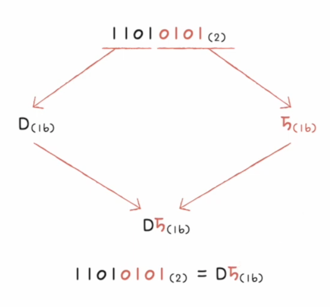

1. 이진수 숫자를 네 개씩 끊는다.
2. 끊어준 네 개의 숫자를 하나의 십육진수로 변한한다.
3. 변환한 수들을 이어붙인다.

## 02. 0과 1로 문자를 표현하는 방법

### 문자 집합과 인코딩

- 문자 집합 : 컴퓨터가 인식할 수 있는 문자들의 모음
- 인코딩 : 문자 집합들을 컴퓨터가 이해할 수 있는 0과 1로 변환하는 과정
- 디코딩 : 0과 1로 표현된 문자 코드를 사람이 읽을 수 있는 문자로 변환하는 과정

### 아스키 코드

- 초창기 문자 집합 중 하나이다.
- 알파벳, 아라비아 숫자, 일부 특수문자 및 제어문자로 이루어져있다.
- **7비트로 하나의 문자를 표현**한다.
  - 실제로는 8비트를 사용하고, 1비트는 오류를 검출하는데에 사용된다.
  - 그 1비트를 패리티 비트(`parity bit`)라고 불린다.
- 2의 7승이므로 아스키 문자를 128개를 표현할 수 있다.

👉🏻 아스키 문자 집합에 0부터 127가지의 수가 할당되어 아스키 코드로 인코딩된다.

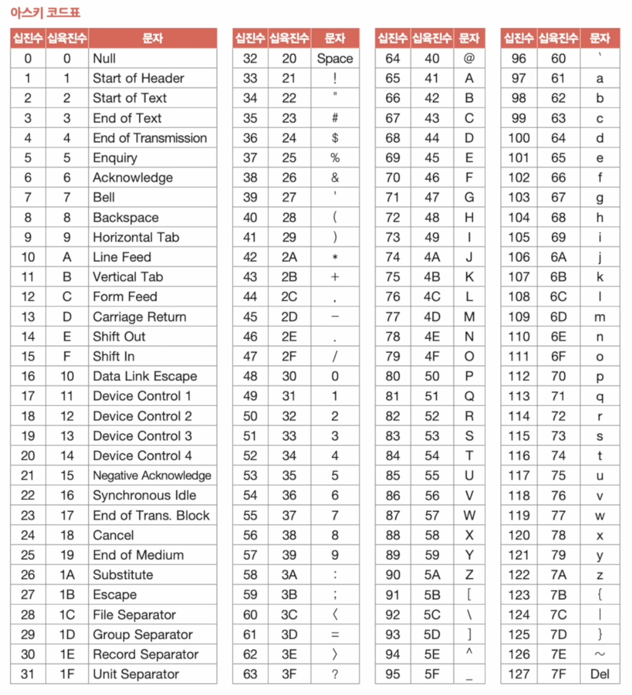

> 💡 코드 포인트(`code point`) : 글자에 부여된 고유한 값

#### 아스키 코드의 단점

- 아스키 문자 집합 외의 문자, 특수문자 뿐만 아니라 한글도 표현할 수 없다.

```
훗날 더 다양한 문자 표현을 위해 아스키 코드에 1비트를 추가한 8비트의 확장 아스키가 등장했지만, 256개의 문자는 턱없이 부족했다.
```

이 문제로 등장한 한글 인코딩 방식이 `EUC-KR`이다.

### EUC-KR

- 한글 인코딩 방식으로는 **완성형과 조합형**이 있다.

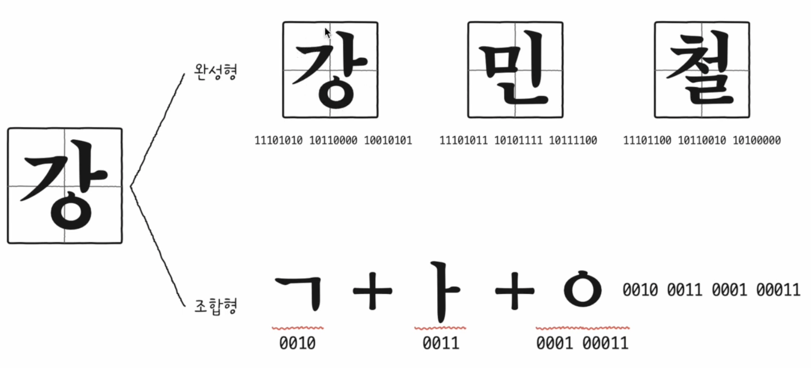

#### 완성형 인코딩

> 초성, 중성, 종성의 조합으로 이루어진 완성된 하나의 글자에 고유한 코드를 부여하는 방식<br/>
> 예를들어) '가'는 1, '나'는 2, '다'는 3

#### 조합형 인코딩

> 초성을 위한 비트열, 중성을 위한 비트열, 종성을 위한 비트열을 할당해 조합으로 하나의 글자 코드를 완성하는 방식.<br>
> 즉, 초성, 중성, 종성에 해당하는 코드를 합하여 하나의 글자 코드를 만드는 인코딩 방식이다.

#### EUC-KR은?

1. `EUC-KR`은 완성형 방식이다.
2. `KS X 1001, KS X 1003`문자 집합 기반의 한글 인코딩 방식
3. 글자 하나하나의 2바이트 코드 부여<br/>
   2바이트 == 16비트 == 4자리 십육진수로 표현

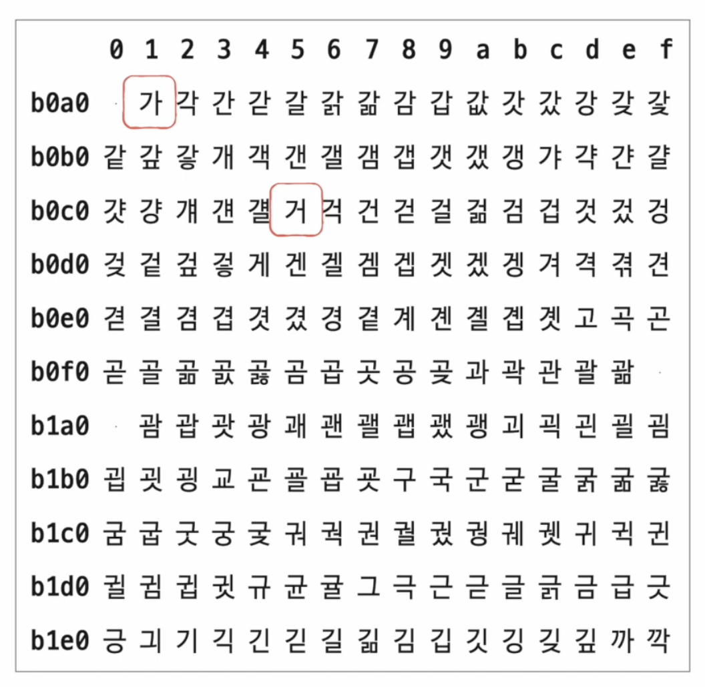

ex)

- 가 : `b0a1`
- 거 : `b0c5`

> 💡 총 2,350개 정도의 한글을 표현할 수 있다.<br>
> 하지만, 쀍, 쀓, 믜 같은 글자는 표현할 수 없다.<br>
> 이 문제를 조금이나마 해결하기 위해 등장한 것이 EUC-KR의 확장판인 마이크로소프트의 CP949(Code page 949)이다.<br>
> 다만, 이마저도 한글 전체를 표현하기에 넉넉한 양은 아니다.

### 유니코드와 UTF-8

#### 유니코드

- 통일된 문자 집합
- 한글, 영어, 화살표와 같은 특수 문자, 이모티콘까지.
- 현대 문자 표현에 있어 매우 중요한 위치로 자리잡았다.
- 유니코드의 인코딩 방식
  - `utf-8`, `utf-16`, `utf-32`...
  - `UTF` : `Unicode Transformationi Fomat`

#### UTF-8

- 1바이트부터 4바이트까지의 인코딩 결과를 만든다.
- `UTF-8`로 인코딩한 결과가 몇 바이트가 될지는 유니코드 문자에 부여된 값의 범위에 따라서 결정된다.
- 외우지말고 어떻게 인코딩되는지 흐름파악이 중요하다.

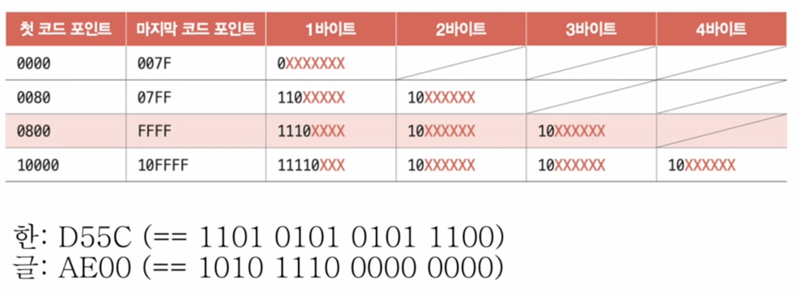

📍**사진 출처**

- [한빛미디어 유튜브](https://www.youtube.com/watch?v=bls_GjX-4U8&list=PLVsNizTWUw7FCS83JhC1vflK8OcLRG0Hl)
