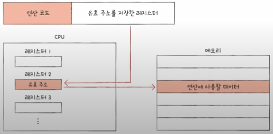

# 명령어

## 소스코드와 명령어

> 💡 고급언어 ---변환---> 저급언어

- 고급언어 : 개발자가 이해하기 쉽게 만든 언어
- 저급언어 : 컴퓨터가 이해하고 실행하는 언어

### 저급언어

- 기계어
  - 이진수(0과 1)또는 십육진수로 이루어진 명령어로 구성된 저급언어이다.
- 어셈블리어
  - 이진수(0과 1)또는 십육진수로 이루어진 기계어를 읽기 편한 형태로 번역한 저급언어이다.

### 고급언어

- 컴퓨터에서 고급언어에서 저급언어로 변환되는 방식이 두가지가 있다.

1. 컴파일 언어
2. 인터프리터 언어

#### 컴파일 언어

- 컴파일러에 의해 소스코드 전체가 저급언어로 변환되어 실행되는 **고급언어**이다.
  - 대표적인 컴파일 언어 : `C`
  - 컴파일러(`compile`) : 컴파일을 수행해 주는 도구

> 💡 컴파일러는 개발자가 작성한 소스코드 전체를 쭉 훑어보며 소스코드에 문법적인 오류는 없는지, 실행 가능한 코드인지, 실행하는데 불필요한 코드는 없는지 등을 따지며 소스코드를 처음부터 끝까지 저급언어로 컴파일한다. 
> 이때, **컴파일러가 소스코드 내에서 오류를 하나라도 발견하면 해당 소스코드는 컴파일에 실패**한다. 
> 성공한다면, 개발자가 작성한 소스코드는 컴퓨터가 이해할 수 있는 저급언어로 변환된다. 
> 이 변환된 저급언어를 **목적 코드**라고 한다.

#### 인터프리터 언어

- 인터프리터에 의해 소스코드가 한 줄씩 실행되는 **고급언어**이다.
  - 대표적인 인터프리터 언어 : `Python`
  - 인터프리터(`interpreter`) : 소스코드를 한 줄씩 저급언어로 변환해 실행해주는 도구
- 컴파일 언어와는 달리, 한 줄씩 한 줄씩 차례로 실행된다.
- 컴퓨터와 대화하듯 소스코드를 **한 줄씩 실행하기 때문에 소스코드 전체를 저급언어로 변환하는 시간을 기다릴 필요가 없다.**
- 한 줄씩 실행되기 때문에 소스코드 N번째 줄에 문법 오류가 있더라도 N-1번째 줄까지는 올바르게 수행된다.

#### 컴파일언어와 인터프리터 언어의 차이점

- 컴파일 : 오류가 발생하면 소스코드 전체가 실행되지 않음
- 인터프리터 : 오류가 발생하면 오류 발생 전까지의 코드는 실행

> 둘 중 누가 더 빠를까 ? 
> 결론 : 컴파일이 더 빠르다. 
> 이유 : 목적코드는 컴퓨터가 이해하고 실행할 수 있는 저급언어인 반면, 
> 인터프리터 언어는 소스 코드 마지막에 이를 때까지 한 줄 한 줄씩 저급언어로 해석하며 실행해야하기 때문이다.

## 명령어의 구조

### 연산코드와 오퍼랜드

- 누군가에게 명령을 할 때와 동일하게 컴퓨터도 **'무엇을 대상으로, 어떤 작동을 수행해라'**는 구조로 되어있다.

> - 명령어 : 연산코드와 오퍼랜드로 구성되어있다.
> - 연산코드 : 색 배경 필드값, 즉 **'명령어가 수행할 연산'**
> - 오퍼랜드 : 흰색 배경 필드값, 즉 **'연산에 사용할 데이터'** 또는 **'연산에 사용할 데이터가 저장된 위치'**
> - **연산코드 👉🏻 연산자 / 오퍼랜드 👉🏻 피연산자** 라고 부른다.

#### 오퍼랜드

- 오퍼랜드 필드에는 숫자나 문자와 같이 연산에 사용할 데이터를 직접 명시하기보다는, 많은 경우 연산에 사용할 데이터가 저장된 위치, **즉, 메모리 주소나 레지스터 이름이 담긴다.**
- 오퍼랜드 필드를 **주소 필드**라고 부른다.
- 오퍼랜드 갯수는 0, 1, 2, 3개 일 수도 있다.
  - 0-주소 명령어
  - 1-주소 명령어
  - 2-주소 명령어
  - 3-주소 명령어

#### 연산코드

> 👉🏻 가장 기본적인 연산 코드 유형 4가지 
>
> 1. 데이터 전송 
> 2. 산술/논리 연산 
> 3. 제어 흐름 변경 
> 4. 입출력 제어 

- 명령어의 종류와 생김새는 `CPU`마다 다르기 때문에 연산코드의 종류와 생김새 또한 `CPU`마다 다르다.
- 대부분의 `CPU`가 공통으로 이해하는 대표적인 연산 코드의 종류 정도로만 이해해도 무방하다.

##### 데이터 전송

- `MOVE` : 데이터를 옮겨라
- `STORE` : 메모리에 저장해라
- `LOAD (FETCH)` : 메모리에서 `CPU`로 데이터를 가져와라
- `PUSH` : 스택에 데이터를 저장하라
- `POP` : 스택의 최상단 데이터를 가져와라

##### 산술/논리 연산

- `ADD / SUBTRACT / MULTIPLY / DIVIDE` : 덧셈 / 뺄셈 / 곱셈 / 나눗셈을 수행해라
- `INCREMENT / DECREMENT` : 오퍼랜드에 1을 더해라 / 오퍼랜드에 1을 빼라
- `AND / OR / NOT` : AND / OR / NOT 연산을 수행해라
- `COMPARE` : 두 개의 숫자 또는 `TURE / FALSE` 값을 비교해라

##### 제어 흐름 변경

- `JUMP` : 특정 주소로 실행 순서를 옮겨라
- `CONDITIONAL JUMP` : 조건에 부합할 때 특정 주소로 실행 순서를 옮겨라
- `HALT` : 프로그램의 실행을 멈춰라
- `CALL` : 되돌아올 주소를 저장한 채 특정 주소로 실행 순서를 옮겨라
- `RETURN` : `CALL`을 호출할 때 저장했던 주소로 돌아가라

##### 입출력 제어

- `READ(INPUT)` : 특정 입출력 장치로부터 데이터를 읽어라
- `WRITE(OUTPUT)` : 특정 입출력 장치로 데이터를 써라
- `START IO` : 입출력 장치를 시작해라
- `TEST IO` : 입출력 장치의 상태를 확인해라

### 주소 지정 방식

> "왜 오퍼랜드 필드에 메모리나 레지스터의 주소를 담는 이유는 무엇일까 ?"
>
> - 명령어 길이 때문이다.

- **유효 주소(`effective address`)** : 연산의 대상이 되는 데이터가 저장된 위치
- **주소 지정 방식(`addressing mode`)** : 오퍼랜드 필드에 데이터가 저장된 위치를 명시할 때 연산에 사용할 데이터 위치를 찾는 방법
- 대표적인 주소 지정 방식 5가지를 알아보자.

#### 즉시 주소 지정 방식 (`immediate addressing mode`)

- **연산에 사용할 데이터를 오퍼랜드 필드에 직접 명시하는 방식**
- 가장 간단한 형태의 주소 지정 방식
- 연산에 사용할 데이터를 메모리나 레지스터로부터 찾는 과정이 없기 때문에 이하 설명할 주소 지정 방식들보다 빠르다.
- 데이터의 크기가 작아지는 단점이 있다.

#### 직접 주소 지정 방식 (`direct addressing mode`)

- **오퍼랜드 필드에 유효 주소를 직접적으로 명시하는 방식**
- 오퍼랜드 필드에서 표현할 수 있는 데이터의 크기는 즉시 주소 지정 방식보다 더 커졌지만, 유효 주소를 표현할 수 있는 범위가 연산 코드의 비트 수만큼 줄어들고, 유효 주소에 제한이 생길 수 있다.

#### 간접 주소 지정 방식 (`indirect addressing mode`)

- 유효 주소의 주소를 오퍼랜드 필드에 명시한다.
- 유효 주소의 범위는 직접 주소 지정 방식보다 넓어졌지만, **두 번의 메모리 접근이 필요하기 때문에 앞의 주소방식들 보다는 일반적으로 느린방식**이다.
- 연산에 사용할 데이터가 레지스터에 저장된 경우도 있는데 이 경우, 레지스터 주소 지정 방식 또는 레지스터 간접 주소 지정 방식을 사용할 수 있다.

#### 레지스터 주소 지정 방식 (`register addressing mode`)

- 직접 주소 지정 방식과 비슷하게 연산에 사용할 데이터를 저장한 레지스터를 오퍼랜드 필드에 직접 명시하는 방법
- 일반적으로 `CPU` 외부에 있는 메모리에 접근하는 것보다 **`CPU` 내부에 있는 레지스터에 접근하는 것이 빠르다.**
- 그러므로 직접 주소 지정 방식보다 빠르게 데이터에 접근한다.
- 단점은 표현할 수 있는 레지스터 크기에 제한이 생길 수 있다는 점이다.

#### 레지스터 간접 주소 지정 방식 (`register indirect addressing mode`)

- **연산에 사용할 데이터를 메모리에 저장하고 그 주소(유효 주소)를 저장한 레지스터를 오퍼랜드 필드에 명시하는 방법**
- 유효 주소를 찾는 과정이 간접 주소 지정 방식과 비슷하지만, **메모리에 접근하는 횟수가 한 번으로 줄어든다는 차이이자 장점**이 있다.

> 💡 오퍼랜드 필드에 명시하는 값, 총 정리 💡
>
> - 주소 지정 방식 : 연산에 사용할 데이터를 찾는 방법
> - 유효 주소 : 연산에 사용할 데이터가 저장된 위치
>
> - 즉시 주소 지정 방식 : 연산에 사용할 데이터
> - 직접 주소 지정 방식 : 유효 주소 (메모리 주소)
> - 간접 주소 지정 방식 : 유효 주소의 주소
> - 레지스터 주소 지정 방식 : 유효 주소 (레지스터 이름)
> - 레지스터 간접 주소 지정 방식 : 유효 주소를 저장한 레지스터
