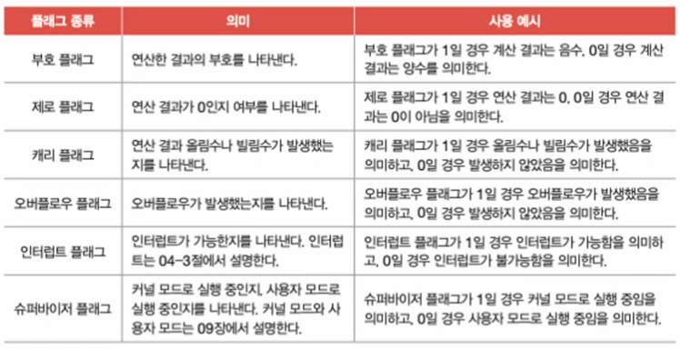
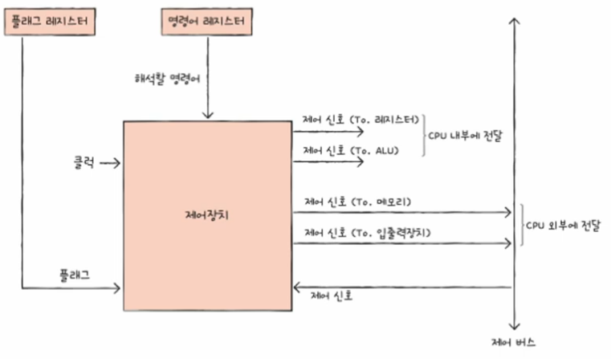
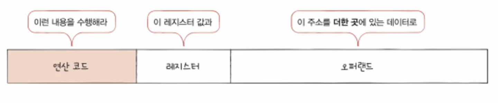
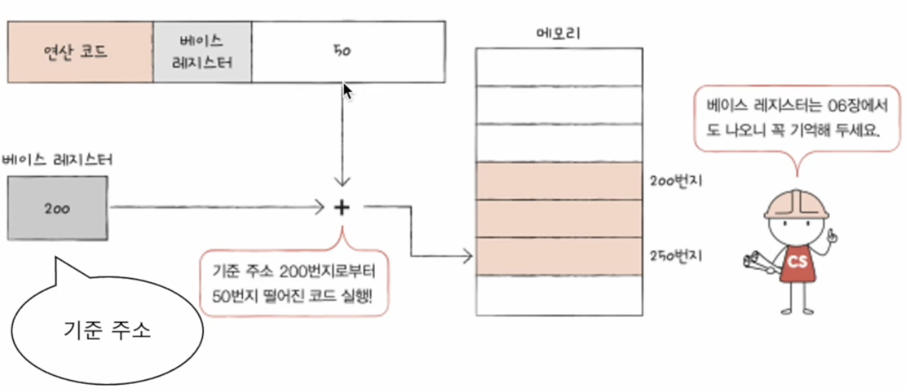
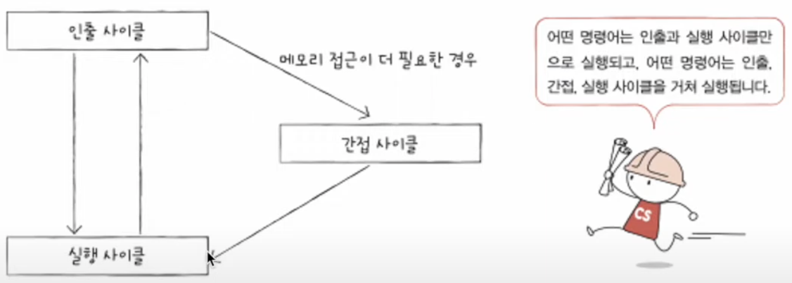
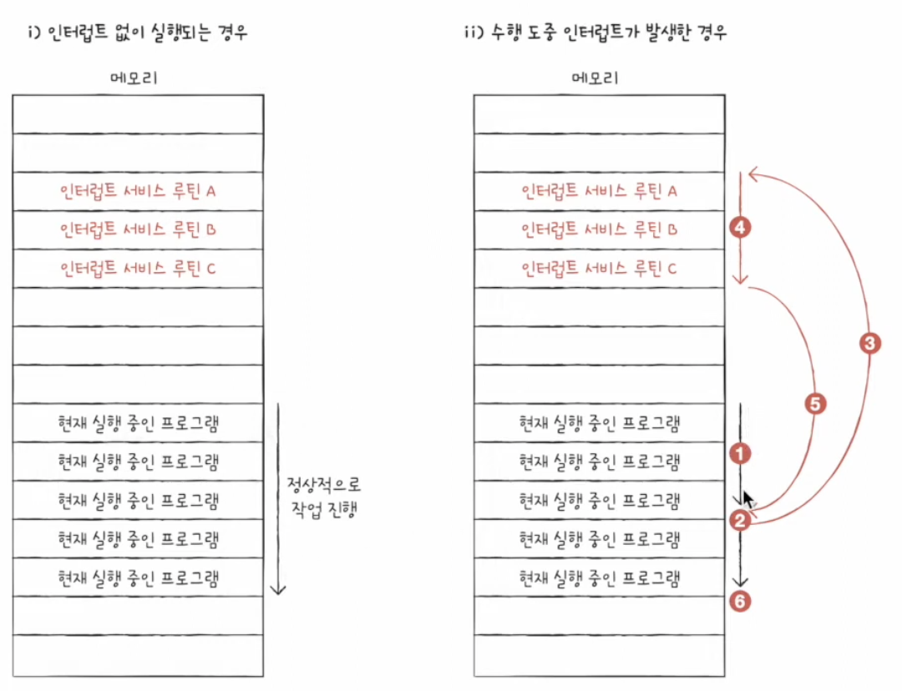

# `CPU`의 작동 원리

## 01. `ALU`와 제어장치

- `ALU`와 제어장치가 내보내고 받아들이는 정보가 무엇인가 ?

### `ALU` : 계산하는 장치

- 레지스터로부터 피연산자를 받아들이고, 제어장치로부터 제어 신호를 받아들인다.

> - 메모리가 아닌, 레지스터에 저장하는 이유는?  > `CPU`가 레지스터에 접근하는 속도가 `CPU`가 메모리에 접근하는 속도보다 빠르기 때문이다.

- 계산 결과값 외에 `ALU`가 내보내는 또 다른 정보 👉🏻 **플래그**

#### 플래그

- 음수와 양수를 구분하기위해 사용된다.
- '방금 계산한 결과는 음수', '결괏값이 너무 크다'라는 연산 결과의 추가적인 상태 정보를 내보내는 것

> 💡 연산 결과가 연산 결과를 담을 레지스터보다 큰 상황을 \*\*오버플로우(`overflow`)라고 한다.

- 플래그는 `CPU`가 프로그램을 실행하는 도중 반드시 기억해야 하는 일종의 참고 정보이다.
- 플래그들은 **플래그 레지스터**라는 레지스터에 저장된다. (플래그를 저장하는 값을 저장하는 레지스터)

### 제어장치 : 제어 신호를 발생시키고 명령어를 해석하는 장치

- 제어신호 : 컴퓨터 부품들을 관리하고 작동시키기 위한 일종의 전기신호

1. 제어장치는 **클럭** 신호를 받아들인다.

   - 클럭(`clock`) : 컴퓨터의 모든 부품을 일사불란하게 움직일 수 있게 하는 시간 단위.
   - 주기에 맞춰 한 레지스터에서 다른 레지스터로 이동, `ALU`에서 연산 수행, `CPU`가 메모리에 저장된 명령어를 읽어들이는 것들.
   - But, 컴퓨터의 모든 부품이 클럭신호에 맞춰 작동하는 것을 모든 부품이 한 클럭마다 이동한다는 것이 아니라 **하나의 명령어가 여러 클럭에 걸쳐 실행**될 수 있다.

2. 제어장치는 **현재 해석해야 할 명령어**를 받아들인다.

   - `CPU`가 해석해야 할 명령어는 **명령어 레지스터**라는 특별한 레지스터에 저장된다.
   - 레지스터로부터 해석할 명령어를 받아들이고 해석한 뒤, 제어신호를 발생시켜 컴퓨터 부품들에 수행할 내용을 알려준다.

3. 제어장치는 플래그 레지스터 속 **플래그 값**을 받아들인다.

   - 제어장치는 플래그 값을 받아들이고 이를 참고해 제어 신호를 발생한다.

4. 제어장치는 시스템 버스, 그 중에서 제어 버스로 전달된 **제어 신호**를 받아들인다.
   - `CPU` 내부와 외부로 제어신호를 보낸다.
     - 크게 메모리에 전달하는 제어신호
     - 입출력장치(보조기억장치 포함)에 전달하는 제어신호

## 02. 레지스터

- 레지스터 속 값을 유심히 관찰하면 프로그램을 실행할 때 `CPU` 내에서 무슨일이 벌어지는지, 어떤 명령어가 어떻게 수행되는지 알 수 있다.
- `CPU`안에 다양한 레지스터들의 어떤 역할을 할까 ?

### 반드시 알아야 할 레지스터

#### 프로그램 카운터 (`PC : Program Counter`)

- 메모리를 가져올 명령어의 주소 즉, **메모리에서 일어 들일 명령어 주소를 저장**한다.
- 명령어 포인터(`IP : Instruction Pointer`)라고 부르는 `CPU`도 있다.

#### 명령어 레지스터 (`IR : Instruction Register`)

- 해석할 명령어, 즉 방금 메모리에서 읽어 들인 명령어를 저장하는 레지스터

#### 메모리 주소 레지스터 (`MAR : Memory Address Register`)

- 메모리의 주소를 저장하는 레지스터
- `CPU`가 읽어 들이고자 하는 주소 값을 주소 버스로 보낼 때 메모리 주소 레지스터를 거친다.

#### 메모리 버퍼 레지스터 (`MBR : Memory Buffer Register`)

- 메모리와 주고받을 값(데이터와 명령어)을 저장하는 레지스터
- 메모리 데이터 레지스터(`MDR : Memory Data Register`)라고도 부른다.

#### 플래그 레지스터

- 연산 결과 또는 `CPU` 상태에 대한 부가적인 정보를 저장하는 레지스터

#### 범용 레지스터

- 이름 그대로 다양하고 일반적인 상황에서 자유롭게 사용할 수 있는 레지스터

#### 스택 레지스터

- 스택과 스택 포인터를 이용한 스택 주소 지정 방식
- 스택 포인터 : 스택의 꼭대기를 가리키는 레지스터 (스택이 어디까지 차 있는지에 대한 표시)

#### 베이스 레지스터

- 오퍼랜드 필드의 값(변위)과 특정 레지스터의 값을 더하여 유효 주소 얻는 방식

##### 순차적인 실행 흐름이 끊기는 경우

1. 명령어 중 `JUMP`, `CONDITIONAL JUMP`, `CALL`, `RET`와 같이 특정 메모리 주소로 실행 흐름을 이동하는 명령어가 실행되었을 때 프로그램은 차례대로 실행되지 않는다. 
   이 경우 프로그램 카운터에는 변경된 주소가 저장된다.
2. 인터럽트가 발생하면 프로그램의 순차적인 실행 흐름이 끊긴다.

### 특정 레지스터를 이용한 주소 지정 방식(1) : 스택 주소 지정 방식

- 스택 포인터
  - 스택 주소 지정 방식이라는 주소 지정 방식에 사용된다.
  - 프로그램 카운터와 베이스 레지스터는 변위 주소 지정 방식이라는 주소 지정 방식에 사용된다.
- 스택 주소 지정 방식
  - 스택과 스택 포인터를 이용한 주소 지정 방식
  - 스택은 한쪽 끝이 막혀 있는 통과 같은 저장 공간이다.
  - 가장 최근에 저장하는 값부터 꺼낸다.
- 스택 포인터
  - 스택의 꼭대기를 가리키는 레지스터
  - 즉, 스택 포인터는 스택에 마지막으로 저장된 값의 위치를 저장하는 레지스터이다.
- 스택
  - 메모리 안에 스택처럼 사용할 영역이 정해져있다.
  - 이를 **스택 영역**이라 한다.
  - 다른 주소 공간과는 다르게 스택처럼 사용하기로 암묵적으로 약속된 영역이다.

### 특정 레지스터를 이용한 주소 지정 방식(2) : 변위 주소 지정 방식

- 오퍼랜드 필드의 값(변위)과 특정 레지스터의 값을 더하여 유효 주소를 얻어내는 주소 지정 방식
- 오퍼랜드 필드의 주소와 어떤 레지스터를 더하는지에 따라 **상대 주소 지정 방식, 베이스 레지스터 주소 지정 방식** 등으로 나뉜다.
- `CPU`의 종류에 따라 다양한 방식들이 있지만, 여기선 두 가지 방식을 다뤄보자.

#### 상대 주소 지정 방식 (`relative addressing mode`)

- 오퍼랜드와 프로그램 카운터의 값을 더하여 유효 주소를 얻는 방식.
- 프로그래밍 언어의 `if`문과 유사하게 모든 코드를 실행하는 것이 아닌, **분기하여 특정 주소의 코드를 실행할 때 사용**된다.

#### 베이스 레지스터 주소 지정 방식(`base-register addressing mode`)

- 오퍼랜드와 베이스 레지스터의 값을 더하여 유효 주소를 얻는 방식.
- 베이스 레지스터 속 기준 주소로부터 얼마나 떨어져 있는 주소에 접근할 것인지를 연산하여 유효주소를 얻어내는 방식이다.

## 03. 명령어 사이클과 인터럽트

### 명령어 사이클 (`instruction cylcle`)

- `CPU`는 명령어들을 하나씩 실행하는데 프로그램 속 각각의 명령어들은 일정한 주기(정형화된 흐름)가 반복되며 실행되는데, 이 주기(정형화된 흐름)를 **명령어 사이클**이라 부른다.
- `CPU`는 인출, 실행이 반복되면서 실행된다.

1. 메모리에 있는 명령어를 `CPU`로 가지고 오는 단계를 **인출 사이클(`fetch cycle`)**이라 한다.
2. `CPU`로 가져온 명령어를 실행하는 단계를 **실행 사이클(`execution cycle`)**이라 한다.

### 인터럽트 (`interrupt` : 방해, 중단)

- `CPU`는 정해진 흐름에 따라 명령어를 처리해 나가지만, 간혹 이 흐름이 끊어지는 상황을 인터럽스라 한다.
- 발생 상황 : `CPU`가 꼭 주목해야 할 때, `CPU`가 얼른 처리해야 할 다른 작업이 생겼을 때

> - 인터럽트는 크게 두 가지의 종류로 나뉜다.
>   - 동기 인터럽트 (`synchronous interrupts`)
>   - 비동기 인터럽트 (`asynchronous interrupts`)

 

1️⃣ 동기 인터럽트

- `CPU`에 의해 발생하는 인터럽트
- `CPU`가 명령어들을 수행하다가 예상치 못한 상황에 마주쳤을 때, 가령 `CPU`가 실행하는 프로그래밍상의 오류와 같은 예외적인 상황에 마주쳤을 때 발생한다.
- 이런 점에서 동기 인터럽트는 **예외(`exceprion`)**라고 한다.
- 동기 인터럽트의 종류 : 폴트, 트랩, 중단, 소프트웨어 인터럽트

2️⃣ 비동기 인터럽트

- 입출력장치에 의해 발생하는 인터럽트
- ex) 세탁기 완료 알림, 전자레인지 조리 완료 알림
  - `CPU`가 프린트에 입출력 작업을 부탁하면 작업을 끝낸 입출력장치가 `CPU`에 완료 알림(인터럽트)를 보낸다.
  - 키보드, 마우스가 어떠한 입력을 받아들였을 때, 처리하기 위해 `CPU`에 입력 알림(인터럽트)를 보낸다.
- 비동기 인터럽트를 인터럽트라 칭하지만, 이 학습에서는 **하드웨어 인터럽트**라 칭할 것

#### 하드웨어 인터럽트

- 하드웨어가 없는 인터럽트라면 ? 
  알림없는 전자레인지가 언제 조리를 끝낼지 모르는 상황에 무작정 전자레인지 앞에서 서성이는 상황과도 같다.

#### 하드웨어 인터럽트 처리 순서

- `CPU`가 하드웨어 인터럽트를 어떻게 처리할까 ?
- 대동소이 : 크게 보면 같고 작은 차이만이 있다.

1. 입출력장치는 `CPU`에 **인터럽트 요청 신호**를 보낸다.
2. `CPU`는 실행 사이클이 끝나고 명령어를 인출하기 전 항상 인터럽트 여부를 확인한다.
3. `CPU`는 인터럽트 요청을 확인하고 **인터럽트 플래그**를 통해 현재 인터럽트를 받아들일 수 있는지 여부를 확인한다.
4. 인터럽트를 받아들일 수 있다면 `CPU`는 지금까지의 작업을 백업한다.
5. `CPU`는 **인터럽트 벡터**를 참조해 **인터럽트 서비스 루틴**을 실행한다.
6. 인터럽트 서비스 루틴 실행이 끝나면 **4번에서 백업해 둔 작업을 복구하여 실행을 재개**한다.

 

> 💡 키워드
>
> - 인터럽트 요청 신호 : 다른 누군가가 인터럽트하기 전에 `CPU`에게 물어보는 신호
> - 인터럽트 플래그 : 하드웨어 인터럽트를 받아들일지, 무시할지를 결정하는 플래그
>   - 막을 수 있는 인터럽트, 막을 수 있는 인터럽트로 나뉜다.
>   - 막을 수 없는 인터럽트는 **정전, 하드웨어 고장**인 상황이 해당된다.
> - 인터럽트 서비스 루틴(`ISR : Interrupt Service Routine`) : 인터럽트를 처리하기 위한 동작들로 이루어진 프로그램
>   - 인터럽트 핸들러(`interrupt handler`)라고도 부른다.
>   - 어떤 인터럽트가 발생했을 때 해당 인터럽트를 어떻게 처리하고 작동해야 할지에 대한 정보로 이루어진 프로그램.
> - **인터럽트 벡터(`interrupt vector`)** : 인터럽트 서비스 루틴을 식별하기 위한 정보
>   - 인터럽트 벡터를 알면 인터럽트 서비스 루틴의 시작주소를 알 수 있기에 `CPU`는 인터럽트 벡터를 통해 특정 인터럽트 서비스 루틴을 처음부터 실행할 수 있다.
>   - **`CPU`는 하드웨어 인터럽트 요청을 보낸 대상으로부터 데이터 버스를 통해 인터럽트 벡터를 전달받는다.**

 

1. 정상적으로 작업 진행
2. 인터럽트 발생
3. 인터럽트 서비스 루틴으로 점프
4. 인터럽트 서비스 루틴 실행
5. 기존 작업으로 점프
6. 기존 작업 수행 재개

- 기존 `CPU`가 작업하던 내역들은 백업공간인 스택에 쌓인다.
- 입출력 장치마다 처리하는 방법이 달라 각기 다른 인터럽트 서비스 루틴을 가지고 있으며, '인터럽트가 밠애하면 어떻게 행동해야 할지를 알려주는 프로그램'으로 보면 된다.
- `CPU`는 수많은 인터럽트 서비스 루틴을 구분하기 위해 인터럽트 벡터를 이용한다.

> 👉🏻 총 정리  
> 명령어 사이클은 인출, 실행, 간접, 인터럽트 사이클로 구성되어있다. 
> 인터럽트 서비스 루틴을 실행하고, 본래 수행하던 작업으로 다시 되돌아온다.
