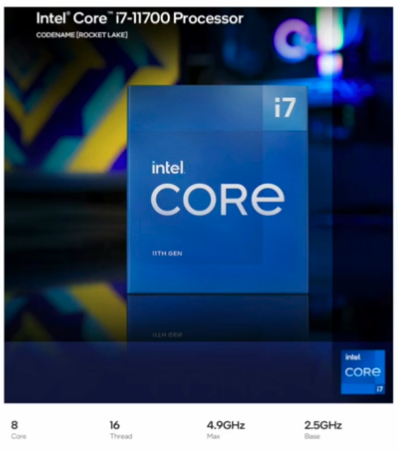

# `CPU` 성능 향상 기법

## 01. 빠른 `CPU`를 위한 설계 기법

### 클럭

- 클럭 속도가 높아지면 `CPU`는 명령어 사이클을 더 빠르게 반복하고 다른 부품들도 발맞춰 더 빠르게 작동한다.
- 클럭 속도는 **헤르츠(`Hz`)**단위로 측정한다.
  - 1초 1번 반복하면 1Hz, 100번 반복하면 100Hz
- 즉, 클럭 속도가 높은 `CPU`는 빠르게 작동한다.
- 하지만, 클럭속도만으로 `CPU`의 성능을 올리는 것은 한계가 있다.

> 고성능을 요하는 순간에는 순간적으로 최대 클럭 속도를 강제로 높이는데 이런 기법을 **오버클럭킹(`overclocking`)**이라 한다.

### 코어와 멀티코어

- `CPU`의 성능을 높이는 방법 중에는 **코어와 스레드 수를 늘리는 방법**이 있다.
- **코어(`Core`) : `CPU` 내에서 명령어를 실행하는 부품으로 여러 개 일 수 있다.**
  - ex) 8Core라고 한다면 ? 명렁어를 실행하는 부품을 8개 포함하고 있다는 뜻이다.
- 코어를 여러 개 포함하고 있는 `CPU`를 **멀티 코어(`multi-core`) `CPU`** 또는 **멀티코어 프로세서**라 한다.

  - **멀티코어 프로세서** : 여러 개의 코어를 포함하고 있는 `CPU`
  - 명령어를 처리하는 일꾼이 여러 명 있는 것과 같다.
    

- ❗️ 코어마다 처리할 명령어들을 얼마나 적절하게 분배하느냐가 중요하고, 그에 따라 연산 속도는 크게 달라진다.

### 스레드와 멀티스레드

> 💡 스레드란? 
> 사전적 의미로는 '실행 흐름의 단위'라고 하지만, 이 정의를 그대로 받아들이지 않아야한다.  > `CPU`에 사용되는 스레드가 두가지로 나뉜다.
>
> 1. 하드웨어적 스레드
> 2. 소프트웨어적 스레드

#### 하드웨어적 스레드

- '**하나의 코어가 동시에 처리하는 명령어 단위**'를 의미한다.
- ex) 2코어 4스레드 👉🏻 명령어를 실행하는 부품 2개, 한 번에 4개의 명령어를 처리할 수 있는 `CPU`
- **멀티스레드(`multithread`)프로세서 `or` 멀티스레드 `CPU`** : 하나의 코어로 여러 명령어를 동시에 처리하는 `CPU`

- 명령어를 실해하는 부품을 8개 포함하고, 한 번에 16개의 명령어를 처리할 수 있는 `CPU`를 의미한다.
- 하이퍼스레딩(`hyper-threading`) : 인텔의 멀티스레드 기술

#### 스프트웨어적 스레드

- '**하나의 프로그램에서 독립적으로 실행되는 단위**'를 의미한다.

> ❗️ 워드 프로세서 프로그램을 개발한다는 가정에 아래의 기능이 동시에 수행되길 원한다.
>
> 1. 사용자로부터 입력받은 내용을 화면에 보여 주는 기능
> 2. 사용자가 입력한 내용이 맞춤법에 맞는지 검사하는 기능
> 3. 사용자가 입력한 내용을 수시로 저장하는 기능

#### 멀티스레드 프로세서

- 소프트웨어적으로 정의된 스레드는 **스레드**
- `CPU`에서 사용되는 스레드는 **하드웨어 스레드**

- 실제로 설계하는 일은 매우 복잡하지만, 가장 큰 핵심은 **레지스터**이다.

- 하드웨어 스레드를 **논리 프로세서**(`logical processor`)라고 부르기도 한다.

> 💡 총 정리
>
> - 하드웨어적 정의 : **하나의 코어가 동시에 처리하는 명령어 단위**를 의미한다.
> - 소프트웨어적 정의 : **하나의 프로그램에서 독립적으로 실행하는 단위**를 의미한다. 
>   (스레드를 위 두가지로 구분지어 기억하자. )
>
> - 코어 : 명령어를 실행할 수 있는 '하드웨어 부품'
> - 스레드 : 명령어를 실행하는 단위
> - 멀티코어 프로세서 : 명령어를 실행할 수 있는 하드웨어 부품이 `CPU`안에 두개 이상 있는 `CPU`
> - 멀티스레드 프로세서 : 하나의 코어로 여러개의 명령어를 동시에 실행할 수 있는 `CPU`

## 02. 명령어 병렬 처리 기법 (`ILP : Instruction-Level Parallelism`)

- 명령어를 동시에 처리하여 `CPU`가 놀지 않고 시간을 알뜰하게 쓰며, 한시도 쉬지 않고 작동시키는 기법

### 명령어 파이프라인

> 클럭 단위로 나누어보는 명령어 처리 과정
>
> 1. 명령어 인출 (`Instruction Fetch`)
> 2. 명령어 해석 (`Instruction Decode`)
> 3. 명령어 실행 (`Execute Instruction`)
> 4. 결과 저장 (`Write Back`)

- 이 단계가 정답은 아니다.
- 전공서에 따라 **명령어 인출 👉🏻 명령어 실행** 또는 **명령어 인출 👉🏻 명령어 해석 👉🏻 명령어 실행 👉🏻 메모리 접근 👉🏻 결과 저장**으로 나누기도 한다.
- 같은 단계가 겹치지만 않는다면 `CPU`는 **각 단계를 동시에 실행할 수 있다**
- 효율적이다.

- 공장 생산 라인과 같이 명령어들을 **명령어 파이프라인**에 넣고 동시에 처리하는 기법을 **명령어 파이프라이닝**(`instruction pipelining`) 이라고 한다.
- 높은 성능을 가져오지만, 특정 상황에서는 성능 향상에 실패하는 경우를 **파이프라인 위험**(`pipeline hazard`)이라 부른다.

> 파이프라인 위험 종류
>
> 1. 데이터 위험
> 2. 제어 위험
> 3. 구조적 위험

#### 데이터 위험

- 명령어 간 '데이터 의존성'에 의해 발생한다.
- 모든 명령어를 동시에 처리할 수 없다.
- 예를 들어, A명령어를 수행 한 후, B 명령어를 수행해야하는 경우.
  - 이를 무시하고 동시에 실행하려하면 파이프라인이 제대로 작동하지 않는다.

#### 제어 위험

- 분기 등으로 인한 '프로그램 카운터의 갑작스러운 변화'에 의해 발생한다.
- 프로그램 카운터는 '현재 실행 중인 명령어의 다음 주소'로 갱신된다.
- But, 프로그램 실행 흐름이 바뀌어 명령어가 실행되면서 프로그램 카운터 값에 갑작스러운 변화가 생긴다면 **명령어 파이프라인에 미리 가지고 와서 처리 중이었던 명령어는 아무쓸모가 없어진다.**
- 이를 위해 사용하는 기술 중 하나가 **분기 예측**(`branch prediction`)이라한다.

#### 구조적 위험

- 명령어들을 겹쳐 실행하ㅏ는 과정에서 서로 다른 명령어가 동시에 `ALU`, 레지스터 등과 같은 `CPU`부품을 사용하려고 할 때 발생된다.
- **자원 위험**(`resource hazard`)이라 부른다.

### 슈퍼스칼라

- **`CPU` 내부에 여러 개의 명령어 파이프라인을 포함한 구조**
- 슈퍼스칼라 명령어 처리가 가능한 `CPU`를 **슈퍼스칼라 프로세서** 또는 **퍼스칼라 CPU**라고 한다.
- 한 번에 여러 명령어를 인출하고, 해석하고, 실행할 수 있기에 슈퍼스칼라 구조를 사용할 수 있다.
- 반드시 파이프라인 개수에 비례하여 빨라지지 않는다.
- 여러 개의 파이프라인을 이용하면 하나의 파이프라인을 사용할 때보다 데이터 위험, 제어위험, 자원위험을 피하기가 더욱 까다롭기 때문에 고도로 설계되어야한다.

### 비순차적 명령어 처리

- OoOE로 줄여 불린다.
- 명령어들을 순차적으로 실행하지 않는 기법으로 **명령어의 합법적인 새치기**라고 볼 수 있다.
- 명령어를 순차적으로만 실행하지 않고 순서를 바꿔 실행해도 무방한 명령어를 먼저 실행하여 멸영어 파이프라인이 멈추는 것을 방지하는 기법

> ❗️
>
> - 3번은 1번이과 바꿀 수 없다.
> - 4번과 5번은 순서를 바꾸어도 실행된다.

## 03. `CISC`와 `RISC`

### 명령어 집합

- `CPU`가 이해할 수 있는 명령어들의 모음을 **명령어 집합**(`instruction set`) 또는 **명령어 집합 구조**(`ISA : Instruction Set Architecture`)
- 즉, `CPU`마다 `ISA`가 다를 수 있다.
- '구조'라는 단어가 붙은 이유는 `CPU`가 어떤 명령어를 이해하는지에 따라 컴퓨터 구조 및 설계 방식이 달라지기 때문이다.
- `ISA`가 다르다는 건 `CPU`가 이해할 수 있는 명령어가 다르다는 뜻이므로 명령어가 달라지면 어셈블리어도 달라진다.
- 즉, 같은 소스 코드로 만들어진 같은 프로그램이라도 `ISA`가 다르면 `CPU`가 이해할 수 있는 명령어와 어셈블리어도 달라진다는 것이다.

> `ISA`는 `CPU`의 언어이자 하드웨어가 소프트웨어를 어떻게 이해할지에 대한 약속

### `CISC`

- `Complex Instruction Set Computer`의 약자이다.
- 복잡한 명령어 집합을 활용하는 컴퓨터(`CPU`), **복잡하고 다양한 명령어들을 활용하는 `CPU` 설계 방식**
- 다양하고 강력한 기능의 명령어 집합을 활용하기 때문에 명령어의 형태와 크기가 다양한 **가변 길이 명령어**를 활용한다.
  - 상대적으로 적은 수의 명령어로도 프로그램을 실행할 수 있다는 것을 의미한다.
  - 프로그램을 실행하는 명령어 수가 적다는 말은 '컴파일된 프로그램의 크기가 작다'는 것을 의마한다.
  - 같은 소스 코드를 컴파일해도 `CPU`마다 생성되는 실행파일의 크기가 다를 수 있다는 것이다.

#### 장점

- '적은 수의 명령어만으로도 프로그램을 동작시킬 수 있다는'점이 메모리 공간을 절약한다.

#### 단점

- 활용하는 명령어가 워낙 복잡하고 다양한 기능을 제공하는 탓에 명령어의 크기와 실행되기까지의 시간이 일정하지 않다.
- 복잡한 명령어 하나를 실행하는데에 여러 클럭 주기가 필요하다.
- 명령어의 규격화가 어려워 파이프라인이 효율적으로 명령어를 처리할 수 없다.
- 대다수의 복잡한 명령어는 사용빈도가 낮다.

### `RISC`

- `Reduced Instruction set Computer`의 약자이다.
- `CISC`에 비해 명령어 종류가 적다.
- 짧고 규격화된 명령어, 되도록 1클럭 내외로 실행되는 명령어를 지향한다.
- **고정 길이 명령어**를 활용한다.
- 파이프라이닝에 최적화되어 있다.
- 메모리에 직접 접근하는 명령어를 `load`, `store` 두 개로 제한할 만큼 메모리 접근을 단순화하고 최소화를 추구한다.
  - `RISC`를 `load-store`구조라 부르기도 한다.
- 메모리 접근을 단순화, 최소화 하는 대신에 **레지스터**를 적극 활용한다.
  - 레지스터를 이용하는 연산이 많고, 일반적인 경우보다 범용 레지스터 개수도 더 많다.
  - 명령어 개수가 `CISC`보다는 적기 때문에 `CISC`보다는 많은 명령으로 프로그램을 작동 시킨다.

### 총 정리

