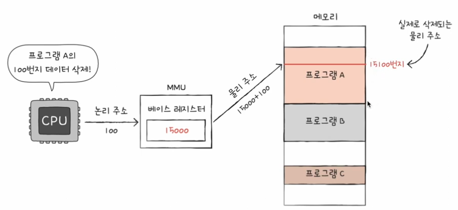

# 메모리와 캐시 메모리

- 메모리라는 용어 대신 `RAM`이라는 용어를 사용

## 01. `RAM`의 특징과 종류

### `RAM`의 특징

- 휘발성 저장 장치 (`volatile memory`)
  - 전원을 끄면 `RAM`에 저장된 명령어와 데이터가 모두 날아간다
- 비휘발성 저장 장치 (`non-volatile memory`)
  - 전원이 꺼져도 저장된 내용이 유지되는 장치
  - 하드디스크, `SSD`, `CO-ROM`, `USB`
  - `CPU`는 보조기억장치에 직접 접근하지 못한다.

> 보조기억장치인 비휘발성 저장 장치에는 '보관할 대상'을 저장  > `RAM`인 휘발성 저장 장치에는 '실행할 대상'을 저장
>
> `CPU`가 실행하고 싶은 프로그램이 보조기억장치에 있다면, `RAM`으로 복사하여 저장한 뒤 실행한다.

### `RAM`의 용량과 성능

**`RAM`용량이 적다면 ?**

- `RAM`용량이 프로그램 A, B, C 중 하나만 저장할 수 있을 만큼 작다면,
- `CPU`가 프로그램 `A`를 실행하고 싶을 때는 보조기억장치에서 프로그램 `A`를 `RAM`으로 가져오고,
- `B`를 실행하고 싶을 때는 `B`를 `RAM`으로, `C`를 실행하고 싶을 때는 `C`를 `RAM`으로 가져와야한다.

- `RAM` 용량이 충분히 크다면 보조기억장치에서 많은 데이터를 가져와 미리 `RAM`에 저장한다.
- 많은 프로그램을 동시에 실행하는데 유리하다.
- 책이 꽂혀 있는 책장 : 보조기억장치
- 책을 읽을 수 있는 책상 : `RAM`

> `RAM`용량이 커지면 프로그램 실행 속도가 어느 정도 증가하는 것도 맞지만, 
> 용량이 필요 이상으로 커졌을 때 속도가 그에 비례하여 증가하지는 않는다.

### `RAM`의 종류

#### `DRAM` (`Dynamic RAM`)

- `Dynamic` : 동적의
- 저장된 데이터가 동적으로 변하는(사라지는) `RAM`
- 즉, 시간이 지나면 저장된 데이터가 점차 사라진다.
- 데이터의 소멸을 막기 위해 일정 주기로 데이터를 재활성화(다시 저장)해야 한다.
- 소배 전력이 비교적 낮고, 저렴하고, 집적도가 높기 때문에 대용량으로 설계하기 용이하다.

> 직접도가 높다 : '더 작고 빽빽하게 만들 수 있다.'

#### `SRAM` (`Static RAM`)

- `Static` : 정적의
- 저장된 데이터가 변하지 않는 `RAM`
- 시간이 지나도 저장된 데이터가 사라지지 않는다.
- 주기적으로 데이터를 재활성화할 필요가 없다.
- `DRAM`보다 속도가 더 빠르다.

> `SRAM`가 비휘발성 메모리는 아닌 이유는, 전원이 공급되지 않으면 저장된 내용이 날아간다.

- 메모리가 아닌 '대용량으로 만들어질 필요는 없지만 속도가 빨라야 하는 저장 장치'인 즉, **캐시 메모리**에서 사용된다.

#### `SDRAM`

- `Synchronous Dynamic RAM`
- 클럭에 맞춰 동작하며 클럭마다 `CPU`와 정보를 주고 받을 수 있는 `DRAM`

#### `DDR SDRAM`

- `Double Data Rate SDRAM`
- 최근 가장 흔히 사용되는 `RAM`
- 대역폭을 넓혀 속도를 빠르게 만든 `SDRAM` ( 대역폭(`data rate`) : 데이터를 주고받는 길의 너비 )
- 자동차 도로와 같이 생각하면된다.
- **두 배의 대역폭으로 한클럭당 두 번씩 `CPU`와 데이터를 주고 받을 수 있고, 전송 속도도 두 배가량 빠르다.**
- `SDR SDRAM(Single Data Rate SDRAM)`이라 부르기도 한다.

> - `DDR2 SDRAM`은 `DDR SDRAM`보다 대역폭이 두 배 넓은 `SDRAM`
> - 즉, `DDR2 SDRAM`은 1차선이 2차선으로, 너비가 네 배 넓은 도로와 같다.
> - `DDR3 SDRAM`은 `DDR2 SDRAM`보다 대역폭이 두 배 넓다.
> - `SDR SDRAM`보다는 대역폭이 여덟 배 넓은 `SDRAM`이다.
> - **최근에 흥히 사용하는 메모리는 `DDR4 SDRAM`으로, `SDR SDRAM`보다 16배 넓은 대역폭을 가진다.**

## 02. 메모리의 주소 공간

- 주소에는 두 종류가 있다.
- 물리 주소 : 메모리 하드웨어가 사용하는 주소
- 논리 주소 : `CPU`와 실행 중인 프로그램이 사용하는 주소

### 물리 주소와 논리 주소

- 현재 메모리 몇 번지에 무엇이 저장되는지 알 수 없다.
- 메모리에 저장된 정보는 시시각각 변하기 때문이다.
  - 메모리에 새롭게 실행되는 프로그램이 시시때때로 적재되고, 실행이 끝난 프로그램은 삭제된다.
  - 같은 프로그램을 실행하더라도 실행할 때마다 적재되는 주소가 달라 질 수 있다.
- 논리 주소
  - 메모장, 게임, 인터넷부라우저같이 **적재되어 있는 프로그램**
  - 프로그램마다 같은 논리 주소가 얼마든지 있고, `CPU`는 이 논리 주소를 받아들이고, 해석하고, 연산한다.

> 논리 주소와 물리 주소 간에 어떠한 변환도 이루어지지 않는다면 `CPU`와 메모리는 서로 이해할 수 없는 주소 체계를 가지고, 각자 다른 이야기만 할 뿐 **상호작용을 할 수 없다.**

#### 논리 주소를 물리 주소로 변환

- `CPU`와 주소 버스 사이에 위치한 **메모리 관리 장치(`MMU : Memory Management Unit`)**라는 하드웨어에 의해 수행된다.
- `MMU`는 **`CPU`가 발생시킨 논리 주소에 베이스 레지스터(프로그램의 기준주소) 값을 더하여 논리 주소를 물리 주소로 변환**한다.

> - 베이스 레지스터
>   - 프로그램의 가작 작은 물리 주소
>   - 즉, 프로그램의 첫 물리 주소를 저장하는 셈이다.
> - 논리 주소
>   - 프로그램의 시작점으로부터 떨어진 거리인 셈이다.

### 메모리 보호 기법

- 프로그램 명령어에서 명령하는 명령들은 **프로그램의 논리 주소 영역을 벗어났기 때문에** 실행되면안된다.
- 예를 들어 삭제하라는 명령어를 실행한다면, 관계도 없는 프로그램을 삭제할 것이다.

> 💡 다른 프로그램의 영역을 침범할 수 있는 명령어는 위험하기 때문에 논리 주소 범위를 벗어나는 명령어 실행을 방지하고 실행 중인 프로그램이 다른 프로그램에 영향을 받지 않도록 보호할 방법이 필요하다. 
> 이를 **한계 레지스터(`limit register`)라고** 한다. 

#### 한계 레지스터

- 베이스 레지스터가 실행 중인 프로그램의 가장 작은 물리 주소를 저장한다면, **논리주소의 최대 크기를 저장**한다.

- 즉, 프로그램의 물리 주소 범위는 베이스 레지스터 값 이상, 베이스 레지스터 값 + 한계 레지스터 값 미만이 된다.
- `CPU`가 접근하려는 논리 주소는 한계 레지스터가 저장한 값보다 커서는 안된다.
- 왜 ? 👉🏻 한계 레지스터보다 높은 주소 값에 접근하는 것은 곧 **프로그램의 범위에 벗어난 메모리 공간에 접근하는 것과 같기 때문**이다.

1. `CPU`는 메모리에 접근하기 전에 접근하고자 하는 논리주소가 한계 레지스터보다 작은지를 항상 검사한다.
2. 만약, `CPU`가 한계 레지스터보다 높은 논리 주소에 접근하려고 하면 인터럽트(트랩)를 발생시켜 실행을 중단한다.

> 이런 방식으로, 
> 실행 중인 프로그램의 독립적인 실행 공간을 확보하고 하나의 프로그램이 다른 프로그램을 침범하지 못하게 보호할 수 있다.

## 03. 캐시 메모리

- `CPU`가 메모리에 접근하는 시간은 `CPU`의 연산 속도보다 느리다.
- 이를 위한 저장 장치가 **캐시 메모리**이다.

### 저장 장치 계층 구조

'빠른 저장 장치'와 '용량이 큰 저장 장치'는 양립하기 어렵다.

1. `CPU`와 가까운 저장 장치는 빠르고, 멀리 있는 저장 장치는 느리다.
2. 속도가 빠른 저장 장치는 저장 욜양이 작고, 가격이 비싸다.

- 낮은 가격대의 대용량 저장 장치를 원한다면, 느린 속도는 감수해야한다.
- 빠른 메모리를 원한다면 작은 용량과 비싼 가격은 감수해야 한다.

> **저장 장치 계층 구조 (`memory hierarchy`)** 
> 컴퓨터가 사용하는 저장 장치들은 '`CPU`에 얼마나 가까운가'를 기준으로 계층적으로 나타낸 구조

- 위 계층으로 올라갈수록 `CPU`와 가깝고 용량은 작지만 빠른 저장 장치, 가격 비쌈
- 아래 계층으로 내려갈수록 `CPU`와 멀고 용량은 크지만 느린 저장 장치, 가격 저렴

### 캐시 메모리

- `CPU`아 메모리 사이에 위치하고, 레지스터보다 용량이 크고 메모리보다 빠른 `SRAM`기반의 저장장치이다.
- `CPU`의 연산 속도와 메모리 접근 속도의 차이를 조금이나마 줄일 수 있다.

ex)

- 메모리 : 물건은 많지만 집과는 멀리 떨어져 있어 왕복이 오래 걸리는 대형마트
- 캐시 메모리 : 물건이 많지는 않아도 집과 가까이 있는 편의점

- `L1 (level 1)` : 코어와 가까운 캐시 메모리
- `L2 (level 2)` : 그 다음 가까운 캐시 메모리
- `L3 (level 3)` : 그 다음 가까운 캐시 메모리

- 캐시 메모리 용량 : `L1` 👉🏻 `L2` 👉🏻 `L3`으로 커짐
- 속도 : `L3` 👉🏻 `L2` 👉🏻 `L1`으로 빨라짐
- 가격 : `L3` 👉🏻 `L2` 👉🏻 `L1`으로 비싸짐

- 멀티 코어 프로세서
- `L1`, `L2` 캐시는 코어마다 고유한 캐시 메모리에 할당
- `L3` 캐시는 여러 코어가 공유하는 형태로 사용
- 명령어만 저장하는 `L1`, 데이터만 저장하는 `L1`으로 `L1`을 분리하는데 이 캐시는 **분리형 캐시**라고 부른다.

### 참조 지역성 원리

#### 캐시 히트

- 보조기억장치는 전원이 꺼져도 기억할 대상을 저장
- 메모리는 실행 중인 대상을 저장한다면 캐시 메모리는 `CPU`가 사용할 법한 대상을 예측하여 저장
- 이때, 자주 사용될 것으로 예측한 데이터가 실제로 들어맞아 캐시 메모리 내 데이터가 `CPU`에서 활용할 경우를 **캐시 히트**라고 한다.

#### 캐시 미스

- 예측이 틀려 메모리에서 필요한 데이터를 직접 가져와야 하는 경우
- `CPU`가 필요한 데이터를 메모리에서 직접 가져와야 하기 때문에 캐시 메모리를 활용할 수 없어 짐으로 **성능이 하락**된다.

#### 캐시 적중률

- 캐시가 히트되는 비율
- 캐시 적중률이 높으면 `CPU`의 메모리 접근 횟수를 줄일 수 있다.

> ❗️ 캐시 히트 횟수 / (캐시 히트 횟수 + 캐시 미스 횟수)

#### 참조 지역성의 원리란 ?

- `CPU`가 메모리에 접근할 때의 주된경향을 바탕으로 만들어진 원리

1. `CPU`는 최근에 접근했던 메모리 공간에 다시 접근하려는 경향이 있다.
2. `CPU`는 접근한 메모리 공간 근처를 접근하려는 경향이 있다.

#### 첫 번째 경향

- `CPU`는 변수가 저장된 메모리 공간을 언제든 다시 참조할 수 있다.
- 변수에 저장된 값은 일반적으로 한 번만 사용되지 않고 프로그램이 실행되는 동안 여러 번 사용된다.
- 즉, `CPU`는 최근 접근했던 (변수가 저장된) 메모리 공간을 여러 번 다시 접근할 수 있다.
- 이를 **시간 지역성**이라 부른다.

#### 두 번째 경향

- `CPU`가 워드 프로세서 프로그램을 실행할 적에는 워드 프로세서 프로그램이 모여 있는 공간 근처를 집중적으로 접근한다.
- 사용자가 입력을 할 적에는 입력 기능이 모여 있는 공간 근처를 집중적으로 접근한다.
- **'접근한 메모리 공간 근처를 접근하려는 경향'을 공간 지역성**이라고 한다.
- 캐시메모리는 참조 지역성의 원리를 입각해 `CPU`가 사용할 법한 데이터를 예측한다.
