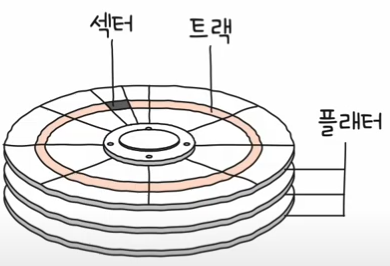

# 보조기억장치

## 01. 다양한 보조기억장치

- 하드 디스크
- 플래시 메모리
  - `USB` 메모리
  - `SD` 카드
  - `SSD`

### 하드 디스크

`HDD : Hard Disk Drive`

- 자기적인 방식으로 데이터를 저장하는 보조기억장치이고, 자기 디스크(`magnetic disk`)의 일종으로 지칭한다.
- 플래터 (`platter`) : 실질적으로 데이터가 저장되는 곳은 (동그란 원판)
  - 자기 물질로 덮여 있어 수많은 `N`극과 `S`극을 저장
  - `N/S`은 0과 1의 역할을 수행
- 스핀들 (`spindle`) : 플래터를 회전시키는 구성 요소
  - 스핀들이 플래터를 돌리는 속도는 분당 회전수를 나타내는 `RPM(Revolution Per Minute)`이라는 단위로 표현
  - ex) `RPM`이 15,000인 하드디스트 - 1분에 15,000바퀴 회전

- 헤드 (`head`) : 플래터를 대상으로 데이터를 읽고 쓰는 구성 요소
  - 플래터 위에서 미세하게 떠 있는 채로 데이터를 읽고 쓰는, 마치 바늘같이 생긴 부품
- 디스크 암 (`disk arm`) : 헤드를 원하는 위치로 헤드를 이동시키는 부품
- 하드디스크
  - 하드 디스크는 `CP`나 `LP`에 비해 훨씬 더 많은 양의 데이터를 저장해야해 여러 겹의 플래터로 이루어져 있고 플래터 양면을 모두 사용할 수 있다.
  - 양면 플래터를 사용하면 위아래로 플래터당 두 개의 헤드가 사용된다.
  - 모든 헤드는 디스크 암에 부착되 다같이 이동된다.

#### 플래터에 데이터가 어떻게 저장될까?

- 플래터는 **트랙**과 **섹터**라는 단위로 데이터를 저장한다.
- 트랙 : 플래터를 여러 동심원으로 나누었을 때 그중 하나의 원
- 섹터 : 피자처럼 여러 조각을 나누는데, 피자 한 조각
  - 하드 디스크의 가장 작은 전송 단위
  - 하나의 섹터는 일반적으로 512바이트 정도의 크기를 가지고 있지만, 정확한 크기는 하드 디스크에 따라 차이가 있다.
- 하나 이상의 섹터를 묶어 **블록**이라 부르기도 한다.
- 실린더 : 여러 겹의 플래터 상에서 같은 트랙이 위치한 곳을 모아 연결한 논리적 단위

> 한 플래터를 동심원으로 나눈 공간은 트랙, 같은 트랙끼리 연결한 원통 모양의 공간은 실린더. 
> 플래터는 트랙과 섹터로 나뉘고, 같은 트랙이 모여 실린더를 이룬다.

- 연속된 정보는 보통 한 실린더에 기록된다.
- 이유는 디스크 암을 움직이지 않고도 바로 데이터에 접근할 수 있기 때문이다.

#### 저장된 데이터에 접근하는 시간

- 탐색 시간 (`seek time`)
  - 접근하려는 데이터가 저장된 트랙까지 헤드를 이동시키는 시간
- 회전 지연 (`rotational latency`)
  - 헤드가 있는 곳으로 플래터를 회전시키는 시간
- 전송 지연 (`transfer time`)
  - 하드 디스크와 컴퓨터 간에 데이터를 전송하는 시간

> 이 시간들이 성능에 큰 영향을 끼치는 시간이다. 
> 접근하려는 데이터가 플래터 혹은 헤드를 조금만 옮겨도 접근할 수 있는 곳에 위치해 있는것도 중요하다.

### 플래시 메모리

- 전기적으로 데이터를 읽고 쓸 수 있는 반도체 기반의 저장 장치이다.
- 보조기억장치 범주에만 속하기보단, 다양한 곳에서 널리 사용하는 저장 장치이다.
  - `ROM`뿐 만 아니라, 일상에 접하는 모든 전자제품 안에 플래시 메모리가 내장되어 있다.
- 플래시 메모리에는 셀(`cell`)이라는 단위가 있는데, 이는 데이터를 저장하는 가장 작은 단위이다.
- 이 셀이 모이고 모여 `MB`, `GB`, `TB`용량을 갖는 저장 장치가 된다.
- 하나의 셀에 몇 비트를 저장할 수 있느냐에 따라 플래시 메모리 종류가 나뉜다.

  

- `SLC (Single Level Cell)` : 한 셀에 1비트를 저장할 수 있는 플래시 메모리 (한 집에 한명)
- `MLC (Multiple Level Cell)` : 한 셀에 2비트를 저장할 수 있는 플래시 메모리 (한 집에 두명)
- `TLC (Triple-Level cell)` : 한 셀에 3비트를 저장할 수 있는 플래시 메모리 (한 집에 세명)

> 💡 이 차이들이 수명, 속도, 각격에 큰 영향을 끼친다.

#### `SLC` 타입

- 한 셀로 두 개의 정보를 표현할 수 있다.
- 수명이 길어 수만에서 수십만 번 가까이 데이터를 쓰고 지우고 반복할 수 있다.

#### `MLC` 타입

- 한 셀로 네 개의 정보를 표현할 수 있다.
- 한 셀에 두 비트씩 저장할 수 있다는 점에서 대용량화하기 유리하다.

#### `TLC` 타입

- 한 셀로 여덟 개의 정보를 표현할 수 있다.

> 즉, 셀의 타입에 따라 수명, 가격, 성능이 다르다.   > `SLC` : 썼다 지우기를 자주 반복해야 하는 경우 혹은 높은 성능을 원하는 경우   > `TLC` : 저가의 대용량 저장 장치를 원하는 경우  > `MLC` : 그 중간을 원하는 경우

 

**셀 보다 더 큰 단위**

- 페이지 : 셀들이 모여 만들어진 단위
- 블록 : 페이지가 모여 만들어진 단위
- 블록이 모이면 플레인, 플레인이 모여 다이가 된다.

- **읽기와 쓰기**는 페이지 단위로 이뤄진다.
- **삭제**는 페이지보다 큰 블록 단위로 이뤄진다.
- 읽기/쓰기 단위와 삭제 단위가 다르다는 것이 플래스 메모리의 가장 큰 특징 중 하나이다.

 

**페이지의 상태**

- `Free` : 어떠한 데이터도 저장하고 있지 않아 새로운 데이터를 저장할 수 있는 상태
- `Valid` : 이미 유효한 데이터를 저장하고 있는 상태
- `Invalid` : 쓰레기값이라 부르는 유효하지 않은 데이터를 저장하고 있는 상태

> 덮어쓰기가 불가능하며, `Valid`상태인 페이지에는 새 데이터를 저장할 수 없다.

#### 가비지 컬렉션

- 유효한 페이지들만 새로운 블록으로 복사한 후 기존 블록을 삭제하여 공간을 정리하는 기능

## 02. `RAID`의 정의와 종류

### `RAID`의 정의

서버 엔지니어라면, 매일 수십, 수백 TB 데이터가 쏟아지고, 데이터에는 개인 정보, 결제 정보 등 절대 잃어버리면 안 될 민감한 정보를 어떻게 관리할 수 있을까 ?

이럴 때 사용할 수 있는 방법이 `RAID`이다.

> `RAID : Redundant Array of Independent Disks`

- 하드 디스크와 `SSD`를 사용하는 기술로, **데이터의 안전성 혹은 높은 성능을 위해 여러 개의 물리적 보조기억장치를 마치 하나의 논리적 보조기억장치처럼 사용하는 기술**을 의미한다.

### `RAID`의 종류

- `RAID`레벨
  - 대표적으로 `RAID0`, `RAID1`, `RAID2`, `RAID3`, `RAID4`, `RAID5`, `RAID6`이 있다.
  - 그로부터 파생된 `RAID 10`, `RAID50`등이 있다.
  - 2, 3은 현재 잘 사용되지 않는다.

> - `RAID 0` : 데이터를 균등하게 분산하여 저장한다.
> - `RAID 1` : 완전한 복사본을 만든다.
> - `RAID 4` : 패리티를 저장한 장치를 따로 두는 방식
> - `RAID 5` : 패리티를 분산하여 저장하는 방식
> - `RAID 6` : 서로 다른 두 개의 패리티를 두는 방식

#### `RAID 0`

- **여러 개의 보조기억장치에 데이터를 단순히 나누어 저장하는 구성 방식**이다.
- 스트라입(`stripe`) : 줄무늬처럼 분산되어 저장된 데이터
- 스트라이핑(`striping`) : 분산하여 저장하는 것.

> `1TB`하드 디스크 네 개로 `RAID 0`를 구성했다면 ? 
> 어떠한 데이터를 저장 할 때 각 하드 디스크는 번갈아 가며 데이터를 저장한다. 
> 즉, **저장되는 데이터가 하드 디스크 개수만큼 나뉘어 저장**한다.

- 스트라이핑되면 저장된 데이터를 읽고 쓰는 속도가 빨라진다. (4배 빠르다.)
- 하나의 대용량 저장 장치를 이용했더라면 여러 번에 걸쳐 읽고 썼을 데이터를 동시에 읽고 쓸 수 있기 때문이다.

**단점**

- 저장된 정보가 안전하지 않다.
- `RAID 0`으로 구성된 하드디스크 중 하나에 문제가 생긴다면 다른 모든 하드 디스크의 정보를 읽는 데 문제가 생길 수 있다.

#### `RAID 1`

- **복사본을 만드는 방식**
- 미러링(`mirroring`) : 거울처럼 완전한 복사본을 만드는 구성
- 쓰기 속도는 `RAID 0`보다 느리다.

**장점**

- 복구가 매우 간단하다.
  - 똑같은 디스크가 두 개인 셈이니, 하나에 문제가 발생해도 잃어버린 정보도 금방 되찾을 수 있다.

**단점**

- 하드 디스크 개수가 한정되었을 때, 사용 가능한 용량이 적어진다.
  - `RAID 1`에서는 `2TB`의 정보만 저장할 수 있다.
- 즉, `RAID 1`에서는 복사본이 만들어지는 용량만큼 사용자가 사용하지 못한다.
- 많은 양의 하드 디스크가 필요하고, 비용이 증가한다.

#### `RAID 4`

- `RAID 1`처럼 완전한 복사본을 만드는 대신 **오류를 검출하고 복구하고 위한 정보를 저장한 장치를 두는 구성 방식**이다.
- 패리티 비트 : 오류를 검출하고 복구하기 위한 정보

- `RAID 1`보다 적은 하드 디스크로도 데이터를 안전하게 보관할 수 있다.

#### `RAID 5`

- `RAID 4`에 병목현상이 발생한다는 문제를 해소할 수 있다.
- **패리티 정보를 분산하여 저장하는 방식**

#### `RAID 6`

- `RAID 5`와 같지만, **서로 다른 두 개의 패리티를 두는 방식**이다.
- 오류를 검출하고 복구할 수 있는 **수단이 두 개인 것**이다.
- 4, 5보다는 안전한 구성이다.
- 쓰기 속도는 5보다 느리다.

  

- **데이터 저장 속도를 조금 희생하더라도 데이터를 더욱 안전하게 보관하고 싶을 때 사용하는 방식**이다.
- 여러 `RAID`레벨을 혼합한 방식을 `Nested RAID`이라 한다.
