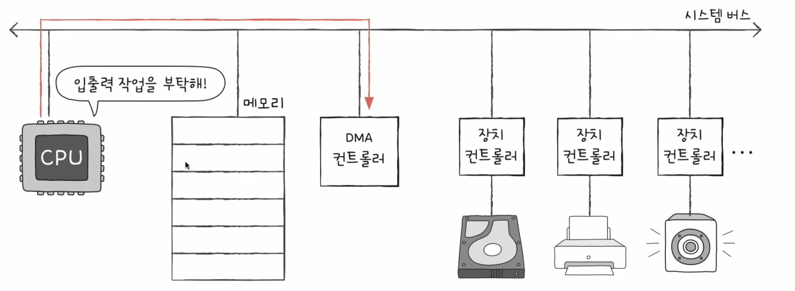
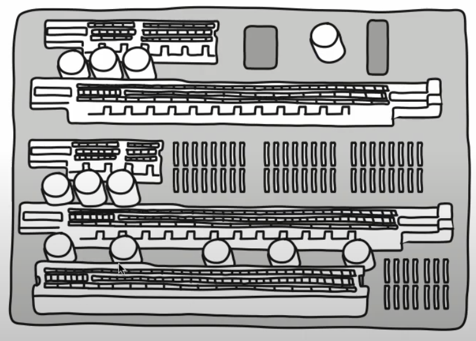

# 입출력장치

## 01. 장치 컨트롤러와 장치 드라이버

### 장치 컨트롤러

- 입출력장치는 `CPU`, 메모리보다 다루기가 더 까다롭다 왜일까 ?

#### 입출력장치에는 종류가 너무나도 많다

- 키보드, 모니터, `USB`메모리, `CD-ROM`, `SSD`, 마우스, 프린터, 스피커, 마이크 등 ..
- 다양한 장치마다 속도, 데이터 전송 형식 등도 다양하다.
- 정보를 주고받는 방식을 규격화하기 어렵다.

#### 일반적으로 `CPU`와 메모리의 데이터 전송률은 높지만 입출력장치의 데이터 전송률은 낮다

- 전송률(`transfer rate`) : 데이터를 얼마나 빨리 교환할 수 있는지를 나타내는 지표
  - 전송률의 차이는 `CPU`와 메모리, 입출력장치 간의 통신을 어렵게한다.
- 이러한 이유로 입출력장치는 컴퓨터에 직접 연결되지 않고 **장치 컨트롤러**라는 하드웨어를 통해 연결한다.
  - 입출력 제어기(`I/O controller`), 입출력 모듈(`I/O module`) 등으로 다양하게 불린다.

> - **모든 입출력 장치는 각자의 장치 컨트롤러를 통해 컴퓨터 내부와 정보를 주고받는다.**
> - **장치 컨트롤러는 하나 이상의 입출력장치와 연결되어 있다.**

 

**앞서 문제들의 해결법**

1. `CPU`와 입출력장치 간의 통신 중개
2. 오류 검출
3. 데이터 버퍼링

> ❗️ 장치컨트롤러가 이러한 문제를 해결한다.

- 데이터 버퍼링
  - 버퍼링 : 전송률이 높은 장치와 낮은 장치 사이에 주고받는 데이터를 **버퍼**라는 임시 저장 공간에 저장해 전송률을 비슷하게 맞추는 방법
  - **'버퍼에 데이터를 조금씩 모았다가 한꺼번에 내보내거나, 데이터를 한 번에 많이 받아 조금씩 내보내는 방법'**
  - 즉, 장치 컨트롤러는 일반적으로 전송률이 높은 `CPU`와 일반적으로 전송률이 낮은 입출력장치와의 전송률 차이를 데이터 버퍼링으로 완화한다.

- 데이터 레지스터
  - `CPU`와 입출력장치 사이에 주고받을 데이터가 담기는 레지스터
  - 데이터 버퍼링으로 전송률 차이를 완화하는 **그 버퍼 역할**을 하는 레지스터이다.
  - 데이터가 많은 입출력장치에서는 대신 `RAM`을 사용하기도 한다.
- 상태 레지스터
  - 입출력장치가 입출력 작업을 할 준비가 되었는지, 입출력 작업이 완료되었는지, 입출력장치에 오류는 없는지 등의 **상태 정보가 저장**되는 레지스터
- 제어 레지스터
  - 입출력장치가 수행할 내용에 대한 제어 정보와 명령을 저장한다.

### 장치 드라이버

- **장치 컨트롤러의 동작을 감지하고 제어함으로써 장치 컨트롤러가 컴퓨터 내부와 정보를 주고받을 수 있게 하는 프로그램**이다.
- 실행과정에서 메모리에 저장된다.
- 장치 컨트롤러가 입출력장치를 연결하기 위한 하드웨어적인 통로라면, 장치 드라이버는 입출력장치를 연결하기 위한 소프트웨어적인 통로이다.

- 컴퓨터가 연결된 장치의 드라이버를 인식하고 실행할 수 있다면, 어떤 회사, 제품, 생김새와 상관없이 컴퓨터 내부와 정보를 주고 받을 수 있다.
- 반대로 인식하거나 실행할 수 없는 상태라면 그 장치는 컴퓨터 내부와 정보를 주고받을 수 없다.

> - 장치 드라이버를 인식하고 실행하는 주체는 윈도우, `macOS`와 같은 운영체제이다.
> - 즉, 운영체제가 장치 드라이버를 인식하고 실행할 수 있다면 그 장치는 컴퓨터 내부와 정보를 주고 받을 수 있다.
>   장치 제작자가 따로 제공해야한다면 입출력장치는 해당 드라이버를 직접 설치해야 사용이 가능하다.

## 02. 다양한 입출력 방법

- 장치 컨트롤러는 `CPU`와 어떻게 정보를 주고받을까 ?

### 프로그램 입출력 (`programmed I/O`)

- 프로그램 속 명령어로 입출력 장치를 제어하는 방법이다.
- `CPU`가 프로그램 속 명령어를 실행하는 과정에서 입출력 명령어를 만나면, `CPU`는 입출력장치에 연결된 장치 컨트롤러와 상호작용하며 입출력 작업을 수행한다.

메모리에 저장된 정보를 하드 디스크에 백업하는 상황이라면 ?

1. '하드 디스크에 새로운 정보를 쓴다'는 말과 같다. 
   우선 `CPU`는 **하드 디스크 컨트롤러의 제어 레지스터에 쓰기 명령을 보낸다.**
2. 하드 디스크 컨트롤러는 하드 디스크 상태를 확인한다. 
   하드 디스크가 준비된 상태라면? **하드 디스크 컨트롤러는 상태 레지스터에 준비되었다고 표시한다.**
3.   3-1. `CPU`는 상태 레지스터를 주기적으로 읽어보며 하드 디스크의 준비 여부를 확인한다. 
   3-2. 하드 디스크가 준비됐음을 `CPU`가 알게 되면 백업할 메모리의 정보를 데이터 레지스터에 쓴다. 

- 아직 백업 작업(쓰기 작업)이 끝나지 않았다면, 01번부터 반복한다.
- 쓰기가 끝났다면 작업을 종료한다.

> `CPU`는 입출력장치들의 주소를 어떻게 알까 ? 
> 즉, `CPU`는 장치 컨트롤러의 레지스터들을 어떻게 알까 ?

- 프린트 컨트롤러의 상태 레지스터를 읽어라.
- 프린트 컨트롤러의 데이터 레지스터에 100을 써라.
- 키보드 컨트롤러의 상태 레지스터를 읽어라.
- 하드 디스크 컨트롤러의 데이터 레지스터에 'a'를 써라.

두가지 방식이 있다.

#### 메모리 앱 입출력

- 메모리에 접근하기 위한 주소 공간과 입출력장치에 접근하기 위한 주소 공간을 하나의 주소 공간으로 간주하는 방법이다.

#### 고립형 입출력

- 메모리를 위한 주소 공간과 입출력장치를 위한 주소 공간을 분리하는 방법이다.

### 인터럽트 기반 입출력

- `CPU`는 장치 컨트롤러에 입출력 작업을 명령하고, 장치 컨트롤러가 입출력장치를 제어하며 입출력을 수행하는 동안 `CPU`는 다른 일을 할 수 있다.
- **장치 컨트롤러가 입출력 작업을 끝낸 뒤 `CPU`에게 인터럽트 요청 신호를 보내면 `CPU`는 하던일을 잠시 백업하고 인터럽트 서비스 루틴을 실행**한다.

> 입출력장치가 많을 때는 ? 
> ex) 글을 쓰며, 노래를 듣고, 영상을 보고

- 인터럽트가 발생한 순서대로 인터럽트를 처리하는 방법
  - ex) 인터럽트 `A`를 처리하는 도중 발생한 또 다른 인터럽트 `B`의 요청을 받아들이지 않고, 인터럽트 `A` 서비스 루틴이 끝난 후에 인터럽트 `B` 서비스 루틴을 실행시키는 것.
- 현실적으로 모든 인터럽트를 전부 순차적으로만 해결할 수 없는데 즉, `CPU`는 인터럽트 간에 우선순위를 고려하여 우선순위가 높은 순으로 여러 인터럽트를 처리할 수 있다.
- 플래그 레지스터 속 인터럽스 비트가 활성화되어 있는 경우, 혹은 인터럽트 비트를 비활성화해도 무시할 수 없는 인터럽트인 `NMi(Non-Maskable Interrupt)`가 발 생한 경우 높은 우선순위로 처리한다.

#### 플그래머블 인터럽트 컨트롤러 (`PIC : Programmable Interrupt Controller`)

- 하드웨어이다.
- 여러 장치 컨트롤러에 연결되어 장치 컨트롤러에서 보낸 하드웨어 인터럽트 요청들의 우선순위를 판별한 뒤, `CPU`에 지금 처리해야 할 하드웨어 인터럽트는 무엇인지를 알려주는 장치이다.'

> `PIC`의 다중 인터럽트 처리 과정 
>
> 1. `PIC`가 장치 컨트롤러에서 **인터럽트 요청 신호**를 받아들인다.
> 2. `PIC`는 인터럽트 우선순위를 판단한 뒤, `CPU`에 처리해야 할 **인터럽트 요청신호**를 보낸다.
> 3. `CPU`는 `PIC`에 **인터럽트 확인 신호**를 보낸다.
> 4. `PIC`는 데이터 버스를 통해 `CPU`에 **인터럽트 벡터**를 보낸다.
> 5. `CPU`는 인터럽트 벡터를 통해 인터럽트 요청의 주체를 알게 되고, 해당 장치의 **인터럽트 서비스 루틴**을 실행한다.

- 여러 개의 `PIC`를 사용하면 훨신 더 많은 하드웨어 인터럽트를 관리할 수 있다.

### `DMA` 입출력

- 프로그램 기반 입출력과 인터럽트 기반 입출력에 **공통점**은 입출력장치와 메모리 간의 데이터 이동의 `CPU`가 주도하고, 이동하는 데이터도 반드시 `CPU`를 거친다는 점이다.

 

- 입출력장치 데이터를 메모리에 저장하는 경우
  - `CPU`는 장치 컨트롤러에서 입출력장치 데이터를 하나씩 읽어 레지스터에 적재한다.
  - 적재한 데이터를 메모리에 저장한다.
- 메모리 속 데이터를 입출력장치에 내보내는 경우
  - `CPU`는 메모리에서 데이터를 하나씩 읽어 레지스터에 적재한다.
  - 적재한 데이터를 하나씩 입출력장치에 내보낸다.

> `CPU`에 부담이 가지 않도록 거치지 않고 상호작용할 수 있는 입출력 방식이 **`DMA : Direct Memory Access`** 이다. 
> 직접 메모리에 접근할 수 있는 입출력 기능이다.
> `DMA` 입출력을 하기 위해서 시스템 버스에 연결된 `DMA`컨트롤러라는 하드웨어가 필요하다.

#### `DMA`입출력 과정

1. `CPU`는 `DMA` 컨트롤러에 하드 디스크 주소, 수행할 연산(쓰기), 백업할 내용이 저장된 메모리의 주소 등의 정보와 함께 입출력 작업을 명령한다.
   

2. (`DMA` 컨트롤러는 `CPU`를 거치지 않고 메모리와 직접 상호작용하며 백업할 정보를 읽어오고) 이를 하드 디스크의 장치 컨트롤러에 내보낸다.
   

3. 백업이 끝나면 `DMA` 컨트롤러는 `CPU`에게 인턻트를 걸어 작업이 끝났을을 알린다.
   

 

- `CPU`는 오로지 입출력의 시작과 끝에만 관여하면 된다.
- `DMA` 컨트롤러는 시스템 버스로 메모리에 직접 접근이 가능하지만, **시스템 버스는 동시 사용이 불가능**하다.
  - 공용 자원이기 때문이다.

- 그럴 때는
  - `DMA` 컨트롤러는 `CPU`가 시스템 버스를 이용하지 안을 때마다 조금씩 시스템 버스를 이용하거나,
  - `CPU`가 일시적으로 시스템 버스를 이용하지 않도록 허락을 구하고 시스템 버스를 집중적으로 이용한다.

#### 입출력 버스

`DMA` 입출력 과정에서 한 번 메모리에 접근할 때마다 시스템 버스를 두 번 사용하는 단점 또는 문제가 있다.

- `DMA` 컨트롤러와 장치 컨트롤러들을 **입출력 버스**라는 별도의 버스에 연결해 해결할 수 있다.
- 장치 컨트롤러들이 시스템 버스가 아닌 입출력 버스로 `DMA` 컨트롤러에 연결된다면 `DMA` 컨트롤러와 장치 컨트롤러가 서로 데이터를 전송할 때는 **시스템 버스를 이용할 필요가 없으므로 시스템 버스의 사용 빈도를 줄일 수 있다.**

 

- 대부분의 입출력(장치 컨트롤러)장치는 입출력 버스와 연결된다.
  - 입출력 버스에는 `PCI (Peripheral Component Interconnect)`버스, `PCI Express(PCIe)`버스 등의 여러 종류가 있다.
  - 거의 모든 입출력장치들은 입출력 버스와 연결되는 통로를 통해 시스템 버스를 타고 `CPU`와 정보를 주고 받는다.
