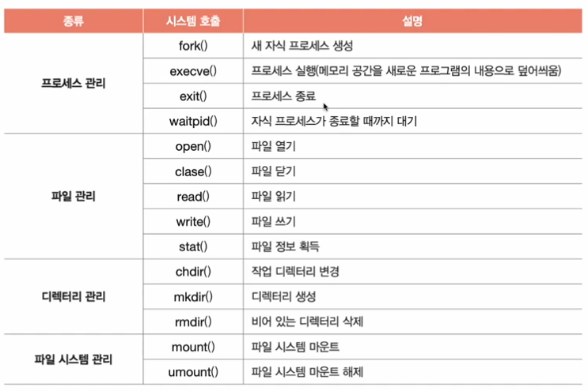

# 가상 머신과 이중 모드의 발전 & 시스템호출의 종류

## 가상 머신

- 소프트웨어적으로 만들어낸 가상 컴퓨터이다.
- 가상 머신을 설치하면 새로운 운영체제와 응용 프로그램을 설치하고 실행할 수 있다.
- 가상 머신 또한 응용프로그램이므로, 사용자 모드로 작동된다.
- 가상화를 지원하는 `CPU`는 커널 모드와 사용자 모드 이외에 가상 머신을 위한 모드인 **하이퍼바이저 모드**를 따로 둔다.
- 이렇게 가상 머신 상에서 작동하는 응용 프로그램들은 하이퍼바이저 모드로써 가상 머신에 설치된 운영체제로부터 운영체제 서비스를 받을 수 있다.

## 시스템호출의 종류

