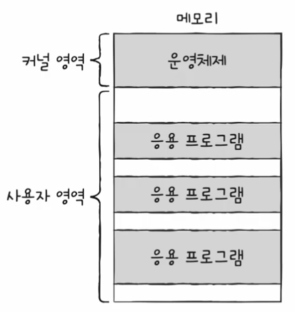
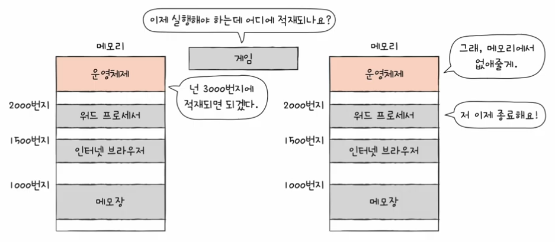
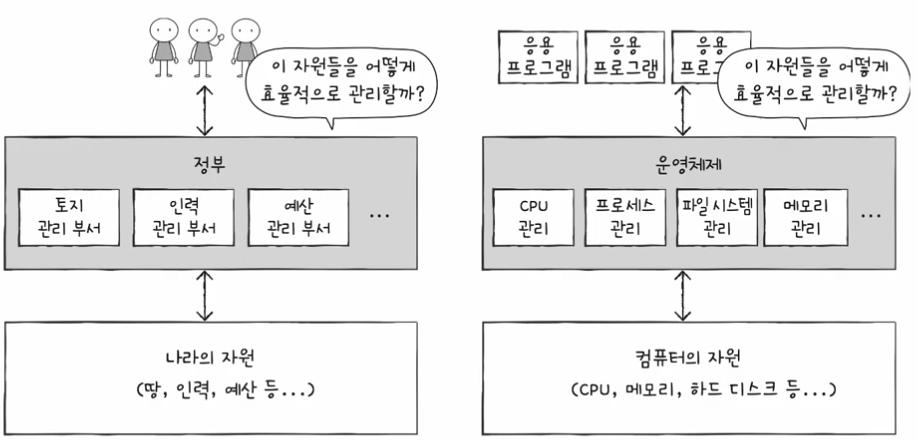
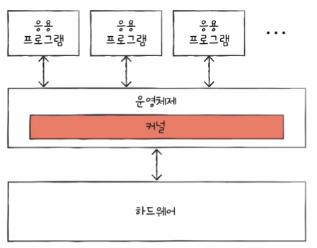
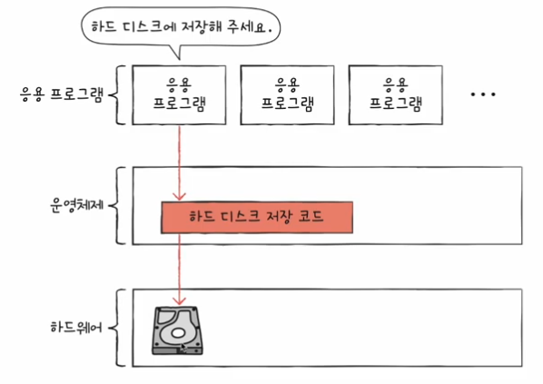
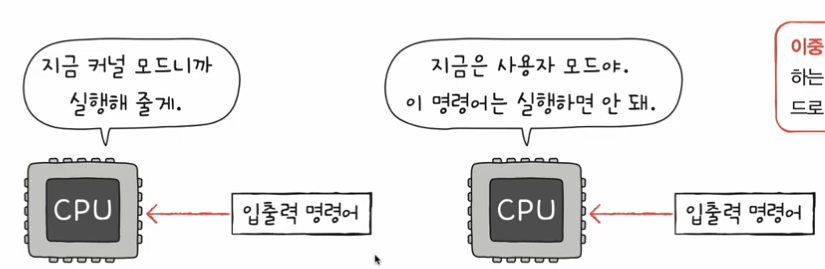
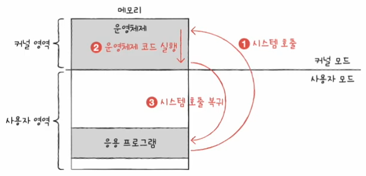
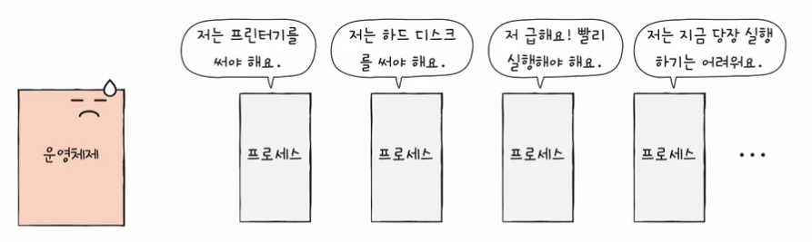

# 운영체제 시작하기

## 01. 운영체제를 알아야하는 이유

### 운영체제란

> 모든 프로그램은 실행되기 위해 반드시 자원이 필요하다. 
> 프로그램 실행에 마땅히 필요한 요소들을 가리켜 **시스템 자원** 혹은 **자원**이라 한다. 
> ❗️실행할 프로그램에 필요한 자원을 할당하고, 프로그램이 올바르게 실행되도록 돕는 특별한 프로그램을 **운영체제**이다.

- 운영체제는 매우 특별한 프로그램이기 때문에 항상 컴퓨터가 부킹될 때 메모리 내 **커널 영역**이라는 공간에 따로 적재되어 실행된다.
- 커널영역을 제외한 나머지 영역, 사용자가 이용하는 프로그램이 적재되는 영역을 **사용자 영역**이라 한다.
- 즉, 운영체제는 커널 영역에 적재되어 사용자 영역에 적재된 프로그램들에 자원을 할당하고 올바르게 실행되도록 돕는다.

**응용 프로그램** 
사용자가 특정 목적을 위해 사용하는 일반적인 프로그램을 의미한다. 
일상적으로 사용하는 워드 프로세서, 인터넷 브라우저, 메모장, 게임 등과 같은 프로그램이 모두 응용프로그램이다.

> 이 세 개의 응용 프로그램이 실행되려면 반드시 `CPU`가 필요하다. 
> 어떤 프로그램부터 `CPU`를 사용할까?  
> 얼마나 오랫동안 `CPU`를 이용할까 ?  
> 이 또한 운영체제가 해결한다. 
> 어느 한 프로그램이 **`CPU`를 독점하면 다른 프로그램들은 올바르게 실행될 수 없기 때문에 운영체제는 최대한 공정하게 여러 프로그램에 `CPU`자원을 할당**한다. 
> 👍🏼 내 생각은 운영체제는 중재자다..?

- 운영체제는 정부에 비유된다.
- 정부는 땅, 인력, 돈 등 국내 자원을 효율적으로 배분하고, 국민들이 지켜야 할 규칙을 만들어 나라 전체를 관리하는 것 처럼 !
- **응용 프로그램에 자원을 효율적으로 배분하고, 실행할 프로그램들이 지켜야 할 규칙을 만들어 컴퓨터 시스템 전체를 관리한다.**

### 운영체제를 알아야하는 이유

- 문제해결
  - 운영체제는 현재 하드웨어의 상태는 어떤지, 코드가 어떻게 실행되었는지, 하드웨어 상에 어떤 문제가 있었는지 등등..을 상세히 알려주며 **문제 해결의 실마리를 찾을 수 있다.**
  - 즉, 운영체제를 깊이 이해하면 운영체제가 건네는 말을 제대로 이해할 수 있고, 운영체제에 제대로 명령할 수 있게된다.
  - 운영체제 덕분에 개발자는 하드웨어를 조작하는 코드를 직접 작성할 필요가 없다는 점.

## 02. 운영체제의 큰 그림

1. 운영체제에서 매우 중요한 개념인 **커널**
2. 응용 프로그램이 운영체제로부터 어떻게 도움을 받으며 실행되는지를 이해하기 위해 **이중모드와ㅏ 시스템호출**의 개념
3. 운영체제가 응용 프로그램에 제공하는 서비스 종류

### 운영체제의 심장, 커널

- 커널
  - 자원에 접근하고 조작하는 기능, 프로그램이 올바르고 안전하게 실행되게 하는 기능이 운영체제의 핵심 서비스에 속한다.
  - 이러한 운영체제의 핵심 서비스를 담당하는 부분을 **커널**이라한다.
  - 어떤 커널을 사용하는지에 따라 실행하고 있는 개발하는 프로그램이 하드웨어를 이용하는 양상이 달라지고, **결과적으로 컴퓨터 전체의 성능도 달라질 수 있다.**

- 운영체제가 제공하는 서비스 중 **커널에 포함되지 않는 서비스**
  - 사용자 인터페이스 : 윈도우의 바탕화면과 같이 사용자가 컴퓨터와 상호작용할 수 있는 통로
- 운영체제가 제공하는 **사용자 인터페이스의 종류**
  - 그래픽 유저 인터페이스
    - 윈도우 바탕화면이나 스마트폰의 화면처럼 그래픽을 기반으로 컴퓨터와 상호작용할 수 있는 인터페이스
  - 커맨드 라인 인터페이스
    - 명령어를 기반으로 컴퓨터와 상호작용할 수 있는 인터페이스

### 이중 모드와 시스템 호출

- 운영체제는 문지기 역할을 한다.
- 응용 프로그램에 접근하기 위해서는 운영체제에 도움을 요청한다.
  - 즉, 운영체제 코드를 실행하려한다 라는 말과 동일하다.
- **운영체제의 문지기 역할은 이중 모드로써 구현**된다.

#### 이중 모드

- 이중 모드 (`dual mode`)
  - `CPU`가 명령어가 실행하는 모드를 크게 **사용자 모드와 커널모드로 구분하는 방식**이다.
  - `CPU`는 명령어를 사용자모드로써 실행할 수 있고, 커널 모드로써 실행할 수 있다.
- 사용자 모드 (`user mode`)
  - 운영체제 서비스를 제공받을 수 없는 실행 모드
  - 즉, 커널 영역의 코드를 실행할 수 없는 모드이다.
  - 일반적으로 응용 프로그램은 기본적으로 사용자 모드로 실행된다.
  - 사용자 모드로 실행 중인 `CPU`는 입출력 명령어와 같이 하드웨어 자원에 접근하는 명령어를 실행할 수 없다.
  - **사용자 모드로 실행되는 일반적인 응용프로그램은 자원에 접근할 수 없다.**
- 커널 모드 (`kenel mode`)
  - 운영체제 서비스를 제공받을 수 있는 실행 모드
  - 즉, 커널 영역의 코드를 실행할 수 있는 모드이다.
  - `CPU`가 커널 모드로 실행하면 자원에 접근하는 명령어를 비롯한 모든 명령어를 실행할 수 있다.
  - **운영체제는 커널 모드로 실행되기 때문에 자원에 접근할 수 있다.**

#### 시스템 호출

- 사용자 모드로 실행되는 프로그램이 자원에 접근하는 운영체제 서비스를 제공받으려면 **운영체제에 요청을 보내 커널 모드로 전환**되어야한다.
- **운영체제 서비스를 제공받기 위해 커널 모드로 전환하는 방법**이다.
- 시스템 호출은 일종의 인터럽트이다. 정확히는 소프트웨어적인 인터럽트이다.
- **소프트웨어적 인터럽트**
  - 입터럽트는 입출력장치에 의해 발생하기도 하지만, 인터럽트를 발생시키는 특정 명령어에 의해 발생하기도한다.

1. 하드 디스크에 데이터를 저장하는 시스템 호출을 발생시켜 커널 모드로 전환한다.
2. 운영체제 내의 '하드 디스크에 데이터를 저장하는 코드'를 실행함으로써 하드 디스크에 접근할 수 있다.
3. 하드 디스크에 접근이 끝났다면 다시 사용자 모드로 복귀하여 실행을 계속해 나간다.

> 일반적으로 응용프로그램은 실행과정에서 운영체제 서비스들을 매우 빈번하게 이용한다. 
> 그 과정에서 빈번하게 시스템 호출을 발생시키고 사용자 모드와 커널 모드를 오가며 실행된다.

### 운영체제의 핵심 서비스

#### 프로세스 관리

- 실행 중인 프로그램
- 컴퓨터를 실행하는 동안 메모리 안에서는 새로운 프로세스들이 마구 생성되고, 사용되지 않는 프로세스는 메모리에서 삭제된다.
- `CPU`는 한 프로세스를 실행하다가 다른 프로세스로 실행을 전환하고, 그 프로세스를 실행하다가 또 다른 프로세스로 실행을 전환하는 것을 반복한다.

- 각 프로세스는 상태도, 사용하고자 하는 자원도 다양하다.
- 여러 프로세스가 동시에 실행되는 환경에서는 '프로세스 동기화'가 필수적이고, 프로세스가 꼼짝도 못하고 더 이상 실행되지 못하는 상황인 '교착 상태'를 해결해야 한다.
- 12chap, 13chap에서 자세히 다룬다.

#### 자원 접근 및 할당

운영체젝가 `CPU`, 메모리, (보조기억장치와) 입출력장치를 어떻게 관리하고, 결과적으로 어떤 기능을 제공하는지 알아보자.

##### `CPU`

- 메모리에는 여러 프로세스가 적재되고, 하나의 `CPU`는 한 번에 하나의 프로세스만 실행할 수 있다.
- 하나의 프로세스가 `CPU`를 이용하고 있다면 다른 프로세스를 기다려야한다.
- 이에 운영체제는 프로세스들에 공정하게 `CPU`를 할당하기 위해 어떤 프로세스부터 `CPU`를 이용하게 할 것인지, 얼마나 오래 `CPU`를 이용하게 할지를 결정할 수 있어야한다.
- **이를 `CPU`스케줄이라 한다.**

##### 메모리

- 메모리에 적재된 프로세스들은 크기도, 적재되는 주소도 가지각색이다.
- 같은 프로세스라 할지라도 실행할 때마다 적재되는 주소가 달라질 수 있다.
- 그래서 운영체제는 새로운 프로세스가 적재될 때마다 어느 주소에 적재해야할지를 결정해야한다.
- 때론, 메모리가 이미 꽉 차 있어 꼭 실행해야 할 프로세스를 적재할 공간이 없는 경우도 있고, 메모리에 공간이 남았는 데도 불구하고 프로세스를 적재하지 못하는 상황도 발생한다.

##### 입출력장치

- 입출력장치가 `CPU`에 하드웨어 인터럽트 요청 신호를 보내면 `CPU`는 하던 일을 잠시 백업한 뒤 커널 영역에 있는 인터럽트 서비스 루틴을 실행한다.
- 운영체제는 인터럽트를 처리하는 프로그램, 즉 인터럽트 서비스 루틴을 제공함으로써 입출력작업을 수행한다.

#### 파일 시스템 관리

- 컴퓨터를 사용할 때는 여러 파일을 열고, 생성하고, 삭제한다.
- 이 파일들을 한데 묶어 디렉터리로 관리한다.
- 이런 파일 시스템도 운영체제가 지원하는 핵심 서비스이다.
