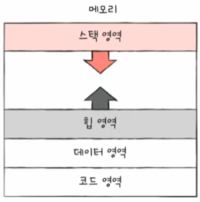
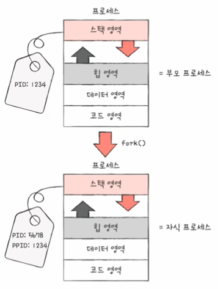

# 프로세서와 스레드

## 01. 프로게스 개요

### 프로세스 직접 확인하기

- 윈도우에서는 작업 관리자의 [프로세스] 탭에서 확인


- 유닉스 체계의 운영체제(리눅스, `macOS`)에서는 `ps` 명령어에서 확인


- 포그라운드 프로세스 (`foreground process`)
  - 사용자가 볼 수 있는 공간에서 실행되는 프로세스
- 백그라운드 프로세스 (`background process`)
  - 보이지 않는 공간에서 실행되는 프로세스
  - 백그라운드 프로세스 중에서도 **사용자와 직접 상호작용할 수 있는 백그라운드 프로세스와 상호작용하지 않고 그저 묵묵히 정해진 일만 수행하는 백그라운드 프로세스**가 있다.
  - 유닉스 체계의 운영체제에서는 **데몬**이라 부른다.
  - 윈도우 운영체제에서는 **서비스**라 부른다.

### 프로세스 제어 블록

- 모든 프로세스는 실행을 위해 `CPU`가 필요하지만, `CPU`자원은 한정적이다.


- 자신의 차례가 되면 정해진 시간만큼 `CPU`를 이용하고, 시간이 끝났음을 알리는 인터럽트(타이머 인터럽트)가 발생하면 자신의 차례를 양보하고 다음 차례가 올 때까지 기다린다.
- **프로세스 제어 블록** (`PCB : Process Control Block`)
  - 프로세스와 관련된 정보를 저장하는 자료 구조이다.
  - 비유를 한다면 **상품에 달린 태그**와 같다.
  - 프로세스 제어 블록에는 해당 프로세스를 식별하기 위해 꼭 필요한 정보들이 저장된다.

<br/>

**PCB**

- 메모리는 커널 영역과 사용자 영역으로 나뉘어있는데 **PCB는 커널 영역에 생성**된다.
- 태그로 특정 옷을 식별하고 관련된 정보를 판단하는 것이 **특정 프로세스를 식별하ㅏ고 해당 프로세스를 처리하는데 필요한 정보를 판단**한다.
- `PCB`는 프로세스 생성 시에 만들어지고 실행이 끝나면 폐기한다.
  - 즉, 운영체제가 `PCB`를 생성하고 실행이 끝나면 폐기한다는 것이다.

## **`PCB`에 담기는 정보**

#### 프로세스 ID

- 특정 프로세스를 식별하기 위해 부여하는 고유한 번호이다.
- 같은 일을 수행하는 프로그램이라 할지라도 두 번 실행하면 PID가 다른 두 개의 프로세스가 생성된다.

#### 레지스터 값

- 프로세스는 자신의 실행 차례가 돌아오면 이전까지 사용했던 레지스터의 중간값들을 모두 복원한다.
- 그래야만 이전까지 진행했던 작업들을 그대로 이어 실행할 수 있다.
- 그래서 `PCB`안에는 해당 프로세스가 실행하며 사용했던 프로그램 카운터를 비롯한 레지스터 값들이 담긴다.

#### 프로세스 상태

- 현재 프로세스가 어떤 상태인지 `PCB`에 기록된다.

#### `CPU` 스케줄링 정보

- 프로세스가 언제, 어떤 순서로 `CPU`를 할당받을지에 대한 정보도 `PCB`에 기록된다.

#### 메모리 관리 정보

- 프로세스마다 메모리에 저장된 위치가 다르기때문에 `PCB`에는 프로세스가 어느 주소에 저장되어 있는지에 대한 정보가 있어야한다.
- **`PCB`에는 베이스 레지스터, 한곌 레지스터 값, 프로세스 주소를 알기 위한 또 다른 중요 정보 중 하나인 페이지 테이블 정보가 담긴다.**

#### 사용한 파일과 입출력장치 목록

- 프로세스가 실행 과정에서 특정 입출력장치나 파일을 사용하면 `PCB`에 해당 내영이 명시된다.
- 즉, 어떤 입출력장치가 이 프로세스에 할당되었는지, 어떤 파일들을 열었는지에 대한 정보들이 `PCB`에 기록된다.
- 운영체제는 커널 영역에 적재된 `PCB`의 기록을 보고 프로세스를 관리한다.

### 문맥 교환 (`context switch`)

> `A`프로세스에서 `B`프로세스로 실행순서가 넘어간다면 ? <br/>
> 👉🏻 기존에 실행되고 있는 `A`프로세스는 중간 정보를 백업한다.


- 이러한 중간 정보, 즉 하나의 프로세스 수행을 재개하기 위해 기억해야 할 정보를 **문맥**이라한다.
- **실행 문맥을 백업해두면 언제든 해당 프로세스의 실행을 재개할 수 있다.**
- **뒤이어 실행할 `B`프로세스의 문맥을 복구**하며 자연스럽게 실행 중인 프로세스가 바뀐다.


- 이러한 과정을 **문맥 교환**이라한다.
  - 여러 프로세스가 끊임없이 빠르게 번갈아 가며 실행되는 원리

### 프로세스의 메모리 영역

- 하나의 프로세스는 사용자 영역에 크게 코드 영역, 데이터 영역, 힙 영역, 스택 영역으로 나뉜다.

#### 코드 영역

- 텍스트 영역이라고도 불린다.
- 기계어로 이루어진 명령어가 저장된다.
- 데이터가 아닌 `CPU`가 실행할 명령어가 담겨 있기 때문에 쓰기가 금지되어있다.
- 즉, 읽기 전용 공간이다.

#### 데이터 영역

- 잠깐 썼다가 없앨 데이터가 아닌 **프로그램이 실행되는 동안 유지할 데이터가 저장되는 공간**이다.
- **전역 변수**가 대표적이다.
- 코드 영역과 데이터 영역의 크기가 변하지 않는다.
- 정적 할당 영역 : 크기가 고정된 영역 (코드, 데이터)
- 동적 할당 영역 : 크기가 변할 수 있는 영역 (힙, 스택)

#### 힙영역

- 프로그래머가 직접 할당할 수 있는 저장공간이다.
- 힙 영역에 메모리 공간을 할당했다면 언젠간 해당 공간에 반환해야한다.
  - 운영체제에 '더 이상 해당 메모리 공간을 사용하지 않는다'라는 말과 같다.
- 메모리 누수 : 메모리 공간을 반환하지 않는 다면, 할당한 공간은 메모리 내에 계속 남아 메모리 낭비를 하는 것이다.

```
ex)
693848==ERROR: LeakSanitizer: detected memory leaks
...
```

#### 스택 영역



- 데이터를 일시적으로 저장하는 공간
- 잠깐 쓰다가 말 값들이 저장되는 공간으로 함수의 실행이 끝나면 사라지는 매개변수, 지역변수가 대표적이다.
- 일시적으로 저장할 데이터는 스택 영역에 `PUSH`, 더 이상 필요하지 않은 데이터는 `POP`되며 스택 영역에서 사라진다.

## 02. 프로세스 상태와 계층 구조

### 프로세스 상태

#### 생성 상태

- 프로세스를 생성 중인 상태
- 이제 막 메모리에 적재되어 `PCB`를 할당 받은 상태

#### 준비 상태

- 당장이라도 `CPU`를 할당받아 실행할 수 있지만, 아직 자신의 차례가 아니기에 기다리고 있는 상태
- 디스패치 : 준비 상태인 프로세스가 실행 상태로 전환되는 것

#### 실행 상태

- `CPU`를 할당받아 실행 중인 상태
- 할당된 일정 시간 동안만 `CPU`를 사용할 수 있다.
- 프로세스가 할당된 시간을 모두 사용한다면 다시 준비 상태가 되고, 실행 도중 입출력장치를 사용하여 입출력장치의 작업이 끝날 때까지 기다려야 한다면 대기 상태가 된다.

#### 대기 상태

- 실행 도중 입출력장치를 사용하는 경우가 있다.
- 입출력 작업은 `CPU`에 비해 처리 속도가 느리기에, 입출력 작업을 요청한 프로세스는 입출력장치가 입출력을 끝낼 때까지 기다려야한다.
- 입출력장치의 작업을 기다리는 상태를 **대기 상태**라고 한다.
- 입출력 작업이 완료되면 해당 프로세스는 다시 준비 상태로 `CPU` 할당을 기다린다.

#### 종료 상태

- 프로세스가 종료된 상태
- 운영체제는 `PCB`와 프로세스가 사용한 메모리를 정리한다.

#### 프로세스 상태 다이어그램 (`process state diagram`)


- 운영체제는 이 상태를 `PCB`에 기록하며 프로세스들을 관리한다.

### 프로세스 계층 구조

- 프로세스는 실행 도중 시스템 호출을 통해 다른 프로세스를 생성할 수 있다.
- 부모 프로세스 : 새 프로세스를 생성한 프로세스
- 자식 프로세스 : 부모 프로세스에 의해 생성된 프로세스

> 부모, 자식 프로세스는 다른 프로세스이기에 다른 `PID`를 가진다.<br/>
> 일부 운영체제에는 자식 프로세스의 `PCB`에 부모 프로세스의 `PID`인 `PPID : Parent PID`가 기록된다.


- 컴퓨터가 부팅될 때 실행되는 최초의 프로세스가 자식 프로세스들을 생성하고, 생성된 자식 프로세스들이 새로운 프로세스들을 낳는 형식으로 여러 프로세스가 동시에 실행된다.
- 이 도표의 트리 구조를 **프로세스 계층 구조**라 한다.

### 프로세스 생성 기법

- 부모 프로세스를 통해 생성된 자식 프로세스들은 **복제와 옷 갈아입기**를 통해 실행된다.
- `fork`, `exec`는 시스템 호출이다.



1. 부모 프로세스는 `fork`를 통해 자신의 복사본을 자식 프로세스로 생성한다.
2. 만들어진 복사본(자식 프로세스)은 `exec`를 통해 자신의 메모리 공간을 다른 프로그램으로 교체한다.


- `fork` : 자기 자신 프로세스의 복사본을 만드는 시스템 호출이다.
  - 메모리 내의 내용, 열린 파일의 목록 등이 자식 프로세스에 상속된다.
  - (복사된 자식 프로세스라 할지라도 `PID`값이나 저장된 메모리 위치는 다르다.)
- `exec` : 자신의 메모리 공간을 새로운 프로그램으로 덮어쓰는 시스템 호출이다.
  - 코드/데이터 영역은 실행할 프로그램의 내용으로 바뀌고, 나머지 영역은 초기화한다.


- 부모가 자식 프로세스를 실행하며 프로세스 계층 구조를 이루는 과정은 `fork`와 `exec`가 반복되는 과정이다.

## 03. 스레드

- 프로세스를 구성하는 싱행의 흐름 단위이다.
- 하나의 프로세스는 여러 개의 스레드를 가질 수 있다.
- 스레드를 이용하면 하나의 프로세스에서 여러 부분을 동시에 실행할 수 있다.

### 프로세스와 스레드

- 단일 스레드 프로세스 : 프로세스를 구성하는 '실행의 흐름단위가 하나'
- 스레드는 프로세스 내에서 각기 다른 값들로 구성되므로 다른 코드를 실행할 수 있다.
  - 스레드 `ID`
  - 프로그램 카운터 값
  - 레지스터 값
  - 스택
- 많은 운영체제는 `CPU`에 처리할 작업을 전달할 때 프로세스가 아닌 **스레드 당뉘로 전달**한다.
- **프로세스 자원을 공유한 채 실행에 필요한 최소한의 정보로만 실행**된다.

### 멀티프로세스와 멀티스레드

- 멀티프로세스 (`multiprocess`) : 여러 프로세스를 동시에 실행하는 것
- 멀티스레드 (`multithread`) : 여러스레드로 프로세스를 동시에 실행하는 것


> 여러 프로세스를 실행하는 것과 여러 스레드로 실행하는 것의 차이는 무엇일까?

#### 멀티 프로세스


💡<br/>
👉🏻 프로세스끼리는 기본적으로 자원을 공유하지 않지만,<br/>
👉🏻 스레드끼리는 같은 프로세스 내의 자원을 공유한다.
👉🏻 남남처럼 독립적으로 실행된다.

- 프로세스를 `fork`하면 코드/데이터/힙 영역 등 모든 자원이 복제되어 저장된다.
- 저장된 메모리 주소를 제외하면, 모든 것이 동일한 프로세스 2, 3, 4..개가 통째로 메모리에 적재되므로 **메모리 낭비**가 된다.

> 참고로,<br/> > `fork`직후 같은 프로세스를 **통째로 메모리에 중복 저장하지 않으면서** 동시에 프로세스끼리 자원을 공유하지 않는 방법도 있다.<br/>
> 이를 **쓰기 시 복사 (`copy on write`)기법**이라한다.

#### 멀티 스레드


💡<br/>
👉🏻 스레들은 각기 다른 스레드ID, 프로그램 카운터 값을 포함한 레지스터 값, 스택을 가질 뿐,<br/>
👉🏻 프로세스가 가지는 자원을 공유한다.
👉🏻 협력과 통신에 유리하다.

#### 각 특성의 특징


멀티 프로세스 환경 👉🏻 하나의 프로세스에 문제가 생겨도 다른 프로세스에는 지장이 적거나 없다.<br/>
멀티 스레드 환경 👉🏻 하나의 스레드에 문젝가 생기면 프로세스 전체에 문제가 생길 수 있다.<br/>
**왜❓**<br/>
👉🏻 모든 스레드는 프로세스의 자원을 공유하고, 하나의 스레드에 문제가 생기면 다른 스레드도 영향을 받기 때문이다.
