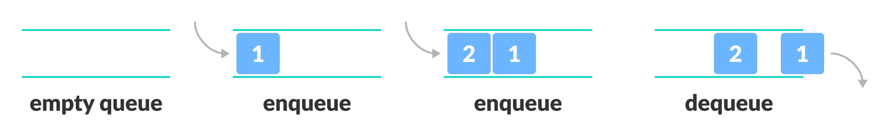

## **스택(Stack)**

> LIFO (Last In, First Out) : 나중에 들어온 데이터가 먼저 나가는 구조

### **특징**

- 접시 쌓기와 같은 방식
- 나중에 추가된 요소가 먼저 제거됨

### **주요 연산**

- `push` : 요소를 스택의 맨 위에 추가
- `pop` : 스택의 맨 위 요소 제거
- `peek` : 스택의 맨 위 요소 확인
- `isEmpty` : 스택이 비어 있는지 확인

### **활용 예시**

- 함수 호출 스택 (재귀)
- 웹 브라우저의 뒤로 가기 기능
- DFS (깊이 우선 탐색)

## **큐(Queue)**

> FIFO (First In, First Out) : 먼저 들어온 데이터가 먼저 나가는 구조

### **특징**

- 줄을 서는 것과 같은 방식
- 먼저 들어온 요소가 먼저 제거됨

### **주요 연산**

- `enqueue` : 요소를 큐의 끝(뒤)에 추가
- `dequeue` : 큐의 앞에서 요소를 제거
- `peek` : 큐의 맨 앞 요소 확인
- `isEmpty` : 큐가 비어 있는지 확인

### **활용 예시**

- 프린터 작업 대기열
- BFS (너비 우선 탐색)
- 프로세스 스케줄링

## **큐 vs. 스택 비교**

|           | 스택(Stack)                                 | 큐(Queue)                                 |
| --------- | ------------------------------------------- | ----------------------------------------- |
| 원칙      | LIFO (Last In, First Out)                   | FIFO (First In, First Out)                |
| 주요 연산 | `push`, `pop`                               | `enqueue`, `dequeue`                      |
| 구조      | 후입선출 (나중에 들어온 데이터가 먼저 나감) | 선입선출 (먼저 들어온 데이터가 먼저 나감) |
| 활용 예시 | DFS, 함수 호출 스택                         | BFS, 대기열 시스템                        |

📍**사진 출처**

- [programiz](http://programiz.com)
