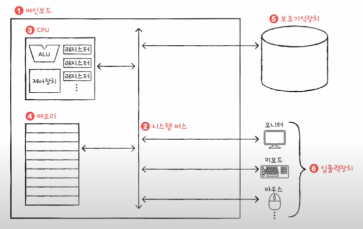
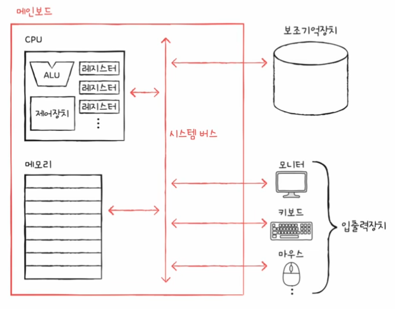
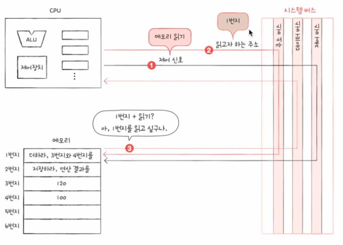
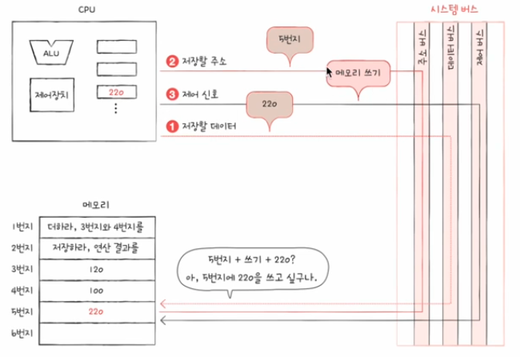

# 01. 컴퓨터 구조를 알아야 하는 이유

## 문제 해결

- 컴퓨터 구조를 이해하고 있다면 문제 상황을 빠르게 진단 가능
- 문제 해결의 실마리를 다양하게 찾을 수 있음

  ⇒ 이러한 사고가 가능하면 컴퓨터는 ‘미지의 대상’에서 ‘분석의 대상’이 됨

- 각종 기술 면접에서 컴퓨터 구조에 관한 소양을 검증하거나 반드시 알아야하는 분야로 명시함

⇒ 컴퓨터 구조 지식은 문법에 맞는 코드만 작성할 줄 아는 개발자를 넘어 다양한 문제를 스스로 해결할 줄 아는 개발자로 만들어줌

## 성능, 용량, 비용

- 어떤 CPU를 사용할지, 어떤 메모리를 사용할지 등을 직접 판단하고 선택해야함

  ⇒ 선택에 따라 성능, 용량, 비용이 달라짐

- 사용자가 많은 프로그램은 필연적으로 성능, 용량, 비용이 고려됨

⇒ 컴퓨터 구조를 이해하면 입력과 출력에만 집중하는 개발을 넘어 성능, 용량, 비용까지 고려하며 개발하는 개발자가 될 수 있음

# 02. 컴퓨터 구조의 큰 그림

## 컴퓨터가 이해하는 정보

- 컴퓨터는 0과1로 표현되는 정보만 이해하는데 이는 크게 데이터, 명령어가 있음
- 데이터: 숫자, 문자, 이미지, 동영상 같은 정적인 정보를 가리킴

  ⇒ 명령어를 위해 존재하는 일종의 재료

- 명령어: 데이터를 움직이고 컴퓨터를 작동시키는 정보

  ⇒ 컴퓨터를 작동시키는 정보
  ex) 더하라 1과 2를 ⇒ 1,2: 데이터, 더하라: 명령어

## 컴퓨터의 4가지 핵심 부품

### **중앙처리장치(CPU: Central Processing Unit)**

- 읽어 들인 명령어를 해석하고 실행하는 부품
- CPU 내부 구성 요소 중 **산술논리연산장치, 레지스터, 제어장치** 세가지가 가장 중요함

  **산술논리연산장치(ALU: Arithmetic Logic Unit)**

  - 계산만을 위해 존재하는 부품
  - 컴퓨터 내부세어 수행되는 대부분의 계산은 ALU가 도맡아 수행

  **레지스터(register)**

  - CPU 내부의 작은 임시 저장 장치
  - 프로그램을 실행하는데 필요한 값들을 임시로 저장
  - CPU 안에는 여러 개의 레지스터가 존재 및 각기 다른 이름과 역할을 가지고 있음

  **제어장치(CU: Control Unit)**

  - 제어신호를 내보내고 명령어를 해석하는 장치

    ⇒ 제어신호: 컴퓨터 부품들을 관리하고 작동시키기 위한 일종의 전기 신호

  - CPU가 메모리에 저장된 값을 읽고 싶을 땐 메모리를 향해 `메모리 읽기`라는 전기신호를 보냄
  - CPU가 메모리에 어떤 값을 저장하고 싶을 땐 메모리를 향해 `메모리 쓰기`라는 제어신호를 보냄

### **주기억장치(main memory)**

- 현재 실행되는 프로그램의 명령어와 데이터를 저장하는 부품

  ⇒ 프로그램이 실행되려면 반드시 메모리에 저장되어 있어야 함

- 저장된 값에 빠르고 효율적으로 접근하기 위해 주소로 메모리 내 원하는 위치에 접근 가능
- **RAM(Random Access Memory)**
- **ROM(Read Only Memory)**

### **보조기억장치(secondary storage)**

- 메모리보다 크고 전원이 꺼져도 저장된 내용을 잃지 않는 메모리를 보조할 저장 장치
- 하드 디스트, SSD, USB 메모리, DVD, CD-ROM 등
- 주변장치라고도 불림

### **입출력장치(input/output(I/O) device)**

- 마이크, 스피커, 프린터, 마우스, 키보드 등과 같이 컴퓨터 외부에 연결되어 컴퓨터 내부와 정보를 교환하는 장치
- 주변장치라고도 불림

### 메인보드와 시스템 버스

- 위 4가지의 핵심 부품들은 모두 메인보드라는 판에 연결
- 메인보드는 마더보드라고도 불림
- 메인보드에 연결된 부품들이 정보를 주고 받는 통로를 버스라고 함
- 여러 버스 중 컴퓨터의 핵심부품들을 연결하는 가장 중요한 버스는 시스템 버스
- 시스템 버스는 주소 버스, 데이터버스, 제어 버스로 구성되어있음

  - 주소 버스(address bus): 주소를 주고 받는 통로
  - 데이터 버스(data bus): 명령어와 데이터를 주고받는 통로
  - 제어 버스(control bus): 제어 신호를 주고받는 통로

- **메모리 읽기 신호를 내보냈을 때**

  

  1. 제어 버스로 ‘메모리 읽기’ 제어 신호 내보내기
  2. 주소 버스로 읽고자 하는 주소 내보냄
  3. 메모리는 데이터 버스로 CPU가 요청한 주소에 있는 내용을 보냄

- **메모리 쓰기 신호를 내보냈을 때**

  

  1. 데이터 버스를 통해 메모리에 저장할 값 보내기
  2. 주소 버스를 통해 저장할 주소 보내기
  3. 제어 버스를 통해 ‘메모리 쓰기’ 제어 신호를 내보내기

📍**사진 출처**

- [한빛미디어 유튜브] 컴퓨터 공학 기초 강의
