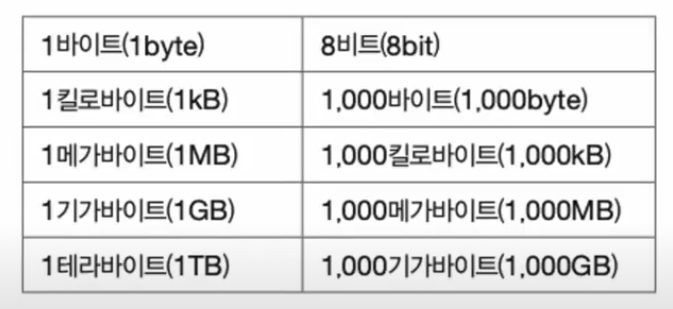
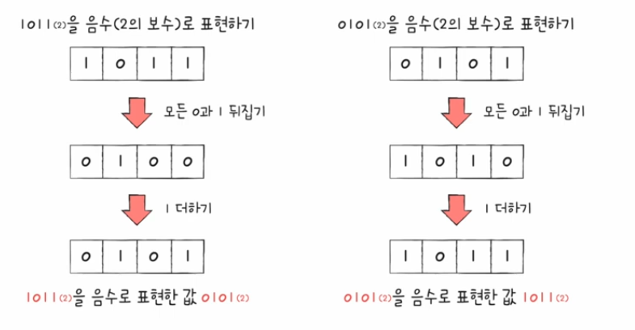
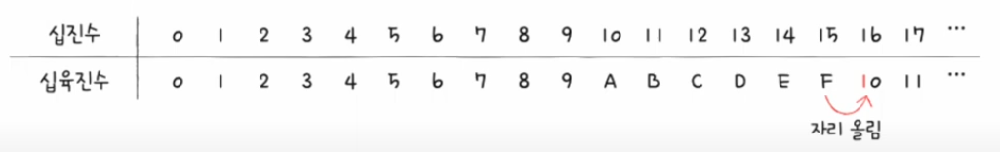
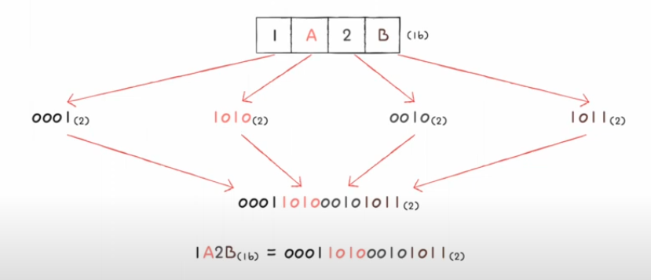
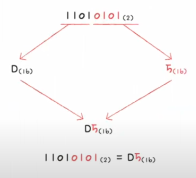
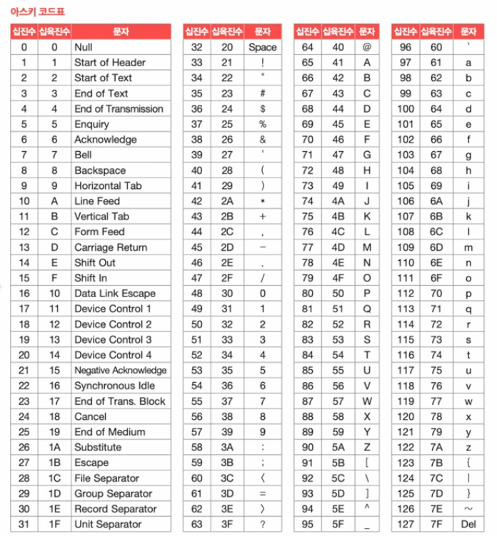
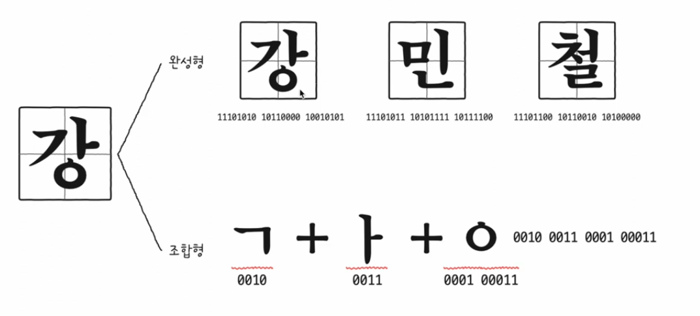
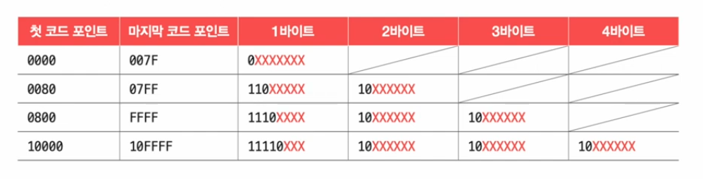

# 01. 0과 1로 숫자를 표현하는 방법

## 정보 단위

- 비트: 가장 작은 정보 단위

  

## 이진법

- 수학에서 0과 1만으로 모든 숫자를 표현하는 방법
- 십진법: 우리가 일상적으로 숫자를 세는 방법
- 2진수의 음수 표현

  - **`2의 보수`** 방법을 많이 사용

    ⇒ 2의 보수를 구해 해당 값을 음수로 간주

  - 모든 0과 1을 뒤집고 거기에 1을 더한 값
  - 해당 수가 음수인지 양수인지 어렵기에 플래그를 사용

    ex) 이진법 11의 음수: 01

    

## 십육진법

- 수가 15를 넘어가는 시점에 자리 올림을 하는 숫자 표현 방식
- (16) 첨자를 붙이거나 숫자 앞에 0x를 붙여 구분

  

- 16진수를 이진수로 변환

  - 16진수 한 글자를 4비트의 이진수로 간주

    

- 이진수를 십육진수로 변환

  - 이진수를 네개씩 끊고 4개의 숫자를 하나의 16진수로 변환

    

# 02. 0과 1로 문자를 표현하는 방법

## 문자 집합과 인코딩

### **문자집합**

- 컴퓨터가 인식하고 표현할 수 있는 문자의 모음
- 컴퓨터는 집합에 속해 있는 문자를 이해할 수 있고, 반대로 문자 집합에 속해 있지 않은 문자는 이해할 수 없음

### **문자 인코딩**

- 문자를 0과 1로 변환하는 과정
- 같은 문자 집합에 대해서도 다양한 인코딩 방법이 있을 수 있음

### **문자 디코딩**

- 0과 1로 이루어진 문자 코드를 사람이 이해할 수 있는 문자로 변환하는 과정

## 아스키 코드

- 초창기 문자 집합 중 하나로 영어 알파벳, 아라비아 숫자, 일부 특수 문자를 포함
- 아스키 문자들은 각각 7비트로 표현

  ⇒ 총 128개의 문자를 표현 가능

- 실제 아스키 문자는 8비트를 사용하지만 그 중 1비트는 패리티 비트(parity bit)

  ⇒ 패리티 비트는 오류 검출을 위해 사용되는 비트로 실질적으로 문자 표현을 위해 사용되는 비트는 7비트

- 매우 간단하게 인코딩이 되지만 한글과 다른 특수문자들을 표현할 수 없음

## EUC-KR

- 한글 인코딩에는 완성형(한글 완성형 인코딩), 조합형(한글 조합형 인코딩) 방식이 존재
- 완성형 인코딩은 초성, 중성, 종성의 조합으로 이루어진 완성된 하나의 글자에 고유한 코드를 부여하는 방식
- 조합형 인코딩은 초성을 위한 비트열, 중성을 위한 비트열, 종성을 위한 비트열을 할당하여 그 조합들로 하나의 글자 코드를 완성하는 인코딩 방식

  

- EUC-KR은 완성형 인코딩 방식
- 해당 인코딩 방식을 사용하면 웹사이트의 한글이 깨지는 등의 오류 발생

  ⇒ 이를 해결하기 위해 마이크로소프트이 CP949(code page 949)가 있지만 한글 전체를 표현하기엔 역부족

## 유니코드와 UTF-8

### 유니코드

- 모든 언어를 아우르는 문자 집합과 통일된 표준 인코딩 방식을 위해 나온 것
- EUC-KR보다 훨씬 다양한 한글 포함
- 대부분 나라의 문자, 특수문자, 화살표, 이모티콘등까지 코드로 표현 가능한 통일된 문자
- 현재 문자를 표현할 때 가장 많이 사용되는 표준 문자 집합
- 글자에 부여된 값 자체를 인코딩된 값으로 삼지 않고 다양한 방법으로 인코딩

  ⇒ UTF-8, UTF-16, UTF-32등

### UTF-8

- 1바이트부터 4바이트까지의 인코딩 결과를 만들어냄

  ⇒ 1바트가 될 수도, 3바이트가 될 수도 있음

  

📍**사진 출처**

- [한빛미디어 유튜브] 컴퓨터 공학 기초 강의
