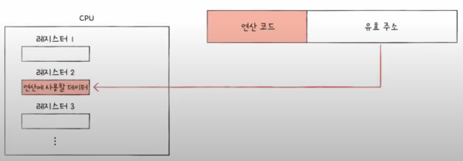
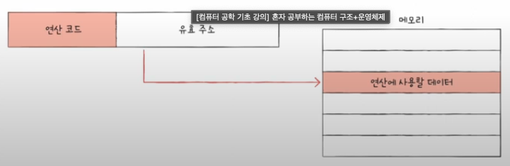

# 01. 소스 코드와 명령어

## 고급 언어와 명령어

- 고급언어: 사람을 위한 언어
- 저급언어: 컴퓨터가 직접 이해하고 실행할 수 있는 언어
- 기계어: 0과 1의 명령어 비트로 이루어진 언어
- 어셈블리어: 0과 1로 표현된 명령어를 읽기 편한 형태로 변역한 저급 언어

## 컴파일 언어와 인터프리터 언어

- 고급 언어가 변환되는 방식은 컴파일 방식과 인터피리트 방식이 있음

### 컴파일 언어

- 컴파일러에 의해 소스 코드 전체가 저급 언어로 변환되어 실행되는 고급 언어
- 대표적으로 C가 있음
- 컴파일 언어로 작성된 코드 전체가 저급 언어로 변환되는 과정을 컴파일이라 함
- 컴파일을 수행해 주는 도구를 컴파일러라 함
- 컴파일러는 개발자가 작성한 소스 코드 전체를 쭉 훑어보며 문법적 오류, 실행 가능성 등을 따짐

  ⇒ 오류를 하나라도 발견하면 해당 소스 코드는 컴파일에 실패

- 컴파일러를 통해 저급 언어로 변환된 코드를 목적코드라 함

### 인터프리터 언어

- 인터프리터에 의해 소스코드가 한 줄씩 실해오디는 고급 언어
- 대표적으로 python이 있음
- 소스코드를 한줄씩 저급 언어로 변환하여 실행하는 도구를 인터프리터라 함
- 소스코드 전체를 저급 언어로 변환하는 시간을 기다릴 필요가 없음
- 한 줄씩 코드를 실행하기에 N번째 줄에 오류가 있다하더라도 N-1번째줄까지 수행 가능

> 💡
> **인터프리터 언어는 컴파일 언어보다 느림**
>
> ⇒ 목적 코드는 컴퓨터가 이해하고 실행하는 저급언어이지만, 인터프리터 언어는 한줄씩 저급 언어로 해석하며 실행해야하기 때문

</aside>

# 02. 명령어의 구조

## 연산 코드와 오퍼랜드

- 명령어는 연산코드와 오퍼랜드로 구성
- 연산코드(operation code): 명령어가 수행할 연산, 연산자
- 오퍼랜드(operand): 연산에 사용할 데이터, 피연산자
- 연산 코드 필드: 연산코드가 담기는 영역
- 오퍼랜드 필드: 오퍼랜드가 담기는 영역

  

### 오퍼랜드

- 연산에 사용할 데이터로 피연산자라고도 불림
- 오퍼랜드 필드에는 숫자와 문자 등을 나타내는 데이터 혹은 메모리나 레지스터 주소가 올 수도 있음
- 메모리의 주소나 레지스터 이름이 주로 담김

  ⇒ 오퍼랜드 필드를 주소 필드라고도 부름

- 0-주소 명령어: 오퍼랜드가 하나도 없는 명령어
- 1-주소 명령어: 오퍼랜드가 하나인 명령어
- 2-주소 명령어: 오퍼랜드가 두 개인 명령어
- 3-주소 명령어: 오퍼랜드가 세 개인 명령어

  

### 연산 코드

- 가장 기본적인 연산 코드 유형은 크게 네가지로 나뉨
  1. 데이터 전송
     - MOVE: 데이터 옮겨라
     - STORE: 메모리에 저장하라
     - LOAD(FETCH): 메모리에서 CPU로 데이터를 가져와라
     - PUSH: 스택에 데이터를 저장하라
     - POP: 스택에 최상단 데이터를 가져와라
  2. 산술/논리 연상
     - ADD / SUBTRACT / MULTIPLY / DIVIDE: 덧셈 / 뺄셈 / 곱셈 / 나눗셈을 수행하라
     - INCREMENT / DECREMENT: 오퍼랜드에 1을 더하라/ 오퍼랜드에 1을 빼라
     - AND / OR / NOT: AND / OR / NOT 연산을 수행하라
     - COMPARE: 두 개의 숫자 또는 TRUE/FALSE 값을 비교하라
  3. 제어 흐름 변경
     - JUMP: 특정 주소로 실행 순서를 옮겨라
     - CONDITIONAL JUMP: 조건에 부합할 때 특정 주소로 실행 순서를 옮겨라
     - HALT: 프로그램 실행을 멈춰라
     - CALL: 되돌아올 주소를 지정한 채 특정 주소로 실행 순서를 옮겨라
     - RETURN: CALL을 호출할 때 지정했던 주소로 돌아가라
  4. 입출력 제어
     - READ(INPUT): 특정 입출력 장치로부터 데이터를 읽어라
     - WRITE(OUTPUT): 특정 입출력 장치로 데이터를 써라
     - START IO: 입출력 장치를 시작하라
     - TEST IO: 입출력 장치의 상태를 확인하라

## 주소 지정 방식

- 오퍼랜드 필드에 데이터가 저장된 위치를 명시할 때 연산에 사용할 데이터 위치를 찾는 방법

  ⇒ 유효 주소를 찾는 방법

- 유효 주소: 연산의 대상이 되는 데이터가 저장된 위치

### 즉시 주소 지정 방식

- 연산에 사용할 데이터를 오퍼랜드 필드에 직접 명시하는 방식
- 데이터의 크기가 작아지지만 연산에 사용할 데이터를 찾는 과정이 없기에 다른 방식들 보다 빠름

  

### 직접 주소 지정 방식

- 오퍼랜드 필드에 유효 주소를 직접적으로 명시하는 방식
- 즉시 주소 지정 방식보단 커졌지만 오퍼랜드 필드의 길이가 연산 코드의 길이만큼 짧아져 표현할 수 있는 유효 주소에 제한이 생길 수 있음

  

### 간접 주소 지정 방식

- 유효 주소의 주소를 오퍼랜드의 필드의 명시
- 직접 주소 지정 방식보단 유효 주소의 범위가 넓어졌지만 두 번의 매모리 접근이 필요하여 일반적으로 느린 방식

  

### 레지스터 주소 지정 방식

- 연산에 사용할 데이터를 저장한 레지스터를 오퍼랜드 필드에 직접 명시하는 방법
- CPU 외부에 있는 메모리에 접근하는 것보다 CPU 내부에 있는 레지스터에 접근하는 것이 빠름

  ⇒ 직접 주소 지정 방식보다 빠르게 데이터데 접근 가능

- 단점은 직접 주소 지정 방식과 같음

  

### 레지스터 간접 주소 지정 방식

- 연산에 사용할 데이터를 메모리에 저장하고 유효 주소를 저장한 레지스터를 오퍼랜드 필드에 명시하는 방법
- 유효 주소를 찾는 과정이 간접 주소 지정 방식과 비슷하지만 메모리에 접근하는 횟수가 한번으로 줄어듦

  

📍**사진 출처**

- [한빛미디어 유튜브] 컴퓨터 공학 기초 강의
