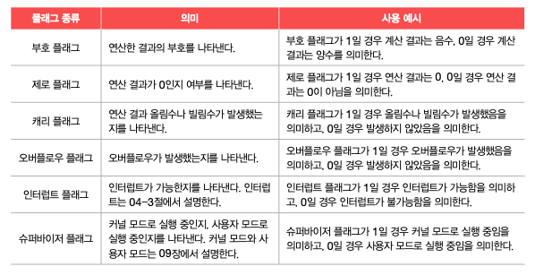
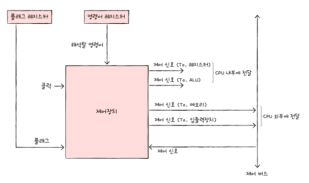
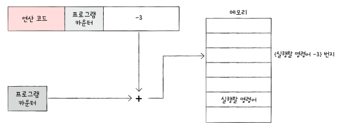
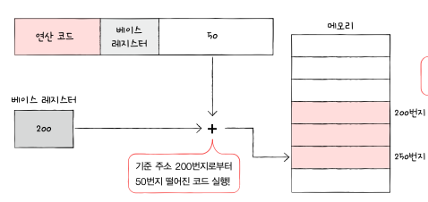

# 04-1. ALU와 제어 장치

## ALU

- 레지스터를 통해 피연산자를 받아들임
- 제어장치로부터 수행할 연산을 알려주는 제어신호를 받아들임
- 계산 결과와 함께 플래그를 내보냄
  ⇒ 해당 플래그들은 플래그 레지스터에 저장됨
  

## 제어장치

- 제어 신호를 내보내고 명령어를 해석하는 부품
- 제어 장치가 받아들이는 정보
  

  1. 클럭 신호를 받아들임
  2. 해석해야 할 명령어를 받아들임
  3. 플래그 레지스터 속 플래그 값을 받아들임
  4. 시스템 버스 중에서 제어 버스로 전달된 제어 신호를 받아들임

# 04-2. 레지스터

## 반드시 알아야 할 레지스터

### 1. 프로그램 카운터(PC: Program Counter)

- 메모리에서 읽어 들일 명령어의 주소를 저장
- 이를 명령어 포인터(IP: Instruction Pointer)라고 부르는 CPU도 있음

### 2. 명령어 레지스터(IR: Instruction Register)

- 방금 메모리에서 읽어 들인 명령어를 저장하는 레지스터
- 제어장치는 명령어 레지스터 속 명령어를 받아들이고 해석한 뒤 제어신호를 내보냄

### 3. 메모리 주소 레지스터(MAR: Memory Address Register)

- 메모리의 주소를 저장하는 레지스터
- CPU가 읽어들이고자 하는 주소 값을 주소 버스로 보낼 때 메모리 주소 레지스터를 거치게 됨

### 4. 메모리 버퍼 레지스터(MBR: Memory Buffer Register)

- 메모리와 주고 받을 값을 저장하는 레지스터
- 메모리에 쓰고 싶은 값이나 메모리로부터 전달받은 값은 메모리 버퍼 레지스터를 거침

### 5. 플래그 레지스터(flag register)

- 연산 결과 또는 CPU 상태에 대한 부가적인 정보를 저장하는 레지스터

### 6. 범용 레지스터

- 다양하고 일반적인 상황에서 자유롭게 사용할 수 있는 레지스터
- 데이터와 주소를 모두 저장할 수 있음
- 일반적으로 CPU 안에는 여러 개의 범용 레지스터들이 있고, 현대 대다수 CPU는 모두 범용 레지스터를 가지고 있음

### 7. 스택 포인터

- 스택 주소 지정 방식에 사용됨

### 8. 베이스 레지스터

- 변위 주소 지정 방식에 사용됨

## 특정 레지스터를 이용한 주소 지정 방식(1): 스택 주소 지정 방식

- 스택과 스택 포인터를 이용한 방식
- 스택 포인터는 스택의 마지막으로 저장한 값의 위치를 저장하는 레지스터
- 메모리 안에 스택처럼 사용할 영역이 정해져 있음
  ⇒ 스택 영역으로 다른 주소 공간과는 스택으로 사용되도록 암묵적으로 약속된 영역

## 특정 레지스터를 이용한 주소 지정 방식(2): 변위 주소 지정 방식

- 오퍼랜드 필드의 값(변위)과 특정 레지스터의 값을 더하여 유표 주소를 얻어내는 방식
- 연산 코드 필두, 레지스터 필드, 오퍼랜드 필드로 구성되어있음
- 오퍼랜드 필드의 주소와 어떤 레지스터를 더하는지에 따라 상대 주소 지정 방식, 베이스 레지스터 주소 지정 방식 등으로 나뉨

### 상대 주소 지정 방식

- 오퍼랜드와 프로그램 카운터의 값을 더하여 유효 주소를 얻는 방식
  

- 만약 오퍼랜드가 음수인 -3이였다면 CPU는 읽어들이기 한 명령어로부터 세번째 이전의 번지로 접근함

### 베이스 레지스터 주소 지정 방식

- 오퍼랜드와 베이스 레지스터의 값을 더하여 유효 주소를 얻는 방식
- 베이스 레지스터 속 기준 주소로부터 얼마나 떨어져 있는 주소에 접근할 것인지 연산하여 유효 주소를 얻어내는 방식
  

# 04-3. 명령어 사이클과 인터럽트

## 명령어 사이클

- 프로그램 속 각각의 명령어들이 일정한 주기가 반복되며 실행되는 것
  ⇒ 프로그램 속 각각 명령어들은 명령어 사이클이 반복되며 실행
- 인출 사이클: 메모리에 있는 명령어를 CPU로 가지고 오는 단계
  ⇒ 명령어 사이클의 첫 번째 과정
- 실행 사이클: CPU로 가져온 명령어를 실행하는 단계
  ⇒ 제어장치가 명령어 레지스터에 담긴 값을 해석하고 제어신호를 발생 시키는 단계
- 간접 사이클: 명령어를 인출하여 CPU를 가져왔더라도 바로 실행할 수 없는 단계에서 실행하는 사이클
  ⇒ 간접 주소 지정 방식은 오퍼랜드 필드에 유효 주소의 주소를 명시함

## 인터럽트

- CPU가 수행 중인 작업이 방해를 받아 중단될 수 있음
  ⇒ 이때 CPU의 작업을 방해하는 신호를 인터럽트라고 함

### 동기 인터럽트

- CPU에 의해 발생하는 인터럽트
- CPU가 명령어들을 수행하다가 예상치 못한 상황에 마주쳤을 때 발생하는 인터럽트
- 동기 인터럽트는 예외라고도 부름

### 비동기 인터럽트

- 주로 입출력장치에 의해 발생하는 인터럽트
- 입출력장치에 의한 비동기 인터럽트는 알림과 같은 역할을 함
- CPU가 프린터와 같은 입출력 장치에 입출력 작업을 부탁하면 작업을 끝낸 입출력장치가 CPU에 완료 알림을 보냄
- 일반적으로 비동기 인터럽트를 인터럽트라 부름

**처리 순서**

1. 입출력 장치는 CPU에서 인터럽트 요청 신호를 보냄
   - `인터럽트 요청 신호`: CPU의 정상적인 실행 흐름을 끊기 전에 물어보는 것
2. CPU는 실행 사이클이 끝나고 명령어를 인출하기 전 항상 인터럽트 여부를 확인
3. CPU는 인터럽트 요청을 확인하고 인터럽트 플래그를 통해 현재 인터럽트를 받아들일 수 있는지의 여부 확인
   - `인터럽트 플래그`: CPU가 인터럽트 요청을 수행하기 위해 활성화 되어야하는 플래그 레지스터
4. 인터럽트를 받아들일 수 있다면 CPU는 지금까지의 작업을 백업
5. CPU는 인터럽트 벡터를 참조하여 인터럽트 서비스 루틴을 실행
   - `서비스 루틴`: 인터럽트를 처리하기 위한 프로그램으로 인터럽트 핸들러라도고 부름
   - `인터럽트 벡터`: 서비스 루틴을 식별하기 위한 정보
6. 인터럽트 서비스 루틴 실행이 끝나면 4번에서 백업해둔 작업을 복구하여 실행 재개
