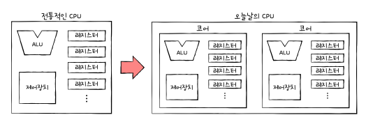
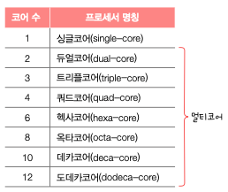
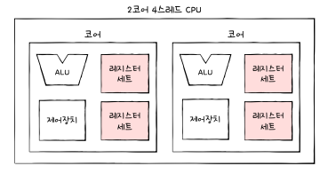
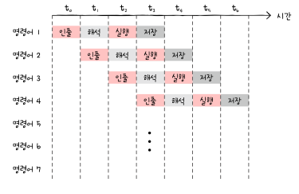
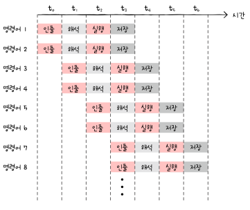
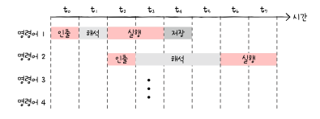

# 05-1. 빠른 CPU를 위한 설계 기법

## 클럭

- 컴퓨터 부품들이 맞춰 움직이는 신호
- 클럭 속도가 높아지면 CPU는 명령어 사이클을 더 빠르게 반복

  ⇒ 클럭 속도가 높은 CPU가 일반적으로 성능이 좋음

- 클럭의 속도는 Hz 단위로 측정

  ⇒ 1초에 1번 반복되면 1Hz

  ⇒ 실제 CPU의 기본 속도는 2.5GHz, 최대 4.9GHz로 기본적으로 25억번 최대 49억번 반복

- 클럭 속도를 높이는 방법으로는 코어와 스레드 수를 늘리면 됨

## 코어와 멀티코어

### 코어

- 오늘날의 코어는 명령어를 실행하는 부품들

  ⇒ 그렇다면 CPU는 단순히 명령어를 실행하는 부품에서 이 부품들을 여러 개 포함하는 부품으로 바뀜
  

### 멀티코어

- 코어를 여러 개 포함하고 있는 CPU를 멀티코어CPU 혹은 멀티코어 프로세서라 함
- CPU 종류는 코어가 몇 개인지에 따라 나뉨

  

- CPU의 연산속도는 꼭 코어 수에 비례하여 증가하진 않음

## 스레드와 멀티스레드

### 스레드

- 사전적 의미는 실행 흐름의 단위
- 하나의 코어로 하나의 명령어를 처리하는 CPU

**하드웨어적 스레드**

- 하나의 코어가 동시에 처리하는 명령어 단위
- 하이퍼스레딩: 인텔의 멀티스레드 기술을 의미

**소프트웨어적 스레드**

- 하나의 프로그램에서 독립적으로 실행되는 단위
- 일반적으로 접하는 스레드는 소프트웨어적으로 정의된 스레드를 의미

### 멀티스레드

- 하나의 코어로 여러 명령어를 동시에 처리하는 CPU

**멀티스레드 프로세서**

- 멀티스레드 프로세서를 설계하는 것은 어렵지만 레지스터가 가장 큰 핵심

  ⇒ 여러 명령어를 처리하기 휘애 꼭 필요한 레지스터를 여러개 가지고 있으면 됨
  

# 05-2. 명령어 병렬 처리 기법

## 명령어 파이프라인

- 명령어 처리 과정을 클럭 단위로 나눈 순서(전공서에 따라 다름)
  1. 명령어 인출
  2. 명령어 해석
  3. 명령어 실행
  4. 결과 저장
- 명령어들을 명령어 파이프라인에 넣고 동시에 처리하는 기법
  

- 파이프라인 위험: 특정 상황에서는 성능 향상에 실패하는 경우

  1. 데이터 위험
     - 명령어 간 데이터 의존성에 발생
     - A 명령어를 수행한 후 B 명령어를 수행해야하는 경우
     - 이를 무시하고 동시에 실행하려고 하면 파이프라인이 제대로 작동하지 않음
  2. 제어 위험

     - 주로 분기 등으로 인한 프로그램 카운터의 갑작스런 변화에 의해 발생
     - 프로그램 카운터 값에 갑작스런 변화가 생기면 명령어 파이프라인에 있는 것들이 쓸모 없어짐

       ⇒ 분기 예측: 이를 위해 사용하는 기술 중 하나로 프로그램이 어디로 분기할지 미리 예측 후 그 주소를 인출하는 기술

  3. 구조적 위험
     - 명령어들을 겹쳐 실행하는 과정에서 서로 다른 명령어가 동시에 ALU, 레지스터 등 같은 CPU 부품을 실행하려고 할 때 발생
     - 이는 자원 위험이라고도 부름

## 슈퍼스칼라

- CPU 내부에 여러개의 명령어 파이프라인을 포함한 구조
  

- 명령어 파이프 ⇒ 공장 생산라인 하나, 슈퍼스칼라 ⇒ 공장 생산라인 여러 개
- 해당 구조로 명령어 처리가 가능한 CPU를 슈퍼스칼라 프로세서 혹은 슈퍼스칼라 CPU라 부름
- 이는 이론적으로 파이프라인 개수에 비례
- 이를 차용한 CPU는 파이프라인 위험 방지를 위해 고도로 설계되어야 함

## 비순차적 명령어 처리(OoOE)

- CPU 성능 향상에 크게 기여한 기법으로 대부분의 CPU가 차용하는 기법
- 명령어들을 순차적으로 실행하지 않는 기법 ⇒ 명령어의 합법적 새치기
- 명령어를 순차적으로 실행하지 않고 순서를 바꿔 실행해도 무방한 명령어를 먼저 실행하여 파이프라인이 멈추는 것을 방지하는 기법

# 05-3. CISC와 RISC

## 명령어 집합

- ISA(Instruction Set Architecture): CPU가 이해할 수 있는 명령어들의 모음으로 명령어 집합구조 혹은 명령어 집합으로 불림

  ⇒ CPU마다 ISA가 다를 수 있음

- 같은 소스코드로 만들어진 프로그램이더라도 ISA가 다르면 CPU가 이해할 수 있는 명령어, 어셈블리어도 달라짐

  ⇒ 이런 관점에서 ISA는 CPU 언어인 셈

## CISC(Complex Instruction Set Computer)

- 복잡하고 다양한 명령어들을 활용하는 CPU 설계 방식
- 다양하고 강력한 기능의 명령어 집합을 활용하기에 명령어의 형태와 크기가 다양한 가변 길이 명령어를 활용
- 활용하는 명령어가 복잡하고 여러 기능을 제공하여 명령어의 크기와 실행되기까지의 시간이 일정하지 않음

  ⇒ 파이프라인을 구현하는게 걸림돌이 됨

  

## RISC(Reduced Instruction Set Computer)

- CISC에 비해 명령어의 종류가 적음

  ⇒ 고정 길이 명령어를 활용

- 명령어가 규격화되어있고 하나의 명령어가 1클럭 내외로 실행되기에 RISC 명령어 집합은 명령어 파이프라이닝에 최적화 되어있음
- 메모리에 직접 접근하는 명령어를 load, store 두개로 제한

  ⇒ load-store 구조라고 부름

- CISC보다 주소 지정 방식의 종류가 적은 경우가 많음

## CISC vs. RISC

| CISC                                 | RISC                                 |
| ------------------------------------ | ------------------------------------ |
| 복잡하고 다양한 명령어               | 단순하고 적은 명령어                 |
| 가변 길이 명령어                     | 고정 길이 명령어                     |
| 다양한 주소 지정 방식                | 적은 주소 지정 방식                  |
| 프로그램을 이루는 명령어의 수가 적음 | 프로그램을 이루는 명령어의 수가 많음 |
| 여러 클럭에 걸쳐 명령어 수행         | 1클럭 내외로 명령어 수행             |
| 파이프라이닝하기 어려움              | 파이프라이닝하기 쉬움                |
