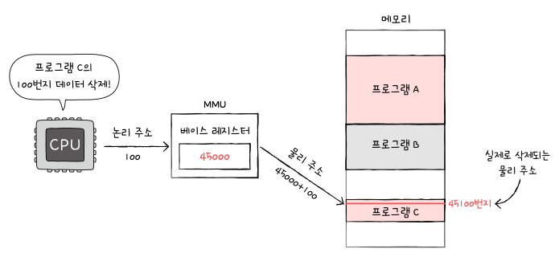
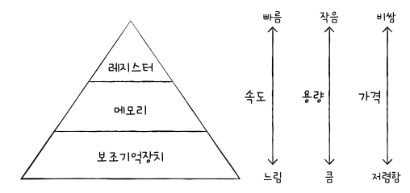

# 06-1. RAM의 특징과 종류

## RAM의 특징

- 휘발성 저장 장치: 전원을 끄면 RAM에 저장된 명령어와 데이터가 모두 날아가는 것
- 비휘발성 저장 장치: 전원이 꺼져도 저장된 내용이 유지되는 저장 장치

## RAM의 용량과 성능

- RAM 용량이 크면 많은 데이터를 미리 RAM에 저장할 수 있음

## RAM 종류

### DRAM(Dynamic RAM)

- 시간이 지나면 저장된 데이터가 점차 사라지는 RAM
- 데이터의 소멸을 막기 위해 일정 주기로 데이터를 재활성화 해야함
- 단점에도 불구하고 소비전력이 비교적 낮고, 저렴하고 집적도가 높아 대용량으로 설계하기 용이

### SRAM(Static RAM)

- 시간이 지나도 저장된 데이터가 사라지지 않음
- DRAM보다 일반적으로 속도가 빠름
- 집적도가 낮고, 소비 전력이 크고, 가격이 더 비쌈

|          | DRAM            | SRAM        |
| -------- | --------------- | ----------- |
| 재충전   | 필요함          | 필요없음    |
| 속도     | 느림            | 빠름        |
| 가격     | 저렴함          | 비쌈        |
| 집적도   | 높음            | 낮음        |
| 소비전력 | 적음            | 높음        |
| 사용용도 | 주기억장치(RAM) | 캐시 메모리 |

### SDRAM

- SRAM과 관계 없음
- 클럭 신호와 동기화된 발전된 형태의 DRAM
- 클럭에 맞춰 동작하며 클럭마다 CPU와 정보를 주고받을 수 있는 DRAM

### DDR SDRAM

- 최근 가장 흔히 사용되는 RAM
- 대역폭을 넓혀 속도를 빠르게 만든 SDRAM
- 한 클럭당 하나씩 데이터를 주고 받을 수 있는 SDRAM을 SDR SDRAM이라 부름

# 06-2. 메모리의 주소 공간

## 물리주소와 논리 주소

- 물리주소: 정보가 실제로 저장된 하드웨어상의 주소
- 논리주소: 실행 중인 프로그램 각각에게 부여된 0번지부터 시작된느 주소
- 메모리 관리 장치: 논리주소와 물리 주소 간의 변환을 담당하는 주소 버스 사이에 위치한 장치
- 베이스 레지스터: 프로그램의 가장 작은 물리주소

  ⇒ 프로그램의 첫 물리 주소를 저장하는 셈
  

## 메모리 보호 기법

- 논리 주소 범위를 벗어나는 명령어 실행을 방지하고 실행 중인 프로그램이 다른 프로그램에 영향을 받지 않도록 보호할 방법

  ⇒ 한계 레지스터가 담당

- 한계 레지스터는 논리 주소의 최대 크기를 저장

  ⇒ 프로그램의 물리 주소 범위는 베이스 레지스터 값 이상, 베이스 레지스터 값 + 한계 레지스터 값 미만

# 06-3. 캐시 메모리

- 캐시 메모리: 메모리에 접근하는 시간을 줄이는 메모리

## 저장 장치 계층 구조

- CPU에 얼마나 가까운가를 기준으로 컴퓨터가 사용하는 저장 장치들을 계층적으로 나타낸 것
  

## 캐시 메모리

- CPU와 메모리 사이에 위치
- 레지스터보다 용량이 크고 메모리보다 빠른 SRAM 기반의 저장 장치
- L1캐시: 코어와 가장 가까운 캐시 메모리
- L2캐시: L1 다음으로 가까운 캐시 메모리
- L3캐시: L2 다음으로 가까운 캐시 메모리

## 참조 지역성 원리

- 캐시 히트: 자주 사용될 것으로 예측한 데이터가 실제로 들어맞아 캐시 메모리 내 데이터가 CPU에서 활용될 경우
- 캐시 미스: 예측하여 캐시 메모리에 저장했지만 예측이 틀려 메모리에서 필요한 데이터를 직접 가져와야하는 경우
- 캐시 적중률: 캐시 히트 횟수 / (캐시 히트 횟수 + 캐시 미스 횟수)
- 참조 지역성의 원리: 캐시 메모리가 한가지의 원칙에 따라 메모리로부터 가져올 데이터를 결정하는 것
  1. CPU는 최근에 접근했던 메모리 공간에 다시 접근하려는 경향이 있다.
  2. CPU는 접근한 메모리 공간 근처를 접근하려는 경향이 있다.
