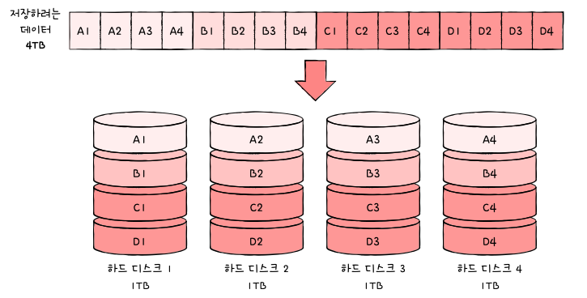
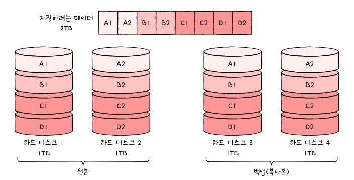
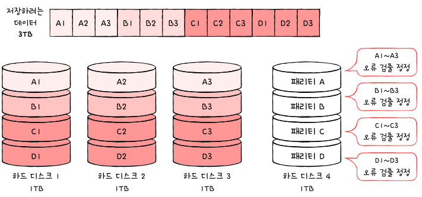
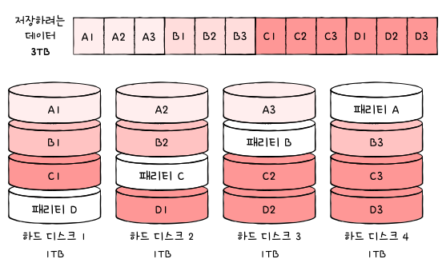
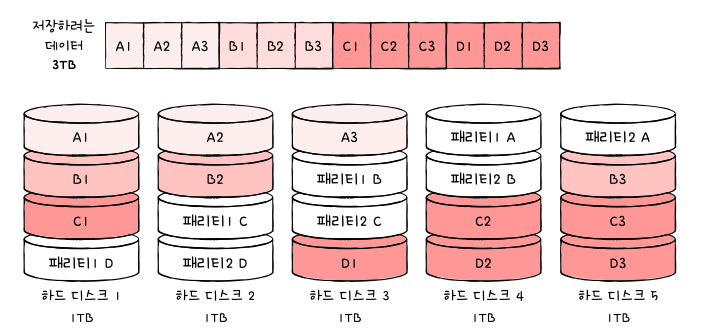

# 07-1. 다양한 보조기억장치

## 하드 디스크

- **자기적인 방식으로 데이터를 저장하는 보조기억장치**
  ⇒ 자기 디스크라고도 불림
- **플래터(Platter)**
  - 데이터를 실질적으로 저장하는 동그란 원판
  - 여러 개의 플래터가 층층이 쌓여 있음
- **스핀들(Spindle)**
  - 플래터를 회전시키는 구성 요소
  - 회전 속도는 **RPM**(Revolutions Per Minute, 분당 회전 수) 단위로 표현됨
- **헤드(Head)**
  - 데이터를 읽고 쓰는 역할을 함
  - 플래터 표면에서 매우 가까운 거리에서 움직이며 데이터를 액세스함
- **액추에이터 암(Actuator Arm)**
  - 헤드를 원하는 위치로 이동시키는 역할을 함
- **컨트롤러(Controller)**
  - 데이터의 입출력을 제어하는 역할을 하는 회로
  - 하드 디스크와 컴퓨터 간의 데이터 전송을 관리함
- **캐시 메모리(Cache Memory)**
  - 자주 사용하는 데이터를 임시 저장하여 속도를 향상시킴
- 하드디스크가 저장된 데이터에 접근하는 시간
  1. 탐색시간: 접근하려는 데이터가 지정된 트랙까지 헤드를 이동시키는 시간
  2. 헤드가 있는 곳으로 플래터를 회전시키는 시간
  3. 전송시간: 하드 디스크와 컴퓨터 간에 데이터를 전송하는 시간

## 플래시 메모리

- 우리가 흔히 사용하는 USB, SD카드, SSD가 모두 플래시 메모리
- 셀 단위
  1. 한 셀에 1비트 저장 가능한 플래시 메모리를 SLC 타입
     - 다른 타입들에 비해 빠른 입출력 가능
     - 기업에서 데이터를 읽고 쓰기가 많이 반복되며 고성능의 빠른 장치가 필요한 경우
  2. 한 셀에 2비트 저장 가능한 플래시 메모리를 MLC 타입
     - SLC보다 대용화에 유리
     - 시중에 사용되는 많은 플래시 메모리 저장 장치들이 MLC 타입 혹은 TLC로 만들어짐
  3. 한 셀에 3비트 저장 가능한 플래시 메모리를 TLC 타입
     - SLC, MLC 보다 수명과 속도가 떨어지지만 용량 대비 가격도 저렴
       | 구분 | SLC | MLC | TLC |
       | -------------- | ------ | ---- | ------ |
       | 셀당 bit | 1bit | 2bit | 3bit |
       | 수명 | 길다 | 보통 | 짧다 |
       | 읽기/쓰기 속도 | 빠르다 | 보통 | 느리다 |
       | 용량 대비 가격 | 높다 | 보통 | 낮다 |

# 07-2. RAID의 정의와 종류

## RAID의 정의

- 주로 하드 디스크와 SSD를 사용하는 기술
- 데이터의 안정성 혹은 높은 성능을 위해 여러 개의 물리적 보조기억장치를 마치 하나의 논리적 보조기억장치처럼 사용하는 기술

## RAID의 종류

- RAID의 구성 방법을 RAID 레벨이라 함
  ⇒ 대표적으로 RAID0, RAID 1, RAID 2, RAID 3, RAID 4, RAID 5, RAID 6이 있음
  ⇒ 그로부터 파생된 RAID 10, RAID 50 등이 있음

### **RAID 0 (스트라이핑, Striping)**

- **구성 방식**: 데이터를 여러 디스크에 분산하여 저장
- **장점**: 속도가 빠름 (병렬 처리로 성능 향상)
- **단점**: 하나의 디스크라도 고장 나면 데이터 손실 발생 (안전성 없음)

### **RAID 1 (미러링, Mirroring)**

- **구성 방식**: 동일한 데이터를 두 개 이상의 디스크에 복제하여 저장
- **장점**: 높은 데이터 안정성 (한 디스크가 고장 나도 복제본이 존재)
- **단점**: 저장 용량 비효율적 (디스크 용량의 절반만 사용 가능)

### **RAID 4**

- **구성 방식**: 데이터를 블록 단위로 나누어 여러 디스크에 저장 + 전용 패리티 디스크 사용
- **장점**: 랜덤 읽기 성능이 좋음
- **단점**: 패리티 디스크가 병목이 될 수 있음

### **RAID 5**

- **구성 방식**: 데이터를 블록 단위로 나누어 저장 + 패리티 정보를 여러 디스크에 분산 저장
- **장점**: 데이터 보호와 성능의 균형이 좋음
- **단점**: 디스크 하나가 고장 나면 성능이 저하될 수 있음

### **RAID 6**

- **구성 방식**: RAID 5와 유사하지만, 패리티를 두 개씩 저장하여 2개의 디스크 고장까지 복구 가능
- **장점**: 데이터 안정성이 높음 (2개 디스크 고장에도 데이터 보호 가능)
- **단점**: 쓰기 성능이 상대적으로 낮음

