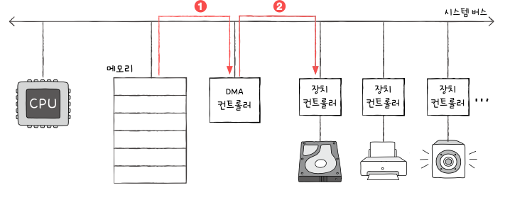

# 08-1. 장치 컨트롤러와 장치 드라이버

## 장치 컨트롤러

- 입출력제어기(I/O Controller)도 불림
- 입출력 모듈(I/O Module)의 일부로 작동
- CPU와 **입출력 장치(I/O 장치)** 사이에서 데이터를 효율적으로 주고받도록 관리하는 하드웨어 장치
- CPU와 입출력 장치는 서로 다른 속도로 데이터를 주고받음

  ⇒ 장치 컨트롤러는 데이터 버퍼링(Buffering)을 통해 이를 조정

  - 버퍼(Buffer)를 활용하여 데이터를 임시 저장
  - CPU나 장치가 데이터를 처리할 준비가 될 때 전송

    ⇒ 속도 차이로 인한 병목 현상을 완화

- 장치 컨트롤러는 데이터 레지스터(Data Register), 상태 레지스터(Status Register), 제어 레지스터(Control Register)로 구성
- 데이터 레지스터: 입출력 장치와 CPU 간 데이터를 송수신하는 역할
- **상태 레지스터**: 장치의 현재 상태를 나타내며, 장치가 사용 가능한지 또는 오류가 발생했는지를 저장
- **제어 레지스터**: 입출력 장치의 동작을 설정하며, 읽기/쓰기 모드 변경, 인터럽트 활성화 등의 기능을 수행
- 전송률(Data Transfer Rate) 조정하는 역할

  ⇒ CPU는 고속으로 데이터를 처리하는 반면, 입출력 장치는 상대적으로 속도가 느림

  ⇒ 장치 컨트롤러는 전송률을 조절하여 데이터가 원활하게 처리될 수 있도록 함

## 장치 드라이버

- 장치 컨트롤러의 동작을 감지하고 제어

  ⇒ 장치 컨트롤러가 컴퓨터 내부와 정보를 주고받을 수 있게하는 프로그램

- 장치컨트롤러 === 하드웨어적 통로, 장치드라이버 === 소프트웨어적 통로

# 08-2. 다양한 입출력 방법

## 프로그램 입출력

### 메모리 맵 입출력

- 메모리에 접근하기 위한 주소 공간과 입출력 장치에 접근하기 위한 주소 공간을 하나의 주소 공간으로 간주하는 방법

### 고립형 입출력

- 메모리를 위한 주소 공간과 입출력 장치를 위한 주소 공간을 분리하는 방법

| 메모리 맵 입출력                            | 고립형 입출력                                |
| ------------------------------------------- | -------------------------------------------- |
| 메모리와 입출력 장치는 같은 주소 공간 사용  | 메모리와 입출력 장치는 분리된 주소 공간 사용 |
| 메모리 주소 공간이 축소됨                   | 메모리 주소 공간이 축소되지 않음             |
| 메모리와 입출력장치에 같은 명령어 사용 가능 | 입출력 전용 명령어 사용                      |

## 인터럽트 기반 출력

- 장치 컨트롤러가 입출력 작업을 끝낸 뒤 CPU에게 인터럽트 요청 신호를 보내면 CPU는 하던 일을 잠시 백업하고 인터럽트 서비스 루틴을 실행
- NMI: 플래그 레지스터 속 인터럽트 비트가 활성화 되어있는 경우

  ⇒ CPU는 우선순위가 높은 인터럽트부터 처리

- PIC(Programmable Interrupt Controller)

  : 여러 장치 컨트롤러에 연결되어 장치 컨트롤러에서 보낸 하드웨어 인터럽트 요청들의우선순위를 판별한 뒤 CPU에 지금 처리해야 할 하드웨어 인터럽트는 무엇인지 알려주는 장치

  1. PIC가 장치컨트롤러에서 인터럽트 요청 신호를 받아들임
  2. PIC는 인터러트 우선순위를 판단한 뒤 CPU에 처리해야 할 인터럽트 요청 신호를 보냄
  3. CPU는 PIC에 인터럽트 확인신호를 보냄
  4. PIC는 데이터 버스를 통해 CPU에 인터럽트 벡터를 보냄
  5. CPU는 인터럽트 벡터를 통해 인터럽트 요청의 주체를 알게 되고, 해당 장치의 인터럽트 서비스 루틴을 실행

## DMA 입출력

- 입출력장치와 메모리가 CPU를 거치지 않고 상호작용할 수 있는 입출력 방식
- 이를 하기 위해서는 시스템 버스에 연결된 DMA 컨트롤러 하드웨어가 필요

### DMA 입출력 과정

1. CPU는 DMA 컨트롤러에 하드 디스크 주소, 수행할 연산(쓰기), 백업할 내용이 저장된 메모리의 주소 등의 정보와 함께 입출력 작업 명령

   

2. DMA 컨트롤러는 CPU 대신 장치 컨트롤러와 상호작용하며 입출력 작업을 수행

   ⇒ DMA 컨트롤러는 필요한 경우 메모리에 직접 접근하여 정보를 읽거나 씀

   

3. 입출력 작업이 끝나면 DMA 컨트롤러는 CPU에 인터럽트를 걸어 작업이 끝났음을 알림

   

### 입출력 버스

1. 메모리에서 DMA 컨트롤러로 데이터를 가져오기 위해 시스템 버스를 한 번 사용
2. DMA 컨트롤러의 데이터를 장치 컨트롤러로 옮기기 위해 시스템 버스를 또 한 번 사용
