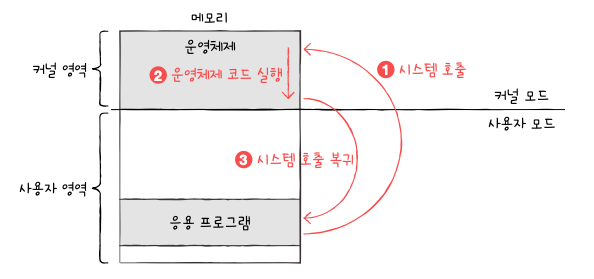

# 09-1. 운영체제를 알아야 하는 이유

## 운영체제란

- 실행 프로그램에 필요한 자원을 할당하고 프로그램이 올바르게 실행되도록 돕는 특별한 프로그램
- 사용자 영역: 커널 영역을 제외한 나머지 영역, 사용자가 이용하는 응용 프로그램이 적재되는 영역

## 운영체제를 알아야 하는 이유

- 우리가 만든 프로그램은 결국 하드웨어가 실행하고 그 하드웨어를 조작하는 프로그램이 운영체제
- 운영체제를 깊이 이해하면 운영체제가 건대는 말을 제대로 이해할 수 있고 제대로 명령 가능

# 09-2. 운영체제의 큰 그림

## 운영체제의 심장, 커널

- 운영체제의 핵심 서비스를 담당하는 부분
- 어떤 커널을 사용하는지에 따라 하드웨어를 이용하는 양상이 달라지고 결과적으로 컴퓨터 전체의 성능도 달라질 수 있음

### 사용자 인터페이스

- 운영체제가 제공하는 서비스 중 커널에 포함되지 않는 서비스
- 인터페스에는 2가지 종류가 있음
  - 그래픽 유저 인터페이스: 그래픽을 기반으로 컴퓨터와 상호작용할 수 있는 인터페이스
  - 커맨드 라인 인터페이스: 명령어를 기반으로 컴퓨터와 상효작용할 수 있는 인터페이스

## 이중 모드와 시스템 호출

- 이중모드: CPU가 명령어를 실행하는 모드를 크게 사용자 모드와 커널 모드로 구분하는 방식

  ⇒ CPU는 명령어를 사용자 모드, 커널모드로써 실행 가능

- 사용자 모드: 운영체제 서비스를 제공받을 수 없는 실행 모드
- 커널 모드: 운영체제 서비스를 제공받을 수 있는 실행 모드
- 사용자 모드로 실행되는 프로그램이 자원에 접근하는 운영체제 서비스를 제공받으려면 운영체제엑 요청을 보내 커널모드로 전환되어야 함

  ⇒ 이때 운영체제 서비스를 제공받기 위한 요청을 시스템 호출(시스템 콜)이라 함

- 시스템 호출은 일종의 인터럽트

  ⇒ 인터럽트를 발생시키는 특정 명령어에 의해 발생하는 것을 소프트웨어 인터럽트라 함

- 시스템 호출 예

  1. 하드 디스크에 데이터를 저장하는 시스템 호출을 발생시켜 커널 모드로 전환
  2. 운영체제 내의 ‘하드디스크에 데이터를 저장하는 코드를 실행함’으로써 하드 디스크에 접근 가능
  3. 하드 디스크에 접근이 끝났다면 다시 사용자 모드로 복귀하여 실행을 진행

     

## 운영체제의 핵심 서비스

### 프로세스 관리

- 프로세스: 실행 중인 프로그램
- 운영체제는 다양한 프로세스를 일목요연하게 관리하고 실행할 수 있어야 함

### 자원 접근 및 할당

CPU

- CPU 스케줄링: 프로세스들에 공정하게 CPU를 할당하기 위해 결정하는 것

메모리

- 메모리에 적재된 프로세스들의 크기와 적재되는 주소도 제각각

입출력 장치

- 인터럽트 서비스 루틴을 제공함으로써 입출력 작업을 수행

## 파일 시스템 관리

- 파일들을 한데 묶어 디렉토리로 보관
- 이런 파일 시스템도 운영체제가 지원하는 핵심 서비스
