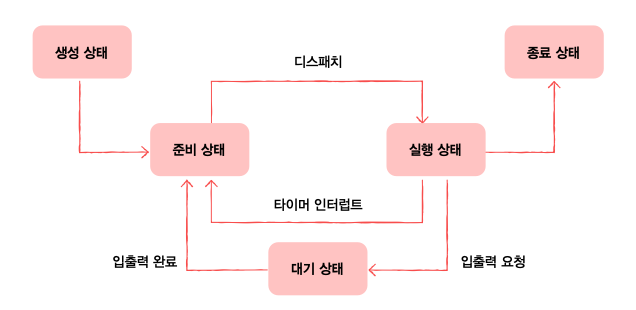

# 10-1. 프로세스 개요

### 프로세스 제어 블록(PCB)

> PCB :프로세스와 관련된 정보를 저장하는 자료 구조.커널 영역에 적재됨프로세스 생성 시 만들어지고, 프로세스 종료 시 삭제됨

### 레지스터 값

- 문맥 교환을 위함

### 프로세스 상태

- 생성/준비/실행/대기/종료 등의 상태

### CPU 스케줄링 정보

- 언제, 어떤 순서로 CPU를 할당 받을 지
- 메모리 관리 정보 : 어느 주소에 저장되어야 하는지사용한 파일, 입출력 장치 목록

## 문맥 교환

- **문맥** : 프로그램 실행에 필요한 정보
- **문맥 교환** :CPU를 다음 프로세스에게 넘겨 줄 때, **사용하고 있던 프로세스는 문맥을 PCB에 저장**하고, **다른 프로세스는 PCB로부터 문맥을 가져와 CPU를 사용**한다.이 과정을 문맥 교환이라고 함

## 프로세스의 메모리 영역

<정적 할당 영역>

- **코드 영역**
  - 기계어로 이루어진 명령어가 저장됨. 읽기 전용 공간
- **데이터 영역**
  - 프로그램이 실행되는 동안 계속해서 사용될 (한 번 쓰고 버리는 데이터가 아닌) 데이터를 저장

<동적 할당 영역>

- **힙 영역**
  - 사용자가 직접 할당할 수 있는 공간힙 영역은 사용 후에 **반환**해야함
  - 그렇지 않으면 메모리 누수(=메모리 낭비)가 발생
- **스택 영역**
  - 데이터를 '일시적으로' 저장하는 공간
  - 데이터 영역과 다르게 잠깐만 쓸 데이터가 저장됨

⇒ 힙 영역과 스택 영역은 동적 할당 영역으로, 언제든 크기가 변할 수 있음

⇒ 따라서 주소가 겹치지 않도록 힙 영역은 낮은 곳에서 높은 곳으로, 스택 영역은 높은 곳에서 낮은 곳으로 주소를 할당받음

# 10-2. 프로세스 상태와 계층 구조

## 프로세스 상태

### 생성 상태

- 프로세스가 막 생성된 상태. PCB를 할당 받고 메모리에 적재
- 이때, 바로 실행되는게 아니라 준비 상태에서 CPU 할당을 기다림
- 준비 상태 :
  CPU 할당을 언제든 받을 수 있으나, 아직 자신의 차례가 아니라 순서를 기다리는 상태
  - 준비 -> 실행 : 디스패치

### 실행 상태

- CPU의 할당을 받아 실행 중인 상태
- 실행 -> 준비 : 프로세스 실행이 끝나지 않았는데 타이머 인터럽트가 발생해 순서가 넘어간 경우
- 실행 -> 대기 : 입출력 장치의 작업 종료를 기다리고 있는 경우

### 대기 상태

- 입출력 장치가 실행이 종료되기를 기다리는 상태
- 보통 입출력 장치의 실행이 CPU에 비해 처리 속도가 느리기 때문

### 종료 상태

- 프로세스의 실행이 모두 종료된 상태
- 프로세스가 종료되면 운영체제는 PCB와 메모리 공간을 정리
  

## 프로세스 계층 구조와 생성 기법

- 모든 프로세스는 **시스템호출을 통해 자식 프로세스**를 만들 수 있음
- 이처럼 프로세스가 트리구조처럼 이루어진 형태를 **프로세스 계층 구조**라고 함
- ex : 최초의 프로세스(리눅스:system / 맥:launchd) -> 로그인 프로세스 -> bash 셸 프로세스 -> Vim 프로세스
- 부모 프로세스는 fork와 exec 명령어로 자식 프로세스를 생성

# 10-3. 스레드

## 프로세스와 스레드

### 스레드

- 프로세스를 구성하는 실행의 흐름 단위
- 스레드에는 프로세스 실행을 위한 최소한의 정보(스레드ID, 레지스터값, 스택)를 가지고 있음
- 하나의 프로세스는 여러 개의 스레드가 존재할 수 있음
- 단일 스레드 프로세스 : 실행의 흐름 단위가 하나, 한 번의 하나의 부분만 실행되는 프로세스
- 멀티 스레드 프로세스 : 실행의 흐름 단위가 여러 개, 한 번의 여러 개의 부분을 실행할 수 있는 프로세스
- 이때, 프로세스의 스레드는 스택 영역을 제외한 힙, 데이터, 코드 영역 등의 **프로세스 자원을 공유**

## 멀티프로세스 vs 멀티스레드

- 멀티프로세스와 멀티스레드의 가장 큰 차이는 **자원을 공유하는 가**에 있음

### **멀티프로세스**

- 자원을 공유하지 않음
- 메모리 공간을 많이 차지하지만 (각각의 프로세스마다 메모리에 적재해야해서) 하나의 프로세스에 문제가 생겨도 다른 프로세스에 영향을 주지 않음

### **멀티스레드**

- 자원을 공유

  ⇒ 불필요하게 메모리 영역을 사용하지 않아 메모리를 효율적으로 사용할 수 있음

- 단, 하나의 스레드에 문제가 생기면 프로세스 전체에 문제가 생길 가능성이 있음
