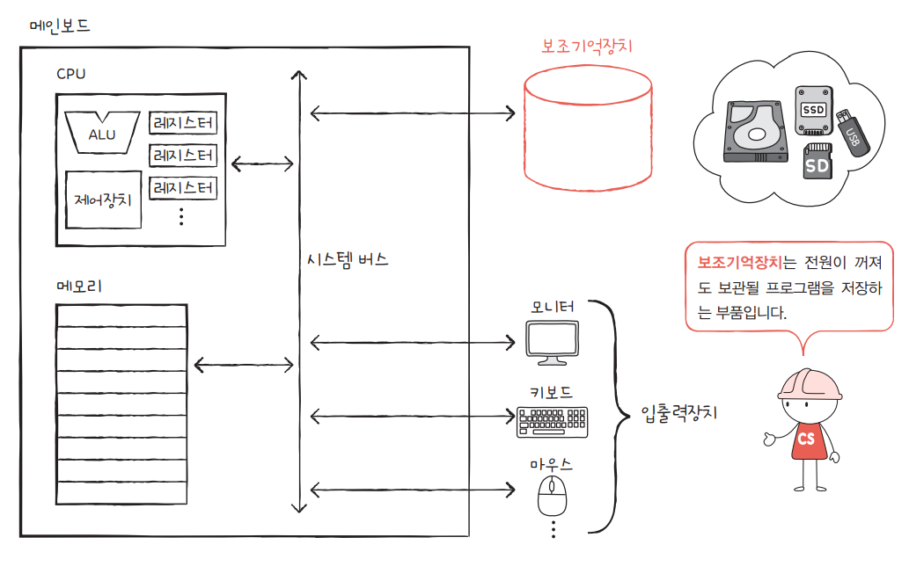

# 1-1. 컴퓨터 구조를 알아야 하는 이유

<aside>
✅

**`문제 해결` `성능/용량/비용`**

실력 있는 개발자가 되려면 왜 컴퓨터 구조를 알아야 할까?

</aside>

## 문제 해결

같은 코드가 작동하지 않을 때? → 컴퓨터 구조를 이해하고 있다면 문제 상황을 빠르게 진단할 수 있음

기업에서도 해당 역량을 많이 요구하고 있으며 각종 기술 면접에서 많이 나옴

컴구 지식은 문법에 맞는 코드만 작성하는 개발자 → **다양한 문제를 스스로 해결할 줄 아는 개발자**로 만들어줌

## 성능, 용량, 비용

웹사이트를 개발했다면? 서버 컴퓨터가 필요하다 (\*서버 컴퓨터 → 실행할 컴퓨터)

서버 컴퓨터마다 사용하는 CPU와 메모리가 다르고 그에 따라 성능, 용량, 비용이 다양함

무조건 저렴한 거나 최신 거보다는 성능과 비용을 고려해서 골라야 한다

서버 컴퓨터를 구매하지 않았다면? 클라우드 서비스를 이용하더라도 이런 고민은 해야 한다.

### 개발자라면,

내가 개발한 프로그램이 어떤 환경에서 어떻게 작동하는지 가장 잘 이해하고, 최적의 컴퓨터 환경이 무엇인지 알아야 한다

성능, 용량, 비용은 문법만으로는 해결하기 어렵다 → 따라서 모든 걸 고려할 수 있는 개발자가 되어야 한다

---

## 마무리

### 2가지 키워드로 정리하는 핵심 포인트

- 컴퓨터 구조를 이해하면 **문제 해결** 능력이 향상된다
- 컴퓨터 구조를 이해하면 문법만으로는 알기 어려운 **성능/용량/비용**을 고려하며 개발할 수 있음

### 확인 문제

1. 2번 → 프로그램을 무작정 빠르게 구현하는 건 좋지 않다
2. ① 미지의 대상, ② 분석의 대상

---

# 1-2. 컴퓨터 구조의 큰 그림

<aside>
✅

**`데이터` `명령어` `메모리` `CPU` `보조기억장치` `입출력장치` `시스템 버스`**

앞으로 배울 컴퓨터 구조에 대해서 알아보자

</aside>

## 시작 하기 전에

컴퓨터 구조는 크게 2가지로 구분 됨 → 1. 컴퓨터가 이해하는 정보 / 2. 컴퓨터의 네 가지 핵심 부품

## 컴퓨터가 이해하는 정보

컴퓨터는 무엇을 이해할 수 있을까? → 컴퓨터는 **0과 1**로 표현된 정보만 이해함

0과 1로 표현되는 정보에는 크게 2 종류가 있다 → **`데이터`와 `명령어`**

### 데이터 (data)

- 명령어를 위해 존재하는 일종의 재료

컴퓨터와 주고받는 정보나 컴퓨터에 저장된 정보를 가리킬 때 데이터라고 통칭한다

### 명령어 (instruction)

- 컴퓨터를 작동시키는 정보

> **컴퓨터는 명령어를 처리하는 기계이다 (명령어 모음)**

컴퓨터가 실질적으로 작동시키는 더 중요한 정보는 명령어이다

데이터는 명령어 없이는 아무것도 할 수 없는 정보 덩어리지만, 명령어는 데이터를 움직이고 컴퓨터를 작동시키는 정보이다

## 컴퓨터의 4가지 핵심 부품

컴퓨터의 종류와 상관 없이 컴퓨터를 이루는 핵심 부품은 다르지 않다

### 주기억장치의 종류

**`RAM(Random Access Memory)`**와 **`ROM(Random Only Memory)`** 두 가지이다.

1. 가장 큰 사각형은 **메인보드**이다
2. 메인보드 안에 **시스템 버스** (양방향 수직 화살표)가 있다
3. **CPU** 내부에는 ALU (산술논리연산장치), 제어장치와 여러 레지스터가 있다

   CPU는 메인보드 내 시스템 버스와 연결되어 있다

4. **메모리**는 메인보드 내 시스템 버스와 연결되어 있다
5. **보조기억장치**는 메인보드 내 시스템 버스와 연결되어 있음
6. 모니터, 기보드, 마우스 등은 메인보드 내 시스템 버스와 연결되어 있고, 이를 **입출력장치**라 부름

### 메모리

**현재 실행되는 프로그램의 명령어와 데이터를 저장하는 부품**

컴퓨터가 이해하는 정보는 명령어와 데이터인데, 메모리는 현재 실행되는 프로그램의 명령어와 데이터를 저장하는 부품 → 즉, 프로그램이 실행되려면 반드시 메모리에 저장되어 있어야 한다

이때 컴퓨터가 빠르게 작동하기 위해선 메모리 속 명령어와 데이터가 중구난방으로 저장되어있으면 안됨

저장된 명령어와 데이터의 위치는 정돈되어 있어야 한다

- 프로그램이 실행되기 위해서는 반드시 메모리에 저장되어 있어야 한다
- 메모리는 현재 실행되는 프로그램의 명령어와 데이터를 저장한다
- 메모리에 저장된 값의 위치는 주소로 알 수 있다

### CPU

**컴퓨터의 두뇌로, 메모리에 저장된 명령어를 읽어 들이고, 읽어 들인 명령어를 해석, 실행하는 부품**

CPU의 역할과 작동 원리를 구체적으로 이해하기 위해선 CPU 내부 구성 요소가 있다

1. 산술논리연산장치(ALU)
   1. 쉽게 말해 계산기이다. (계산만을 위해 존재하는 부품)
   2. 컴퓨터 내부에서 수행되는 대부분의 계산은 ALU가 도맡아 수행
2. 레지스터
   1. CPU 내부의 작은 임시 저장 장치
   2. 프로그램을 실행하는 데 필요한 값들을 임시로 저장
3. 제어장치
   1. 제어 신호라는 전기 신호를 내보내고 명령어를 해석하는 장치

<aside>
💡

- CPU가 메모리에 저장된 값을 읽고 싶을 땐 메모리를 향해 메모리 읽기라는 제어 신호를 보낸다
- CPU가 메모리에 어떤 값을 저장하고 싶을 땐 메모리를 향해 메모리 쓰기라는 제어 신호를 보낸다
</aside>

### CPU에서 이것만 기억하자!

1. CPU는 메모리에 저장된 값을 읽어 들이고, 해석하는 장치이다
2. CPU 내부에는 ALU, 레지스터, 제어장치가 있다
3. ALU는 계산하는 장치, 레지스터는 임시 저장 장치, 제어장치는 제어 신호를 발생시키고 명령어를 해석하는 장치이다

### 보조기억장치

메모리보다 크기가 크고 전원이 꺼져도 저장된 내용을 잃지 않는 메모리를 보조할 저장 장치

하드 디스크, SSD, USB 등이 전부 보조 기억 장치이다

메모리가 현재 ‘실행되는’프로그램을 저장한다면, 보조기억장치는 ‘보관할’ 프로그램을 저장

### 입출력장치

컴퓨터 외부에 연결되어 컴퓨터 내부의 정보를 교환하는 장치

> 관점에 따라 보조기억장치와 입출력장치를 주변장치로 통칭하기도 한다

### 메인보드와 시스템 버스

컴퓨터의 핵심 부품들은 모두 메인보드 (마더보드)

메인보드에 연결된 부품들은 버스라는 통로를 통해서 연결된다

## 마무리

### 7가지 키워드로 정리하는 핵심 포인트

- 컴퓨터가 이해하는 정보에는 **데이터**와 **명령어**가 있다
- **메모리**는 현재 실행되는 프로그램의 명령어와 데이터를 저장하는 부품이다
- **CPU**는 메모리에 저장된 명령어를 읽어 들이고, 해석하고, 실행하는 부품이다
- **보조기억장치**는 전원이 꺼져도 보관할 프로그램을 저장하는 부품이다
- **입출력장치**는 컴퓨터 외부에 연결되어 컴퓨터 내부와 정보를 교환할 수 있는 부품이다
- **시스템 버스**는 컴퓨터의 네 가지 핵심 부품들이 서로 정보를 주고받는 통로이다

### 확인 문제

1. ① 명령어 ② 데이터
2. ② CPU
3. 주기억장치
4. 보조기억장치 → 보관할 프로그램 저장 / 메모리 → 실행되는 프로그램 저장
5. 1번
